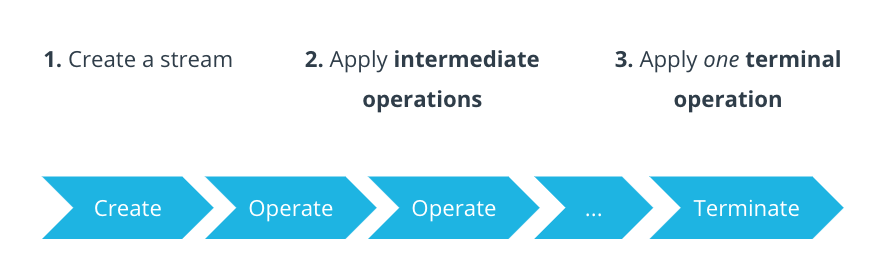

The **Stream API** allows you to **process collections** (like `List`, `Set`) in a **declarative, functional-style** manner.  

> **NOTE:** Instead of writing loops manually, you can describe **what you want to do**, not **how**.

---
### Stream Processing Pipeline

A stream pipeline consists of **creating a stream**, **calling intermediate operations** on the stream, and then **terminating the stream** using a terminal operation.



---
### Intermediate operations

Intermediate operations are the building blocks of a stream pipeline. <span style="color:green;font-weight:bold;background:beige;">They process the stream and return a new stream as the output. This allows you to chain multiple operations together</span>, creating a sequence of transformations on the data.

**Common Intermediate Operations**

| Method              | Description                           |
| ------------------- | ------------------------------------- |
| `filter(Predicate)` | Keeps elements that match a condition |
| `map(Function)`     | Transforms each element               |
| `sorted()`          | Sorts elements                        |
| `limit(n)`          | Takes only first `n` elements         |
| `distinct()`        | Removes duplicates                    |

---
### Terminal Operations

Terminal operations are the final step in the pipeline. They consume the entire stream produced by the chain of intermediate operations. 

Unlike intermediate operations, <span style="color:green;font-weight:bold;background:beige;">terminal operations typically return a non-Stream result (like a count, a collection, or even nothing void) and close the stream. This means you cannot perform further operations on the stream after a terminal operation is called</span>.

**Common Terminal Operations**

| Method                     | Description                                  |
| -------------------------- | -------------------------------------------- |
| `collect()`                | Collects results into a list, set, map, etc. |
| `forEach()`                | Loops over each element (like a for-loop)    |
| `count()`                  | Returns number of elements                   |
| `anyMatch()`, `allMatch()` | Returns boolean based on condition           |

---
### Key Characteristics

- Streams are **single-use**. Once you do an operation on a `Stream`, you cannot do any more operations on that same stream. <span style="color:green;font-weight:bold;background:beige;">This means intermediate operations always return a brand new</span> `Stream`<span style="color:green;font-weight:bold;background:beige;">, never the original</span>.

- Streams are **lazily evaluated**. No computation happens until the very end, when the terminal operation is called.

---
### Difference between Collections and Streams

A **collection** is an in-memory data structure, which holds all the values that the data structure currently has. Every element in the collection has to be computed before it can be added to the collection.

In contrast, a stream is a conceptually fixed data structure in which elements are computed on demand. In reality, streams **don't store the data themselves** but rather act as a processing abstraction on top of existing data sources like collections (e.g., `List`, `Set`), arrays, or even I/O channels.

> **NOTE:** Collections are about data and streams are about computations.

---

<span style="color:red;font-weight:bold;">Q. What will be the output of the following code snippet?</span>

```
import java.util.*;

public class Example {
    public static void main(String[] args) {
        List<String> words = List.of("apple", "banana", "pear", "watermelon");

        String longest = words.stream()
            .max(Comparator.comparingInt(String::length))
            .orElse(null);

        System.out.println(longest);
    }
}

```

<span style="color:green;font-weight:bold;">Explanation</span>

 1. **`words.stream()`** converts the list `words` into a **`Stream<String>`**. 

 2. The expression: **`Comparator.comparingInt(String::length)`**, equivalent to: **`(s1, s2) -> Integer.compare(s1.length(), s2.length())`** is basically creating a comparator that compares strings based on their length.

 3. **`Stream.max(Comparator<String>)`** finds the maximum element, i.e., the <span style="color:green;font-weight:bold;background:beige;">longest string</span> using the custom comparator provided. returns an **`Optional<String>`**, because the list might be empty.

4. **`orElse(null)`** means if the stream has no elements, i.e., the list is empty, return **`null`** instead of throwing an exception.

<span style="color:green;font-weight:bold;">Output</span>

```
watermelon
```

---

<span style="color:red;font-weight:bold;">Q. What will be the output of the following code snippet?</span>

```
import java.util.*;
import java.util.stream.Collectors;

public class JoinWords {
    public static void main(String[] args) {
        List<String> fruits = List.of("apple", "banana", "pear");

        String result = fruits.stream()
            .collect(Collectors.joining(", "));

        System.out.println(result);
    }
}

```

<span style="color:green;font-weight:bold;">Explanation</span>

1. **`fruits.stream()`** converts the list of fruits to **`Stream<String>`**.

2.  **`collect(Collectors.joining(", "))`**  converts a **`Stream<String>`** into a **single concatenated string** with `,` as the separator (delimiter) between them.

<span style="color:green;font-weight:bold;">Output</span>

```
apple, banana, pear
```

> **NOTE:** Think of `.collect()` as <span style="color:green;font-weight:bold;background:beige;">"Take everything in the stream and combine it into one result based on the rule I give"</span>.

---

<span style="color:red;font-weight:bold;">Q. What will be the output of the following code snippet?</span>

```
import java.util.*;

public class SumOfSquares {
    public static void main(String[] args) {
        List<Integer> nums = List.of(1, 2, 3, 4, 5);

        int sum = nums.stream()
            .filter(n -> n % 2 != 0)
            .mapToInt(n -> n * n)
            .sum();

        System.out.println(sum); // Output: 35
    }
}

```

<span style="color:green;font-weight:bold;">Explanation</span>

1. **`nums.stream()`** converts the list of numbers into **`Stream<Integer>`** so we can process it using functional operations.

2. **`filter(n -> n % 2 != 0)`** filters the stream to keep only **odd numbers**. In this case, it keeps: `1`, `3`, and `5`.

3. **`.mapToInt(n -> n * n)`** squares each remaining number: `1 → 1`, `3 → 9`, `5 → 25`.

4. **`sum()`** adds all squared values: `1 + 9 + 25 = 35`.

<span style="color:green;font-weight:bold;">Output</span>

```
35
```

---
### Parallel Processing

<span style="color:green;font-weight:bold;background:beige;">Streams can leverage multi-core architectures without you having to write a single line of multithread code.</span>

Just replace **`stream()`** with **`parallelStream()`** and Java will internally decompose your query **into multiple threads (if possible)** to leverage the multiple cores on your computer.

**Example**

Serial (sequential):

```
int sum = list.stream()
    .filter(n -> n % 2 != 0)
    .mapToInt(n -> n * n)
    .sum();
```

Parallel:

```
int sum = list.parallelStream()
    .filter(n -> n % 2 != 0)
    .mapToInt(n -> n * n)
    .sum();
```

> **NOTE:** Both give the **same result**, but the parallel version **may run faster** for large datasets.

---

We have `InventoryRecord = [hotelId, roomTypeId, date, totalRooms, reservedRooms]`. Given `records = List<InventoryRecord>`, group by `hotelId` and `roomTypeId`.

<span style="color:red;">Step 1:</span> Convert `records` to `Stream<InventoryRecord>`.

<span style="color:red;">Step 2:</span> Use `groupedByRoomTypeId = Collectors.groupingBy(InventoryRecord::getRoomTypeId)` to group all `InventoryRecord` by `roomTypeId`. This will produce `Map<roomTypeId, List<InventoryRecord>>`.

<span style="color:red;">Step 3:</span> Use `groupedByHotelId = Collectors.groupingBy(InventoryRecord::getHotelId, groupedByRoomTypeId)` to group all `Map<roomTypeId, List<InventoryRecord>>` by `hotelId`.
This will produce `Map<String, Map<String, List<InventoryRecord>>>`.

---

```
Map<String, Hotel> hotelById = hotels.stream()
    .collect(Collectors.toMap(Hotel::getId, h -> h));
```

1. `hotels.stream()`: Suppose hotels is a `List<Hotel>`, convert it into a `Stream<Hotel>` so you can process it with collectors.

2. `Collectors.toMap(Hotel::getId, h -> h)`
    
    - toMap needs two things:
        - a key mapper (how to get the key for the map),
        - a value mapper (how to get the value for the map).
        
    - `Hotel::getId` → For each `Hotel` object, use its `id` as the map key. So the Map key type is String (assuming getId() returns a String).
    
    - h -> h → For each `Hotel` object, use the object itself as the map value. So the Map value type is `Hotel`.
    
3. Result
    
    - A Map<String, Hotel> where:

        - Key = hotel id (hotel.getId())
        - Value = the `Hotel` object itself.

---

Suppose `priceList` is a `List<Double>`, e.g. `[1200.0, 1500.0, 1800.0]`. Find the sum of the list using stream API.

```
priceList.stream().mapToDouble(Double::doubleValue).sum();
```

- `mapToDouble` converts a `Stream<Double>` (wrapper objects) into a DoubleStream (primitive double stream).
- `Double::doubleValue` is a method reference that extracts the primitive double value from each `Double` object.

---
