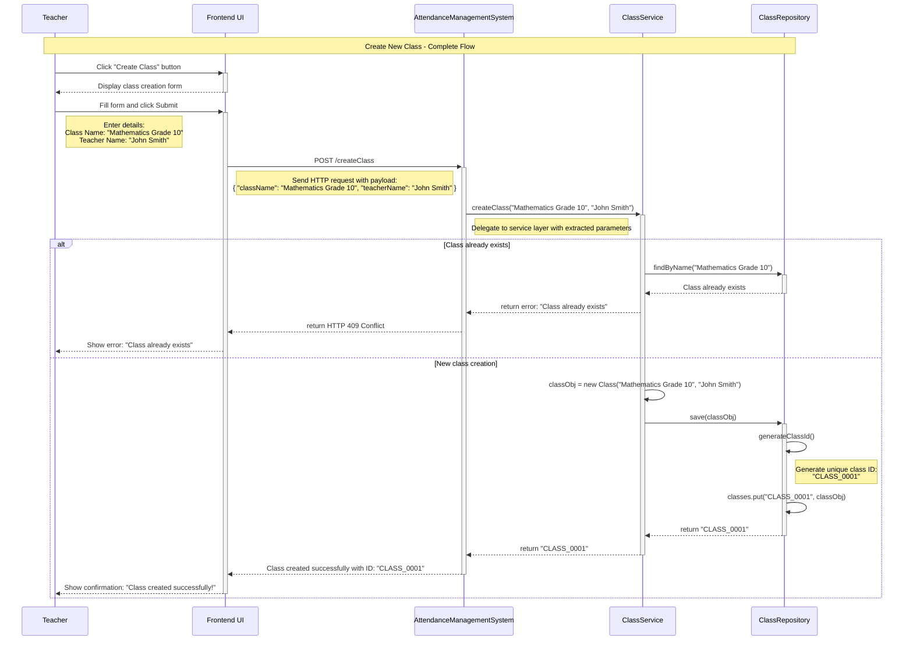
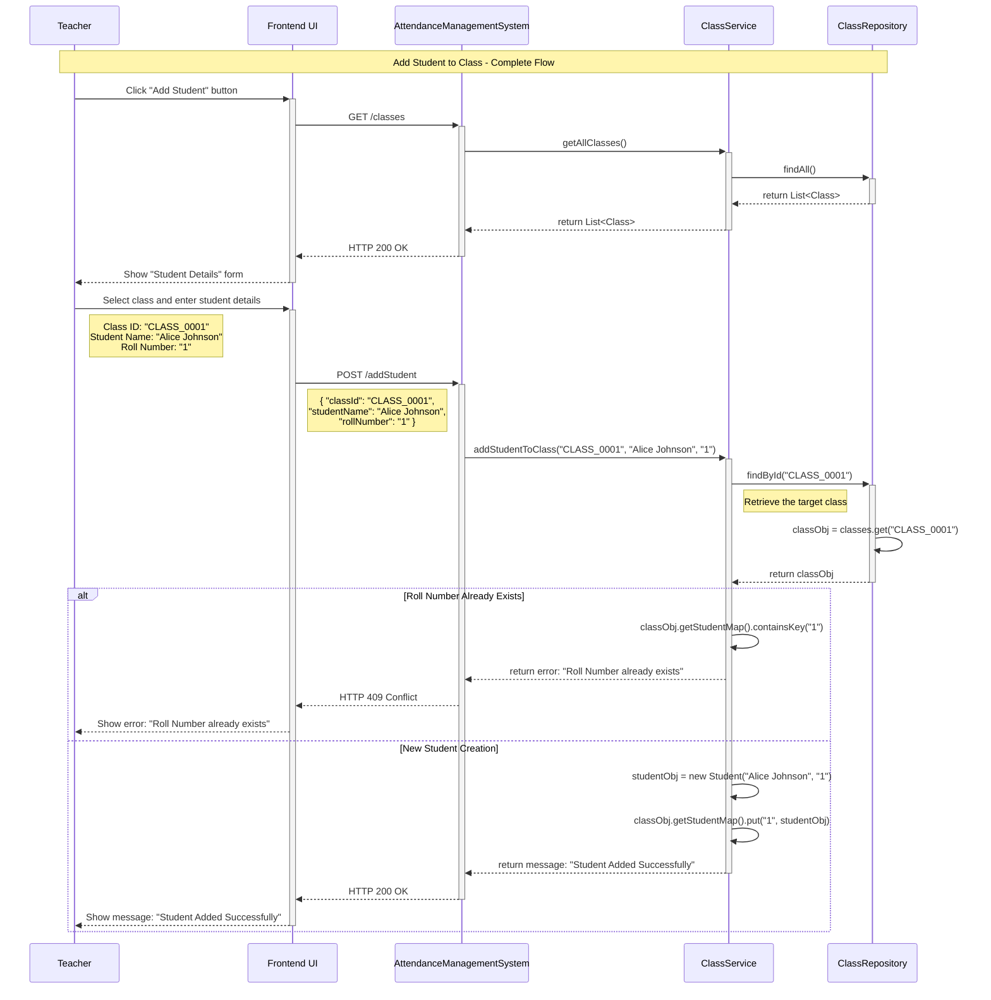
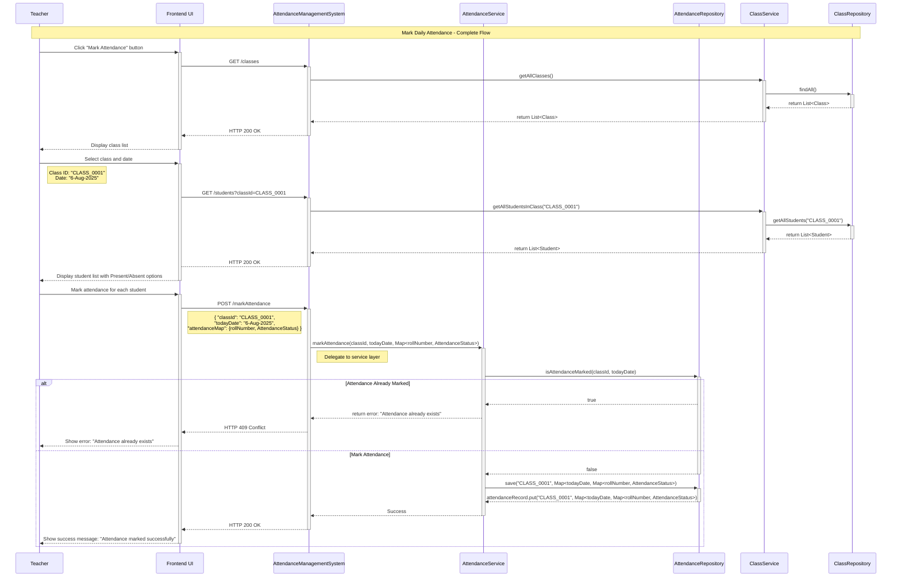
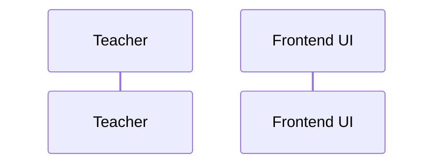

The **teacher (main actor)** is responsible for performing all **key actions (use cases)** such as **defining classes**, **adding students**, **marking attendance**, and **generating monthly reports**.

Let’s understand the **step-by-step sequence flow** of each use case to gain deeper insights into **how teachers interact with the system, how data flows during runtime, and how each feature functions within a memory-only environment**.

---
### Use Case 1: Create a New Class

A **`Teacher`** initiates the process by clicking the **"Create Class"** button from the UI. The UI displays the class creation form and prompts the teacher to enter class details such as **`className`** and **`teacherName`**. 

Upon submitting the form, the frontend sends a **`POST /createClass`** request to the **`AttendanceManagementSystem`**, including the input class details. 

The **`AttendanceManagementSystem`** extracts request parameters: **`className`** and **`teacherName`**, and invokes the **`createClass(className, teacherName)`** method within the **`ClassService`**. 

The **`createClass()`** method performs basic validations (e.g., check if **`className`** already exists), instantiates a new **`Class`** object: **`classObj`**  and invokes the **`save(classObj)`** method within the **`ClassRepository`**.

The **`save()`** method generates a unique **`classID`** and saves the **`classObj`** in the **in-memory** collection.

A success message is then returned to the UI, confirming that the class has been created.

---
### Use Case 2: Add a Student to Existing Class

The **`Teacher`** begins the process by clicking the **"Add Student"** button from the UI. The frontend sends a **`GET request`** to the **`AttendanceManagementSystem`** to fetch the list of existing classes.

The UI displays a list of existing classes, from which the **`Teacher`** selects the desired class (e.g., "Mathematics Grade 10"). The UI then displays the student details form and prompts the teacher to enter student details such as **`studentName`** and **`rollNumber`**.

Upon submitting the form, the frontend sends a **`POST /addStudent`** request to the **`AttendanceManagementSystem`**, including the selected **`classId`** and the student's information. 

The **`AttendanceManagementSystem`** extracts request parameters: **`classId`**, **`studentName`** and **`rollNumber`**, and invokes the **`addStudentToClass(classID,studentName,rollNumber)`** method within the **`ClassService`**.

The **`addStudentToClass()`** method performs basic validations, such as ensuring that the specified **`rollNumber`** does not already exist in the target class. If the validation succeeds, a new **`Student`** object: **`studentObj`** is created and added to the class’s **`studentMap<rollNumber, studentObj>`** collection via the **`ClassRepository`**. 

Finally, the **`AttendanceManagementSystem`** returns a success response to the UI, confirming the student was added.

> **NOTE:** 
> 
> For **in-memory system**, where the teacher creates classes and adds students **per session**, it's better to **let the teacher input the roll number**. This provides more control and aligns well with existing school records or legacy systems.

---
### Use Case 3: Mark Daily Attendance

The **`Teacher`** begins the process by clicking the **"Mark Attendance"** button from the UI. The frontend sends a **`GET /classes`** request to the **`AttendanceManagementSystem`** to fetch the list of existing classes.

The UI displays a list of existing classes, from which the **`Teacher`** selects the desired class (e.g., "Mathematics Grade 10"). The UI then displays a form showing **`List<Student>`** in the selected **`Class`** and prompts the **`Teacher`** to go through each **`Student`** and mark its **`AttendanceStatus`** as **`Present`** or **`Absent`**.

Upon submitting the form, the frontend sends a **`POST /markAttendance`** request to the **`AttendanceManagementSystem`**, including **`todayDate`**, **`classId`** and **`Map<rollNumber, AttendanceStatus>`**. 

The **`AttendanceManagementSystem`** extracts request parameters: **`todayDate`**, **`classId`** and **`Map<rollNumber, AttendanceStatus>`**, and invokes the  **`markAttendance(classId,todayDate,Map<rollNumber, AttendanceStatus>)`** method within the **`AttendanceService`**.

The **`markAttendance()`** method performs basic validations, such as ensuring that the **`Map<rollNumber, AttendanceStatus>`** for **`todayDate`** for the **target class** is not already present in the **`AttendanceRecord`**. 

If the validation succeeds, a new **`Map<todayDate, Map<rollNumber, AttendanceStatus>`** entry is added to the **`AttendanceRecord`** of the **target class** via the **`save(classId, Map<todayDate, Map<rollNumber, AttendanceStatus>)`** method of **`AttendanceRepository`**.

Finally, the **`AttendanceManagementSystem`** returns a success response to the UI, confirming the attendance for all students in the target class is marked for today.

> **NOTE:** 
> 
> It's better to store **attendance records as a separate entity** rather than embedding them inside the **`Class`** object. 
> 
> While storing attendance within `Class` object keeps everything in one place, it tightly couples responsibilities and makes the class harder to manage. Let the **`Class`** object focus only on class metadata and enrolled students. 
> 
> This aligns with the **Single Responsibility Principle** and makes the system easier to extend for features like reporting or persistence later.

---
### Use Case 4: Generate Monthly Class Attendance Report

The **`Teacher`** begins the process by clicking the **"View Attendance Report"** button from the UI. The frontend sends a **`GET /classes`** request to the **`AttendanceManagementSystem`** to fetch the list of existing classes.

The UI then displays a list of existing classes and prompts the **`Teacher`** to choose a specific **class (e.g., "Mathematics Grade 10")**, **year** and **month**.

Upon submitting the form, the frontend sends a **`GET /attendanceReport`** request to the **`AttendanceManagementSystem`**, including the selected **`classId`**, **`year`** and **`month`** as parameters.

The **`AttendanceManagementSystem`** extracts request parameters: **`classId`**, **`year`** and **`month`**, and invokes the  **`generateAttendanceReport(classId,year, month)`** method within the **`ReportService`**.

The **`generateAttendanceReport()`** method invokes the **`getAttendanceRecord(classId)`** method within the **`AttendanceRepository`** to retrieve the **`AttendanceRecord`** for the specified class.

The **`generateAttendanceReport()`** method method then performs some basic validations, such as ensuring that at least one record exist in the **`AttendanceRecord`** that fall within the given month. If the validation succeeds, it aggregates **`AttendanceRecord`** to compute, for each **`Student`**, the number of days marked as **Present** and **Absent**. 

The resulting **`ClassAttendanceReport`** is structured as a **`List<StudentAttendanceStats>`**, containing every individual student's attendance summaries for the month. 

Finally, the aggregated **`ClassAttendanceReport`** is returned to the frontend, where it is typically presented in a tabular format like:

| Roll Number | Name  | Total Present | Total Absent | Attendance % |
| ----------- | ----- | ------------- | ------------ | ------------ |
| 1           | Alice | 20            | 2            | 91.3         |
| 2           | Bob   | 18            | 3            | 86.9         |

---

