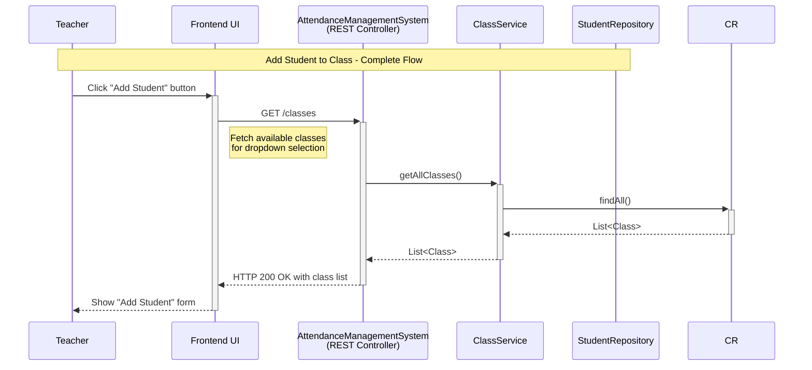

The **teacher (main actor)** is responsible for performing all **key actions (use cases)** such as **defining classes**, **adding students**, **marking attendance**, and **generating monthly reports**.

Let’s understand the **step-by-step sequence flow** of each use case to gain deeper insights into **how teachers interact with the system, how data flows during runtime, and how each feature functions within a memory-only environment**.

---
### Use Case 1: Create Class

A **`Teacher`** initiates the process by clicking the **"Create New Class"** button from the UI. The UI displays the class creation form and prompts the teacher to enter class details such as **`className`** and **`teacherName`**. 

Upon submitting the form, the frontend sends a **`POST /createClass`** request to the **`AttendanceManagementSystem`**, including the input class details. 

The **`AttendanceManagementSystem`** extracts request parameters: **`className`** and **`teacherName`**, and invokes the **`createClass(className, teacherName)`** method within the **`ClassService`**. 

The **`createClass()`** method performs basic validations (e.g., check if **`className`** already exists), instantiates a new **`Class`** object: **`classObj`**  and invokes the **`save(classObj)`** method within the **`ClassRepository`**.

The **`save()`** method generates a unique **`classID`** and saves the **`classObj`** in the **in-memory** collection.

A success message is then returned to the UI, confirming that the class has been created.

---
### Use Case 2: Add Student

The **`Teacher`** begins the process by clicking the **"Add Students"** button from the UI. The frontend sends a **`GET request`** to the **`AttendanceManagementSystem`** to fetch the list of classes assigned to that **`Teacher`**.

The UI displays a list of existing classes, from which the **`Teacher`** selects the desired class (e.g., "Mathematics Grade 10"). The UI then displays the student details form and prompts the teacher to enter student details such as **`name`** and **`rollNumber`**.

Upon submitting the form, the frontend sends a **`POST /addStudent`** request to the **`AttendanceManagementSystem`**, including the selected **`classID`** and the student's information. 

The **`AttendanceManagementSystem`** extracts request parameters: **`classID`**, **`name`** and **`rollNumber`**, and invokes the **`addStudent(classID,name,rollNumber)`** method within the **`ClassService`**.

The **`addStudent()`** method first validates whether the **`rollNumber`** is unique within that class. Upon successful validation, a new **`Student`** object is instantiated and added to the in-memory data store via the **`ClassRepository`**. 

Finally, the **`AttendanceManagementSystem`** returns a success response to the UI, confirming the student was added.

---
### Use Case 3: Mark Attendance

---
### Use Case 4: Generate Monthly Attendance Report

---
