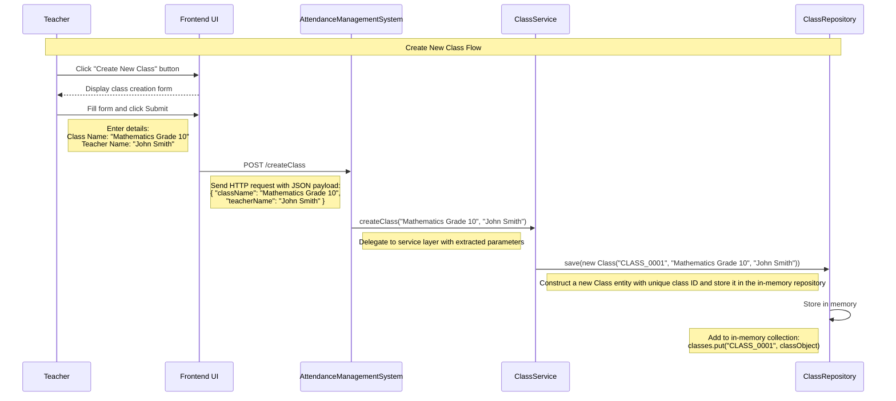

The **teacher (main actor)** is responsible for performing all **key actions (use cases)** such as **defining classes**, **adding students**, **marking attendance**, and **generating monthly reports**.

Let’s understand the **step-by-step sequence flow** of each use case to gain deeper insights into **how teachers interact with the system, how data flows during runtime, and how each feature functions within a memory-only environment**.

---
### Use Case 1: Create Class

A **`Teacher`** initiates the process by selecting the **"Create New Class"** option from the UI and entering details such as **`className`** and **`teacherName`**. Upon submitting the form, the frontend sends a **`POST /createClass`** request to the **`AttendanceManagementSystem`**.

The **`AttendanceManagementSystem`** handles this request by invoking the **`createClass()`** method within the **`ClassService`**. This method is responsible for instantiating a new **`Class`** object and saving it **in-memory** using the **`ClassRepository`**.

---
### Use Case 2: Add Student

1. **Teacher** adds student to existing class
2. **ClassService** validates input and retrieves the class from repository
3. Creates new Student object with generated ID
4. Adds student to class and saves updated class
5. Returns success status

---
### Use Case 3: Mark Attendance

---
### Use Case 4: Generate Monthly Attendance Report

---
