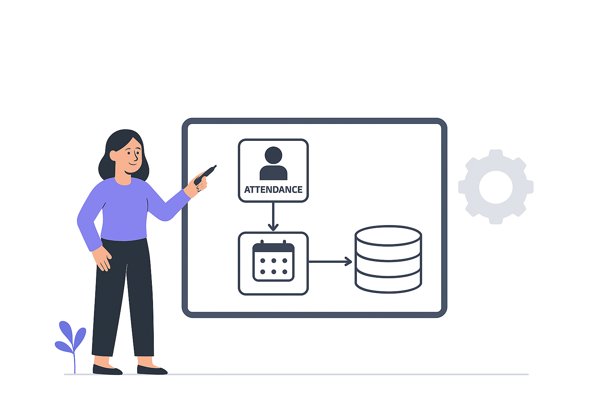

The **in-memory data model** for the Attendance Management System can be broken down into three subgroups: **Domain Objects**, **Data Transfer Objects (DTOs)** and **Centralized Data Repositories**.

Let’s discuss each in detail to understand their roles and responsibilities within the system.



---
### Domain Objects

Represent the core entities such as `ClassEntity`, `StudentEntity` and `StudentAttendanceRecord`, responsible for modeling the real-world concepts of classes, students, and daily attendance.

<span style="color:purple;font-weight:bold;">ClassEntity</span>

Represents a **school class** and acts as the **primary container for both student and attendance registries**.

| **Field**            | **Type**                                        | **Description**                                |
| -------------------- | ----------------------------------------------- | ---------------------------------------------- |
| `id`                 | `String`                                        | Unique identifier for the class.               |
| `name`               | `String`                                        | Human-readable class name.                     |
| `teacherName`        | `String`                                        | Name of the assigned teacher.                  |
| `studentRegistry`    | `Map<String, StudentEntity>`                    | Registry of students, keyed by `enrollmentId`. |
| `attendanceRegistry` | `Map<LocalDate, List<StudentAttendanceRecord>>` | Registry of daily attendance, keyed by date.   |

> **NOTE:** Since **both `studentRegistry` and `attendanceRegistry` are scoped to a single `ClassEntity`**, they are not shared across multiple threads or teachers. Each teacher will only interact with their own class instance, so **a simple `HashMap` is sufficient** for both registries.

<span style="color:purple;font-weight:bold;">StudentEntity</span>

Represents a student enrolled in a class.

|**Field**|**Type**|**Description**|
|---|---|---|
|`enrollmentId`|`String`|Unique identifier for each student within a class.|
|`name`|`String`|Student’s full name.|

<span style="color:purple;font-weight:bold;">StudentAttendanceRecord</span>

Represents an **attendance mark** for a student.

|**Field**|**Type**|**Description**|
|---|---|---|
|`enrollmentId`|`String`|Identifier linking back to the corresponding `StudentEntity`.|
|`name`|`String`|Student’s name (stored redundantly for easier reporting and faster lookups).|
|`attendanceStatus`|`String`|Attendance status for the date (`PRESENT` / `ABSENT`).|

---
### Data Transfer Objects (DTOs)

Act as lightweight carriers for exchanging data across layers. These include `StudentAttendanceStats` and `ClassAttendanceReport`, which are primarily used for aggregating and presenting attendance information.

<span style="color:purple;font-weight:bold;">StudentAttendanceStats</span>

Represents **aggregated attendance stats** per student over a date range.

|**Field**|**Type**|**Description**|
|---|---|---|
|`enrollmentId`|`String`|Identifier linking back to the corresponding `StudentEntity`.|
|`name`|`String`|Student’s full name.|
|`totalPresent`|`int`|Total number of days the student was marked **present**.|
|`totalAbsent`|`int`|Total number of days the student was marked **absent**.|
|`attendancePercentage`|`double`|Percentage of attendance over the selected date range.|

<span style="color:purple;font-weight:bold;">ClassAttendanceReport</span>

Represents the **report output** for a class.

|**Field**|**Type**|**Description**|
|---|---|---|
|`className`|`String`|Name of the class this report belongs to.|
|`startDate`|`LocalDate`|Start date of the reporting window.|
|`endDate`|`LocalDate`|End date of the reporting window.|
|`attendanceSummary`|`List<StudentAttendanceStats>`|Summary of attendance statistics for all students.|

---
### Centralized Data Repositories

Provide centralized, in-memory storage of all `ClassEntity` instances. 

> **NOTE:** Centralized access ensures persistence (within memory) of classes across different operations.

A **`HashMap`** provides efficient key-based access and retrieval, making it a natural choice for storing classes. However, in a **multi-user environment** where <span style="color:green;font-weight:bold;background:beige;">multiple teachers may simultaneously add or modify classes</span>, using a regular **`HashMap`** can lead to **concurrency issues** such as data inconsistency and race conditions.

To address this, we use a **`ConcurrentHashMap`**, which is thread-safe and designed for concurrent read and write operations.

```
Map<String, ClassEntity> classRegistry = new ConcurrentHashMap<>();
```

In this model, each `classId` maps to its corresponding `ClassEntity`, effectively serving as the system’s **single source of truth** for managing classes across the application.

---
