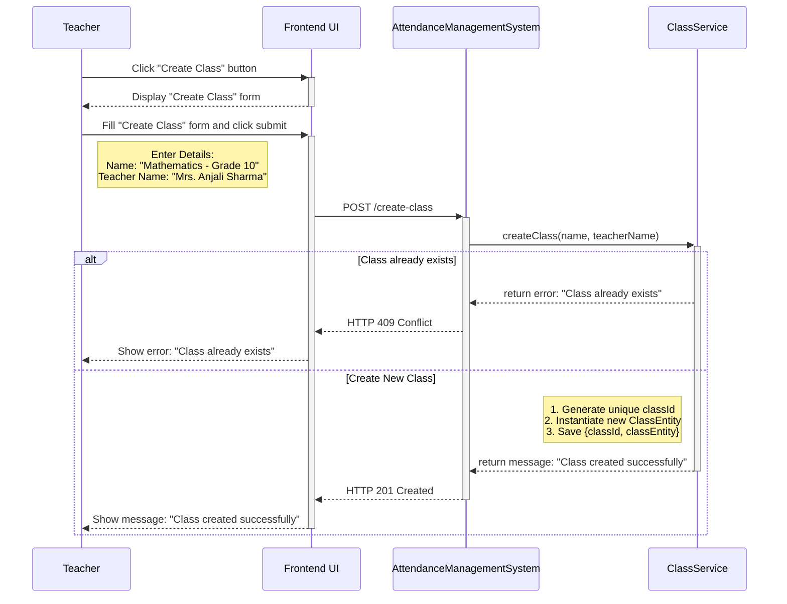
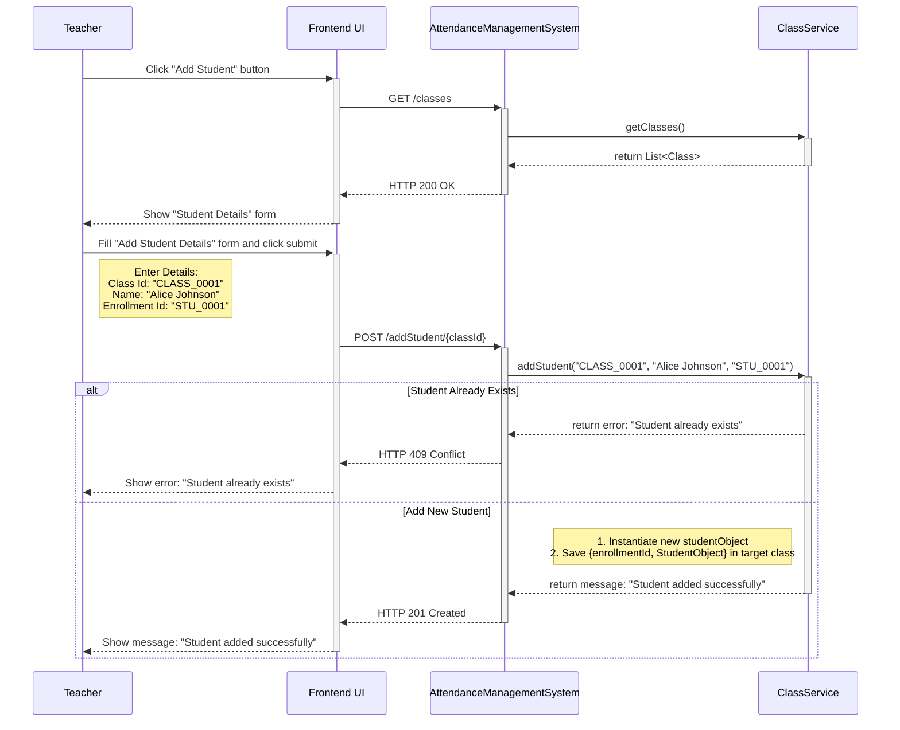
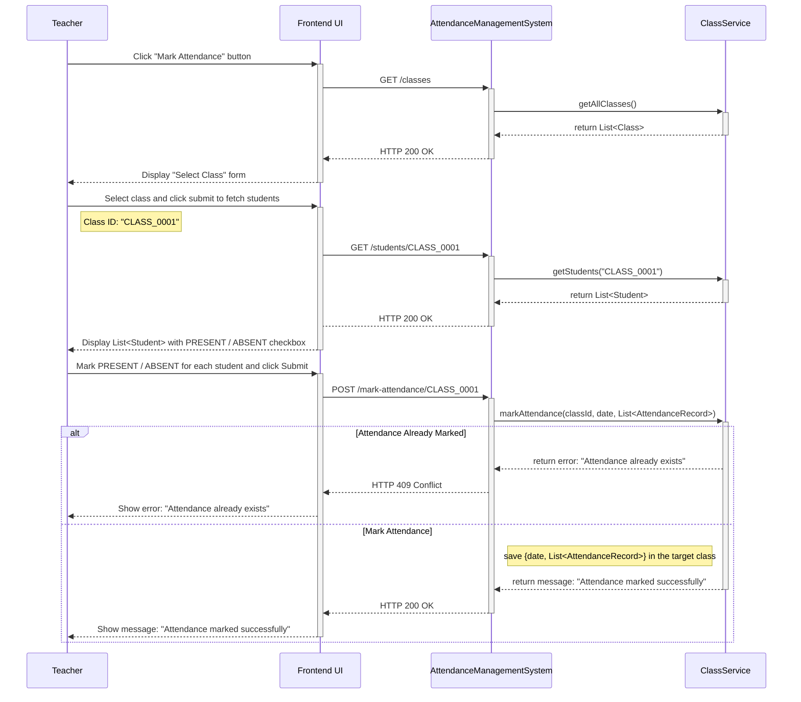
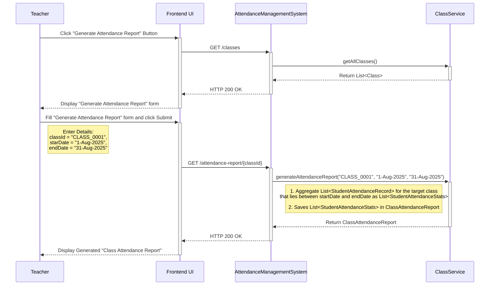

The **Attendance Management System** should allow a **teacher (main actor)** to perform **key actions (use cases)** such as:

1. **Create a new class.**
2. **Add a student to an existing class.**
3. **Mark daily class attendance.**
4. **Generate class attendance report.**

Let’s understand the step-by-step sequence flow of each use case to gain deeper insights into how teachers interact with the system, how data flows during runtime, and how each feature functions within a memory-only environment.

---
### Use Case 1: Create a New Class

This use case allows a teacher to define a new class at the beginning of an academic session. The following interactions describe the step-by-step flow of this operation between the user interface and backend components.

**Interaction 1: Click the "Create Class" Button**

1. A `Teacher` initiates the process by clicking the "Create Class" button from the UI. 
2. The UI displays the "Create Class" form and prompts the `Teacher` to enter class details such as `name` and assigned `teacherName`.

**Interaction 2: Submit the "Create Class" Form**

1. Upon submitting the form, the frontend sends a `POST /create-class` request to the `AttendanceManagementSystem`, including the provided class details.
2. The `AttendanceManagementSystem` intercepts the request, extracts request parameters: `name` and `teacherName`, and invokes the `createClass(name, teacherName)` method within the `ClassService`.
3. The `createClass()` method validates if a `ClassEntity` with the same `name` already exists. Upon successful validation, it generates a unique `classId`, instantiates a new `ClassEntity`  and saves the `{classId, classEntity}` mapping in the in-memory `classRegistry`.
4. Finally, an `HTTP response` is returned to the UI, stating whether the `ClassEntity` has been created or not.

**Sequence Diagram**

---
### Use Case 2: Add a Student to Existing Class

This use case enables a teacher to add a new student to one of the existing classes. The following interactions outline the complete step-by-step flow from initiating the action to successful student registration.

**Interaction 1: Click the "Add Student" Button**

1. The `Teacher` begins the process by clicking the "Add Student" button from the UI. 
2. The frontend sends a `GET \classes` request to the `AttendanceManagementSystem` to populate "Select Class" menu with the list of existing classes.
3. The UI then displays the "Add Student Details" form and prompts the `Teacher` to select the desired class and enters student details such as `name` and `enrollmentId`.

**Interaction 2: Submit the "Add Student Details" Form**

1. Upon submitting the form, the frontend sends a `POST /add-student/{classId}` request to the `AttendanceManagementSystem`, including the student's details.
2. The `AttendanceManagementSystem` intercepts the request, extracts request parameters: `classId`, `name` and `enrollmentId`, and invokes the `addStudent(classId, name, enrollmentNumber)` method within the `ClassService`.
3. The `addStudent()` method validates whether a `Student` with the same `enrollmentId` already exists in the target `Class`. Upon successful validation, it instantiates a new `studentObject` and adds the `{enrollmentId, studentObject}` mapping to the `studentRegistry` of the target `Class`.
4. Finally, an `HTTP response` is returned to the UI, confirming whether the `Student` has been added to the target `Class` or not.

**Sequence Diagram**

---
### Use Case 3: Mark Daily Attendance

This use case allows a teacher to record daily attendance for all students in a selected class. The interactions below describe this flow in detail.

**Interaction 1: Click the "Mark Attendance" Button**

1. The `Teacher` begins the process by clicking the "Mark Attendance" button from the UI. 
2. The frontend sends a `GET /classes` request to the `AttendanceManagementSystem` to populate the "Select Class" drop down with the list of existing classes.
3. The UI then displays a "Select Class" form and prompts the `Teacher` to select a class. 

**Interaction 2: Fill the "Mark Attendance" Form**

1. Upon selecting a class, the frontend sends a `GET /students{classId}` to the `AttendanceManagementSystem` to populate the "Mark Attendance" from with the `List<Student>` in the target `Class`. 
2. The UI then displays the "Mark Attendance" form and prompts the `Teacher` to go through each `Student` and mark its `attendanceStatus` as `PRESENT` or `ABSENT`.

**Interaction 3: Submit "Mark Attendance" Form**

1. Upon submitting the form, the frontend sends a `POST /mark-attendance/{classId}` request to the `AttendanceManagementSystem`, including today's `date` and `List<StudentAttendanceRecord>`.
2. The `AttendanceManagementSystem` intercepts the requests, extracts request parameters: `classId`, `date` and `List<StudentAttendanceRecord>`, and invokes the  `markAttendance(classId, date, List<StudentAttendanceRecord>)` method within the `ClassService`.
3. The `markAttendance()` method validates whether the attendance for the target `Class` for today's `date ` is already marked or not. Upon successful validation, it adds the `{date, List<StudentAttendanceRecord>}` mapping to the `attendanceRegistry` of the target `Class`.
4. Finally, an `HTTP response` is returned to the UI, confirming whether the attendance for all `Student` in the target `Class` is marked for today's `date` or not.

**Sequence Diagram**

---
### Use Case 4: Generate Class Attendance Report

This use case allows a teacher to generate and view the attendance summaries for a selected class for a defined date range. The interactions below illustrate the step-by-step process of how this report is generated and delivered to the teacher through the UI.

**Interaction 1: Click the "Generate Attendance Report" button**

1. The `Teacher` clicks the "Generate Attendance Report" button from the UI. 
2. The frontend sends a `GET /classes` request to the `AttendanceManagementSystem` to populate the "Select Class" dropdown with the list of existing classes.
3. The UI then displays the 'Generate Attendance Report' form, prompting the `Teacher` to select a class along with the `startDate`and `endDate`.

**Interaction 2: Submit "Generate Attendance Report" Form**

1. Upon submitting the form, the frontend sends a `GET /attendance-report/{classId}` request to the `AttendanceManagementSystem`, including the selected `startDate` and `endDate`.
2. The `AttendanceManagementSystem` intercepts the request, extracts request parameters: `classId`, `startDate` and `endDate` and invokes the `generateAttendanceReport(classId, startDate, endDate)` method within the `ClassService`.
3. The `generateAttendanceReport()` method filters the `List<StudentAttendanceRecord>` for the target class that lie between the `startDate` and the `endDate`, aggregates the filtered `List<StudentAttendanceRecord>` as `List<StudentAttendanceStats>` and saves it in `ClassAttendanceReport` along with other details like `className`, `startDate` and `endDate`.
4. Finally, an `HTTP response` containing the aggregated `List<StudentAttendanceStats>` is returned to the UI, where it is typically presented in a tabular format like:

| Roll Number | Name  | Total Present | Total Absent | Attendance % |
| ----------- | ----- | ------------- | ------------ | ------------ |
| 1           | Alice | 20            | 2            | 91.3         |
| 2           | Bob   | 18            | 3            | 86.9         |

**Sequence Diagram**

---

