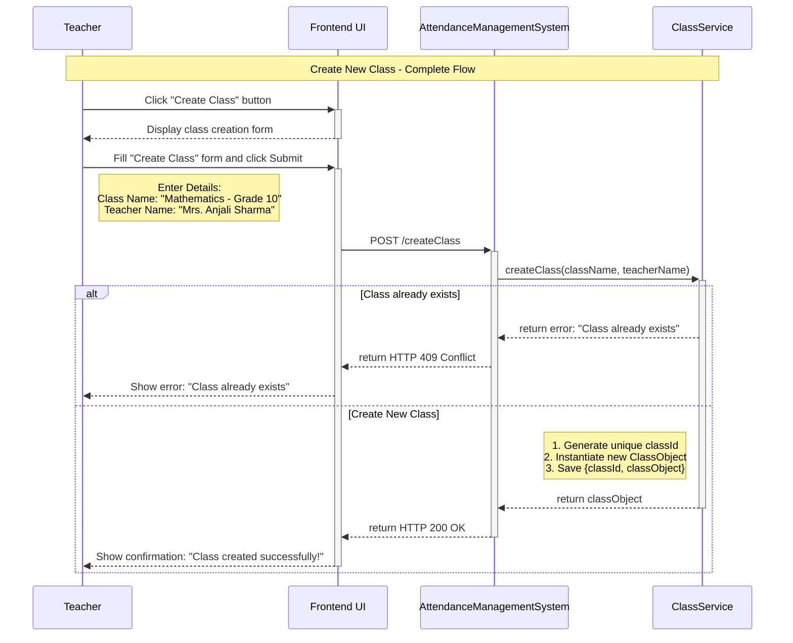
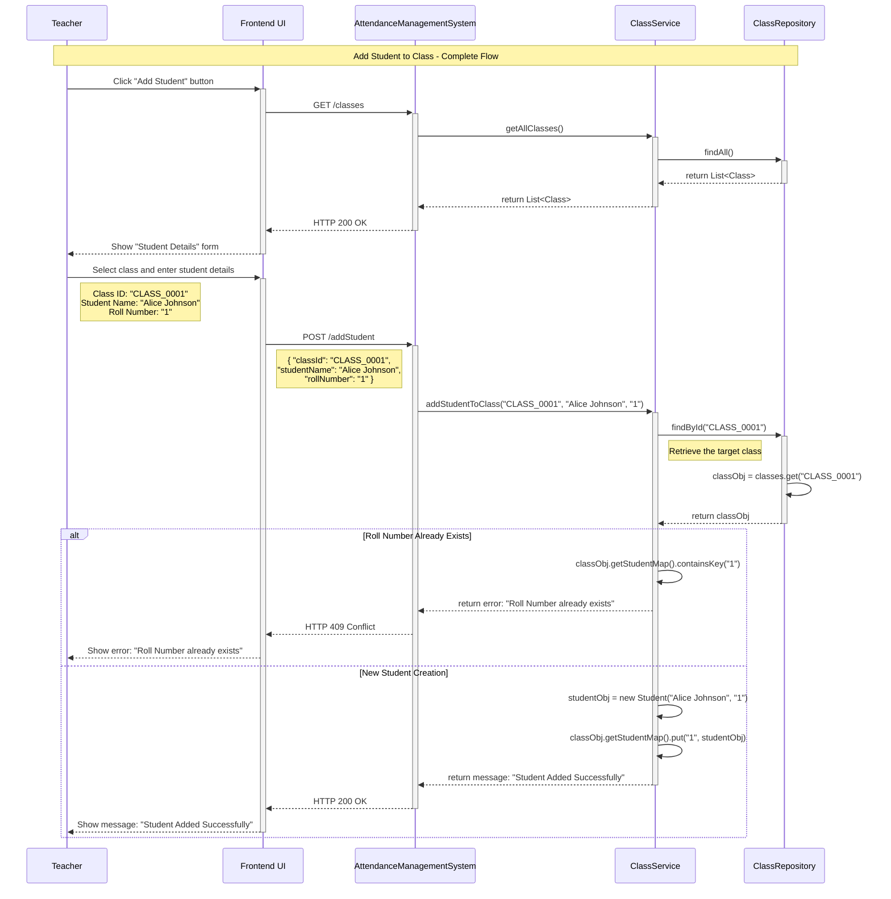
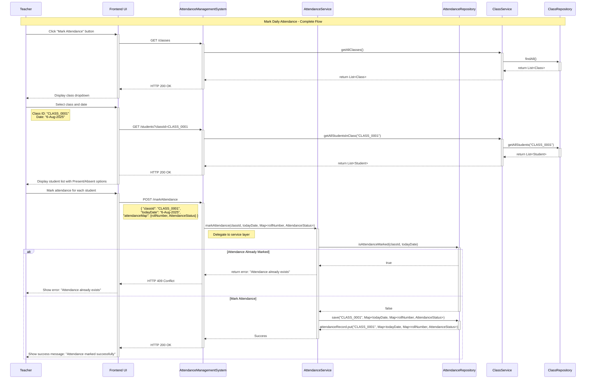
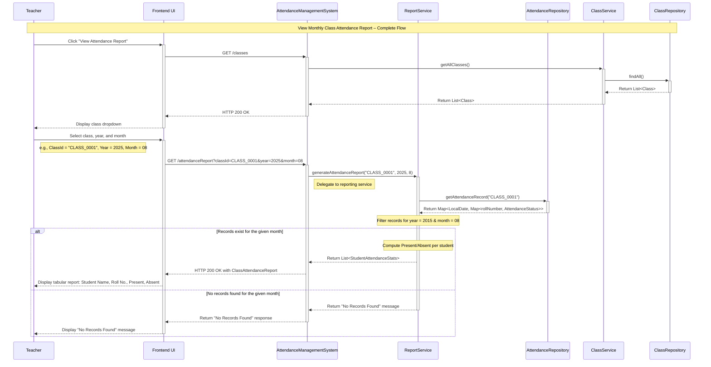

The **Attendance Management System** should allow a **teacher (main actor)** to perform **key actions (use cases)** such as:

1. Create a new class.
2. Add a student to an assigned class.
3. Mark daily class attendance.
4. Generate monthly class attendance reports.

Let’s understand the step-by-step sequence flow of each use case to gain deeper insights into how teachers interact with the system, how data flows during runtime, and how each feature functions within a memory-only environment.

---
### Create a New Class

This use case allows a teacher to define a new class at the beginning of an academic session. The following interactions describe the step-by-step flow of this operation between the user interface and backend components.

**Interaction 1: Click the "Create Class" Button**

1. A `Teacher` initiates the process by clicking the `Create Class` button from the UI. 
2. The UI displays the class creation form and prompts the teacher to enter class details such as `className` and `teacherName`.

**Interaction 2: Submit the "Create Class" Form**

1. Upon submitting the form, the frontend sends a `POST /create-class` request to the `AttendanceManagementSystem`, including the input class details. 
2. The `AttendanceManagementSystem` intercepts the request, extracts request parameters: `className` and `teacherName`, and invokes the `createClass(className, teacherName)` method within the `ClassService`.
3. The `createClass()` method validates if a class with the same name already exists. Upon successful validation, it generates a unique `classId`, instantiates a new `ClassObject`  and saves the `{classId, classObject}` combination in the in-memory class registry.
4. An `HTTP response` is returned to the UI, stating whether the class has been created or not.

**Sequence Diagram**

---
### Add a Student to Existing Class

This use case enables a teacher to add a new student to one of its assigned class. The following interactions outline the complete step-by-step flow from initiating the action to successful student registration.

**Interaction 1: Click the "Add Student" Button**

1. The `Teacher` begins the process by clicking the `Add Student` button from the UI. 
2. The UI displays the add student details form and sends a `GET request` to the `AttendanceManagementSystem` to pre-populate class dropdown menu with the list of classes assigned to the `Teacher`. 

**Interaction 2: Submit the "Add Student Details" Form**

1. The `Teacher` selects the desired class (e.g., `Mathematics Grade 10`) and enters student details such as `name` and `enrollmentId`.
2. Upon submitting the form, the frontend sends a `POST /addStudent` request to the `AttendanceManagementSystem`, including the selected `classId` and the student's details.
3. The `AttendanceManagementSystem` intercepts the request, extracts request parameters: `classId`, `name` and `enrollmentId`, and invokes the `addStudent(classID, studentName, enrollmentNumber)` method within the `ClassService`.
4. The `addStudent()` method validates if a student with the same `enrollmentId` already exists in the target class. Upon successful validation, it generates a unique a unique `rollNumber`, instantiates a new `studentObject` and adds the the `{enrollmentId, studentObject}` combination to the student collection of the target class.
5. An `HTTP response` is returned to the UI, confirming whether the student has been added to the target class or not.

**Sequence Diagram**

> **NOTE:** 
> 
> For **in-memory system**, where the teacher creates classes and adds students **per session**, it's better to **let the teacher input the roll number**. This provides more control and aligns well with existing school records or legacy systems.

---
### Mark Daily Attendance

This use case allows a teacher to record daily attendance for students in a selected class. The interactions below describe this flow in detail.

**Interaction 1: Click the "Mark Attendance" Button**

1. The `Teacher` begins the process by clicking the "Mark Attendance" button from the UI. 
2. The UI displays a "Select Class" form and sends a `GET /classes` request to the `AttendanceManagementSystem` to pre-populate the class dropdown menu with the list of existing classes.

**Interaction 2: Fill the "Mark" Form**

1. The `Teacher` selects the desired class (e.g., "Mathematics Grade 10"). 
2. The UI displays the mark attendance form, showcasing `List<Student>` in the selected `Class` and prompting the `Teacher` to go through each `Student` and mark its `AttendanceStatus` as `Present` or `Absent`.

**Interaction 3: Submit "Mark Attendance" Form**

1. Upon submitting the form, the frontend sends a `POST /markAttendance` request to the `AttendanceManagementSystem`, including `todayDate`, `classId` and `Map<rollNumber, AttendanceStatus>`. 
2. The `AttendanceManagementSystem` extracts request parameters: `todayDate`, `classId` and `Map<rollNumber, AttendanceStatus>`, and invokes the  `markAttendance(classId,todayDate,Map<rollNumber, AttendanceStatus>)` method within the `AttendanceService`.
3. The `markAttendance()` method performs basic validations, such as ensuring that the `Map<rollNumber, AttendanceStatus>` for `todayDate` for the target class is not already present in the `AttendanceRecords`. 
4. If the validation succeeds, a new `Map<todayDate, Map<rollNumber, AttendanceStatus>` entry is added to the `AttendanceRecords` of the target class via the `save(classId, Map<todayDate, Map<rollNumber, AttendanceStatus>)` method of `AttendanceRepository`.
5. Finally, the `AttendanceManagementSystem` returns a success response to the UI, confirming the attendance for all students in the target class is marked for today.

**Sequence Diagram**

> **NOTE:** 
> 
> It's better to store **attendance records as a separate entity** rather than embedding them inside the **`Class`** object. 
> 
> While storing attendance within `Class` object keeps everything in one place, it tightly couples responsibilities and makes the class harder to manage. Let the **`Class`** object focus only on class metadata and enrolled students. 
> 
> This aligns with the **Single Responsibility Principle** and makes the system easier to extend for features like reporting or persistence later.

---
### Generate Monthly Class Attendance Report

This use case allows a teacher to generate and view the monthly attendance summary for a selected class. The interactions below illustrate the step-by-step process of how this report is generated and delivered to the teacher through the UI.

**Interaction 1: Click the "View Attendance Report" button**

1. The `Teacher` clicks the "View Attendance Report" button from the UI. 
2. The frontend sends a `GET /classes` request to the `AttendanceManagementSystem` to pre-populate the class dropdown menu with the list of existing classes and prompts the `Teacher` to choose a specific class (e.g., "Mathematics Grade 10"), year and month.

**Interaction 2: Submit "Select Class and Month" Form**

1. Upon submitting the form, the frontend sends a `GET /attendanceReport` request to the `AttendanceManagementSystem`, including the selected `classId`, `year` and `month` as parameters.
2. The `AttendanceManagementSystem` extracts request parameters: `classId`, `year` and `month`, and invokes the  `generateClassAttendanceReport(classId,year, month)` method within the `ReportService`.
3. The `generateClassAttendanceReport()` method invokes the `getAttendanceRecord(classId)` method within the `AttendanceRepository` to retrieve the `AttendanceRecord` for the specified class and performs basic validations such as ensuring that at least one record exist in the `AttendanceRecord` that fall within the given month. 
4. If the validation succeeds, it aggregates `AttendanceRecord` to compute, for each `Student`, the number of days marked as `Present` and `Absent`. The resulting `ClassAttendanceReport` is structured as a `List<StudentAttendanceStats>`, containing every student's attendance summaries for the month.
5. Finally, the `AttendanceManagementSystem` returns the aggregated `ClassAttendanceReport` to the frontend, where it is typically presented in a tabular format like:

| Roll Number | Name  | Total Present | Total Absent | Attendance % |
| ----------- | ----- | ------------- | ------------ | ------------ |
| 1           | Alice | 20            | 2            | 91.3         |
| 2           | Bob   | 18            | 3            | 86.9         |

**Sequence Diagram**

---

