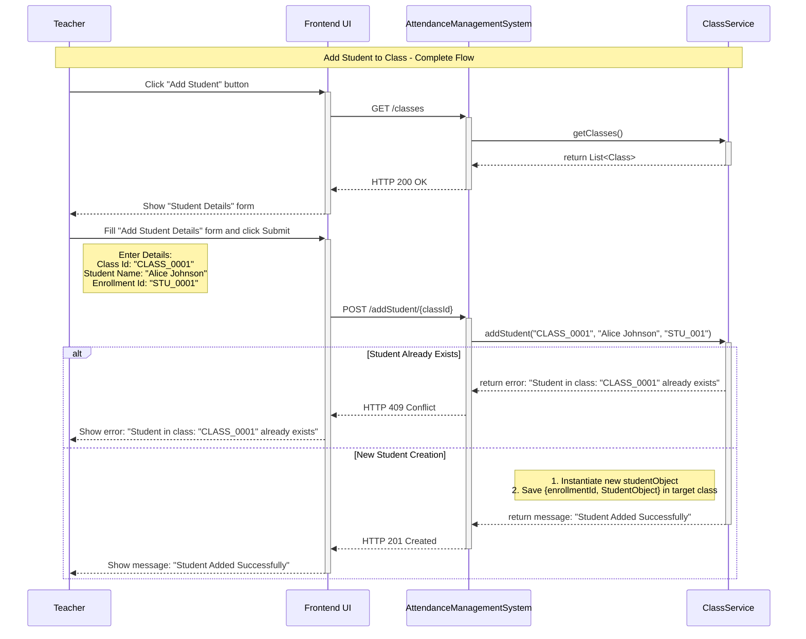
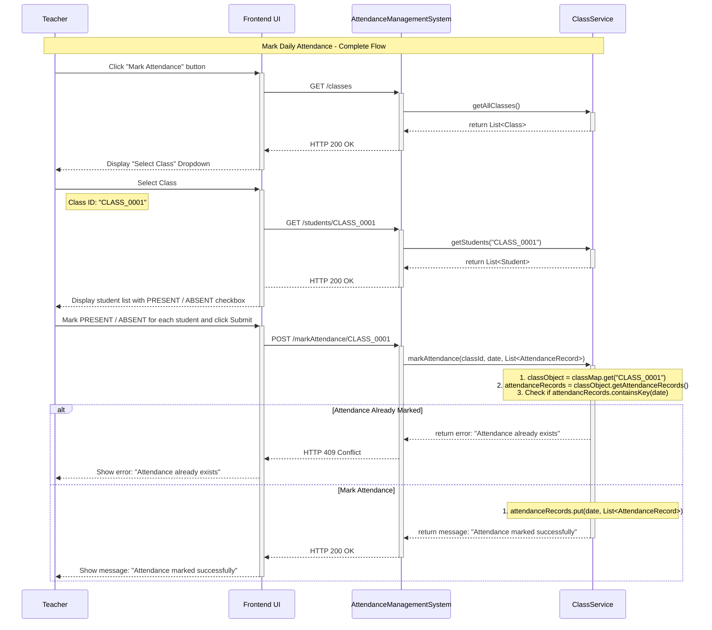
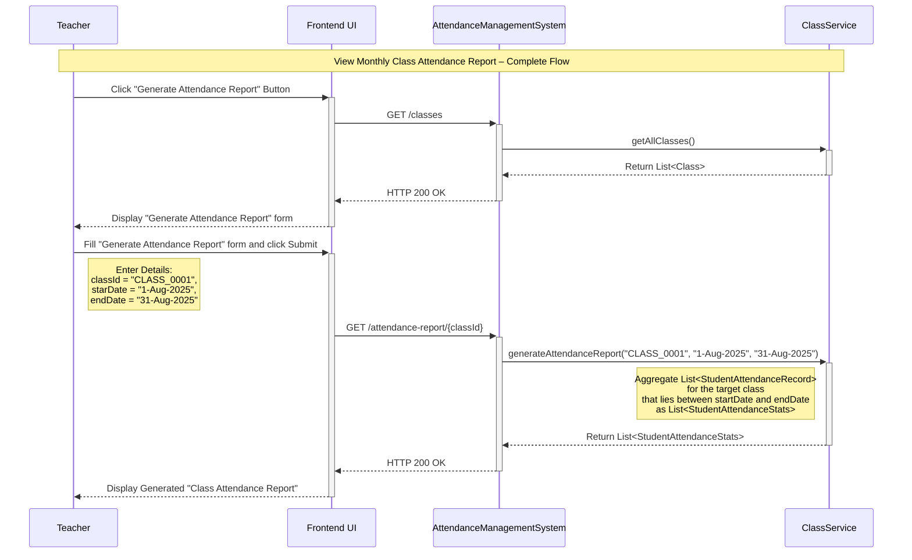

The **Attendance Management System** should allow a **teacher (main actor)** to perform **key actions (use cases)** such as:

1. Create a new class.
2. Add a student to an existing class.
3. Mark daily class attendance.
4. Generate monthly class attendance reports.

Let’s understand the step-by-step sequence flow of each use case to gain deeper insights into how teachers interact with the system, how data flows during runtime, and how each feature functions within a memory-only environment.

---
### Create a New Class

This use case allows a teacher to define a new class at the beginning of an academic session. The following interactions describe the step-by-step flow of this operation between the user interface and backend components.

**Interaction 1: Click the "Create Class" Button**

1. A `Teacher` initiates the process by clicking the `Create Class` button from the UI. 
2. The UI displays the class creation form and prompts the teacher to enter class details such as `className` and `teacherName`.

**Interaction 2: Submit the "Create Class" Form**

1. Upon submitting the form, the frontend sends a `POST /create-class` request to the `AttendanceManagementSystem`, including the input class details. 
2. The `AttendanceManagementSystem` intercepts the request, extracts request parameters: `className` and `teacherName`, and invokes the `createClass(className, teacherName)` method within the `ClassService`.
3. The `createClass()` method validates if a class with the same name already exists. Upon successful validation, it generates a unique `classId`, instantiates a new `ClassObject`  and saves the `{classId, classObject}` combination in the in-memory class registry.
4. An `HTTP response` is returned to the UI, stating whether the class has been created or not.

**Sequence Diagram**

---
### Add a Student to Existing Class

This use case enables a teacher to add a new student to one of its assigned class. The following interactions outline the complete step-by-step flow from initiating the action to successful student registration.

**Interaction 1: Click the "Add Student" Button**

1. The `Teacher` begins the process by clicking the `Add Student` button from the UI. 
2. The frontend sends a A `GET request` to the `AttendanceManagementSystem` to pre-populate class dropdown menu with the list of existing classes.
3. The UI then displays the add student details form, and prompts the teacher to select the desired class (e.g., `Mathematics Grade 10`) and enters student details such as `name` and `enrollmentId`.

**Interaction 2: Submit the "Add Student Details" Form**

1. Upon submitting the form, the frontend sends a `POST /add-student/{classId}` request to the `AttendanceManagementSystem`, including the student's details.
2. The `AttendanceManagementSystem` intercepts the request, extracts request parameters: `classId`, `name` and `enrollmentId`, and invokes the `addStudent(classId, name, enrollmentNumber)` method within the `ClassService`.
3. The `addStudent()` method validates whether a student with the same `enrollmentId` already exists in the target class. Upon successful validation, it instantiates a new `studentObject` and adds the `{enrollmentId, studentObject}` combination to the student registry of the target class.
4. An `HTTP response` is returned to the UI, confirming whether the student has been added to the target class or not.

**Sequence Diagram**

---
### Mark Daily Attendance

This use case allows a teacher to record daily attendance for students in a selected class. The interactions below describe this flow in detail.

**Interaction 1: Click the "Mark Attendance" Button**

1. The `Teacher` begins the process by clicking the `Mark Attendance` button from the UI. 
2. The frontend sends a `GET /classes` request to the `AttendanceManagementSystem` to pre-populate the select class drop down with the list of existing classes.
3. The UI then displays a select class form and prompts the teacher to select the desired class (e.g., `Mathematics Grade 10`). 

**Interaction 2: Fill the "Mark Attendance" Form**

1. Upon selecting a class, the frontend sends a `GET /students` to the `AttendanceManagementSystem` to populate the mark attendance from with the `List<Student>` in the target class. 
2. The UI then displays the mark attendance form and prompts the teacher to go through each `Student` and mark its attendance status as `PRESENT` or `ABSENT`.

**Interaction 3: Submit "Mark Attendance" Form**

1. Upon submitting the form, the frontend sends a `POST /mark-attendance/{classId}` request to the `AttendanceManagementSystem`, including today's `date` and `List<StudentAttendanceRecord>`.
2. The `AttendanceManagementSystem` intercepts the requests, extracts request parameters: `classId`, `date` and `List<StudentAttendanceRecord>`, and invokes the  `markAttendance(classId, date, List<StudentAttendanceRecord>)` method within the `ClassService`.
3. The `markAttendance()` method validates whether the attendance for the target class for today's `date ` is already marked or not. Upon successful validation, it adds the `{date, List<StudentAttendanceRecord>}` combination to the attendance registry of the target class.
4. An `HTTP response` is returned to the UI, confirming whether the attendance for all students in the target class is marked for today or not.

**Sequence Diagram**

---
### Generate Monthly Class Attendance Report

This use case allows a teacher to generate and view the attendance summary for a selected class for a defined date range. The interactions below illustrate the step-by-step process of how this report is generated and delivered to the teacher through the UI.

**Interaction 1: Click the "Generate Attendance Report" button**

1. The `Teacher` clicks the `Generate Attendance Report` button from the UI. 
2. The frontend sends a `GET /classes` request to the `AttendanceManagementSystem` to pre-populate the select class dropdown with the list of existing classes.
3. The UI then displays the generate attendance report form and prompts the `Teacher` to select a desired class (e.g., `Mathematics Grade 10`), `startDate` and `endDate`.

**Interaction 2: Submit "Generate Attendance Report" Form**

1. Upon submitting the form, the frontend sends a `GET /attendance-report/{classId}` request to the `AttendanceManagementSystem`, including the `startDate` and `endDate`.
2. The `AttendanceManagementSystem` intercepts the request, extracts request parameters: `classId`, `startDate` and `endDate` and invokes the `generateAttendanceReport(classId, startDate, endDate)` method within the `ClassService`.
3. The `generateAttendanceReport()` method filters the `List<StudentAttendanceRecord>` for the target class that lie between the `startDate` and the `endDate`, and aggregates the filtered `List<StudentAttendanceRecord>` as `List<StudentAttendanceStats>`.
4. An `HTTP response` containing the aggregated `List<StudentAttendanceStats>` is returned to the UI, where it is typically presented in a tabular format like:

| Roll Number | Name  | Total Present | Total Absent | Attendance % |
| ----------- | ----- | ------------- | ------------ | ------------ |
| 1           | Alice | 20            | 2            | 91.3         |
| 2           | Bob   | 18            | 3            | 86.9         |

**Sequence Diagram**

---

