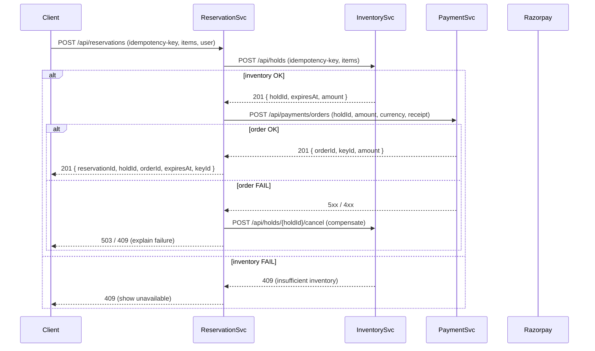

PSP notifies payment-service via a webhook.

payment service create a payment intent with the PSP. The PSP returns a secret id 

---

---

Are we dealing with currency exchange?

Different regions may have different sets of payment methods.

Do we need to support cash-based payment.

---

