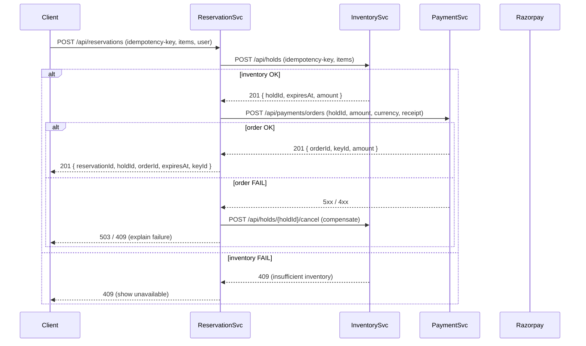

PSP notifies payment-service via a webhook.

payment service create a payment intent with the PSP. The PSP returns a secret id 


---



---
### Role of `payment.authorized` Webhook

When a customer makes a payment, the Razorpay Checkout typically sends a **client-side response** to your frontend via the **handler function** or **callback URL**.

However, due to network issues, browser crashes, or other interruptions, your frontend might **not receive this response** even though the payment was successfully authorized by the bank. This creates uncertainty about the payment status on your side.

The `payment.authorized` webhook event is triggered **when the customer's payment details are successfully authenticated and authorized by the bank**. Razorpay sends an **HTTP POST request** with the payment details to your configured webhook endpoint.  

This webhook acts as a **server-to-server notification**, independent of the client-side flow. Even if your frontend did not receive the payment response, your backend will be notified reliably through this webhook.

---
### EXTRA

Are we dealing with currency exchange?

Different regions may have different sets of payment methods.

Do we need to support cash-based payment.

---
### Payment Signature

The **Razorpay signature** (`razorpay_signature`) is a security feature provided by Razorpay to ensure the authenticity and integrity of a payment transaction. It is returned to you by the Razorpay Checkout form upon a successful transaction.  
  
This signature is a cryptographic hash generated using the order ID and payment ID, combined with your secret key. It helps you verify that the payment details received are indeed from Razorpay and have not been tampered with.  
  
### Why is it important?  
  
- **Security:** It prevents fraudulent activities by ensuring the payment data is genuine.  
- **Verification:** You must verify this signature on your backend server before marking the payment as completed.  

---
### How to verify the Razorpay Signature?  
  
You need to generate a hash on your server using the order ID, payment ID, and your secret key, then compare it with the `razorpay_signature` received. If they match, the payment is verified.


Sample Signature verification Code:

```
// package com.example.payment.razorpay;

import javax.crypto.Mac;
import javax.crypto.spec.SecretKeySpec;
import java.nio.charset.StandardCharsets;

public class RazorpaySignatureVerifier {

    private final String secret;

    public RazorpaySignatureVerifier(String secret) {
        this.secret = secret;
    }

    public boolean isValidSignature(String orderId, String paymentId, String razorpaySignature) {
        try {
            String payload = orderId + "|" + paymentId;

            Mac mac = Mac.getInstance("HmacSHA256");
            SecretKeySpec secretKeySpec =
                    new SecretKeySpec(secret.getBytes(StandardCharsets.UTF_8), "HmacSHA256");
            mac.init(secretKeySpec);

            byte[] digest = mac.doFinal(payload.getBytes(StandardCharsets.UTF_8));

            String actualSignature = toHex(digest);
            // Razorpay sends lowercase hex
            return actualSignature.equalsIgnoreCase(razorpaySignature);
        } catch (Exception e) {
            return false;
        }
    }

    private String toHex(byte[] bytes) {
        StringBuilder result = new StringBuilder();
        for (byte b : bytes) {
            result.append(String.format("%02x", b));
        }
        return result.toString();
    }
}
```
