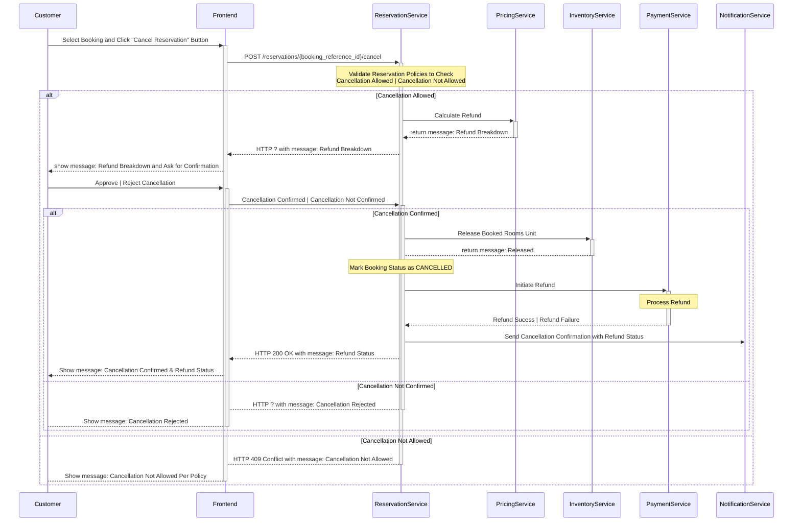

- In hotel systems, it’s often used to quickly find candidate hotels for a query like “hotels in Goa with pool and breakfast”.
    
- Instead of scanning the whole Hotel DB, you index hotel metadata (name, location, amenities, rating, etc.) in ES and query it very fast.
    
- ES usually gives you the top N candidates (say 200 hotel_ids) that you then pass to Inventory and Pricing.
    
- This way, you don’t overload Inventory with all hotels in the destination.

In Search Hotel flow, Inventory + Pricing call can run in parallel (with async futures / reactive programming) to reduce overall latency.

---

As **Search** and **Reservation** Service are public-facing APIs, they should be designed using **RESTful principles**. 

---

1. **User Management**: Allow users to register, log in, and manage their personal profiles and preferences.

2. **Hotel Search**: Enable users to search for hotels based on preferences such as location, travel dates, number of guests, and filters like price or amenities.

3. **Hotel Details Display**: Present hotel information including descriptions, photos, amenities, room types, occupancy limits, policies, and real-time pricing.

4. **Booking Management**: Support the complete booking flow, including reservations, confirmations, modifications, and cancellations.

5. **Payment Processing**: Provide secure payment handling with multiple methods, such as credit/debit cards, UPI, wallets, and net banking.

6. **Notifications**: Send booking confirmations, reminders, and updates through email, SMS, and push notifications.

7. **Inventory Management**: Enable hotels or administrators to manage room inventory, rates, and availability effectively.

---

- **Hotel Inventory Service**
    
    - Purpose: Check which hotels and rooms are available for the selected location and dates.
        
    - Why? Availability changes frequently, so this service maintains real-time room inventory to prevent overbooking.
        
- **Pricing Service**
    
    - Purpose: Get **real-time pricing** for each room type (considering demand, season, discounts).
        
    - Why? Prices fluctuate dynamically, so a dedicated service ensures accurate cost display during search.
        
- **Hotel Details Service**
    
    - Purpose: Provide metadata like **hotel description, amenities, photos, policies, and ratings**.
        
    - Why? This is static or semi-static information that enhances the user experience during hotel selection.

---

Caching is layered to attack the biggest byte and query hotspots first. At the application tier we cache the first pages of popular searches and hotel details in Redis with short TTLs (minutes) and versioned keys so writes can invalidate only affected entries. 

Availability is cached aggressively with very short TTLs (seconds) and write-through invalidation on successful bookings; even modest hit rates here shave milliseconds off end-to-end latency and protect the primary store. On the client and edge we leverage HTTP caching semantics—immutable, fingerprinted JS/CSS and pre-generated thumbnails—so repeat visits incur minimal transfer.

---

need to keep inventory service and hotel service in sync. 

---
### Use Case 4: Cancel a Reservation

Enable customers to cancel an existing reservation in accordance with policy, update inventory, and (if eligible) process a refund.

The following interactions describe the step-by-step flow between the **user interface** and the **backend components** during this operation:

1. The `Customer` selects an existing booking and clicks the “Cancel Reservation” button on the user interface. 

2. The `Frontend` sends a `POST /reservations/{booking_reference_id}/cancel` request to the `ReservationService`, along with the customer’s details.

3. The `ReservationService` first validates whether cancellation is allowed under the reservation’s terms, such as free cancellation deadlines, penalties, or non-refundable conditions.

	- If cancellation is eligible but charges apply, the `ReservationService` invokes the `PricingService` to calculate the applicable refund and prompts the `Customer` to confirm the cancellation.

	- If the policy does not allow cancellation, `ReservationService` immediately returns an error stating that cancellation is not possible.

4. Once the `Customer` confirms, the `ReservationService` releases the booked room units back into availability by communicating with the `InventoryService` and updates the booking status to `CANCELLED`.

5. In parallel, the `ReservationService` initiates the refund process by sending a request to the `PaymentService`, which in turn interacts with the `Payment Gateway` (such as a `Bank`, `CardProcessor`, or `UPIProvider`) to transfer the refund to the `Customer`. 

	- If the refund succeeds, the system continues normally.

	- If the refund fails, the booking remains cancelled, but the refund is flagged as pending and retried asynchronously.

6. After updating the booking and processing the refund, the `ReservationService` triggers the `NotificationService` to send a cancellation confirmation to the `Customer` through email, SMS, or push notification. 

7. Finally, the `Frontend` displays a confirmation message to the `Customer`, summarizing the cancellation details and refund status. This ensures the customer has a clear, transparent view of their cancellation outcome.

Sequence Diagram

---

