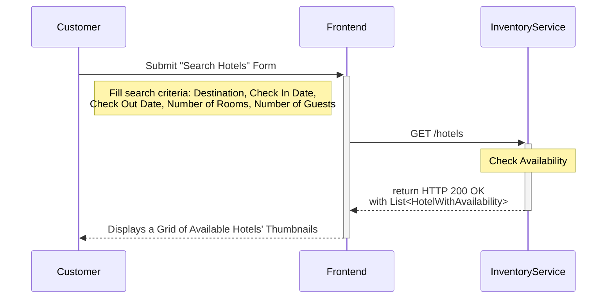
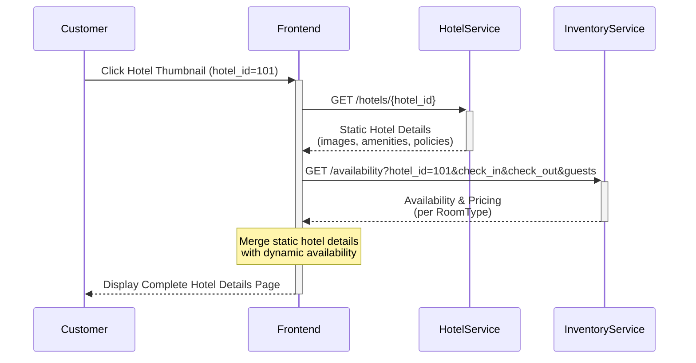
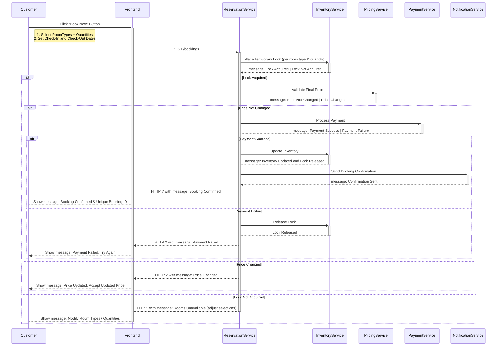

Let’s understand the **step-by-step sequence flow of each of the core use cases** to gain deeper insights into how the system works in practice.


<span style="color:red;">(design choices here are more focused on low level design principles and patterns)</span>

---
### Use Case 1: Search Hotels

The following interactions describe the step-by-step flow between the **user interface** and the **backend components** during this operation:

1. The `Customer` enters the search criteria such as `destination`, `check_in_date`,  `check_out_date` and submits the "Search Hotels" form.

2. The `Frontend` sends a `GET /hotels/hotel-listing` request to the `SearchService`, including the selected `destination`, `check_in_date` and `check_out_date` parameters.

3. The `SearchService` acts as an orchrestlooks up which `Hotels` have available `Rooms` for the given input and retrieves minimal information such as `hotel_Id`, `name`, `location`, `thumbnail_image`, `rating`, and the `lowest_available_price`.

4. Finally, the `InventoryService` returns a list of available `Hotels`, which the `Frontend` uses to display a grid of `Hotel` thumbnails.

<span style="color:green;font-weight:bold;">Sequence Diagram</span>



<span style="color:green;font-weight:bold;">Design Choice</span>

Keep `InventoryService` separate from `HotelService`.

The `HotelService` manages slow-changing information like hotel `names`, `locations`, `images`, `amenities`, `policies`, and `room type` definitions, which rarely change and can be stored in databases or cached for long periods. 

The `InventoryService` handles fast-changing data such as room availability, booking locks, and restrictions, which update constantly. 

Keeping them separate ensures `HotelService` is optimized for stable content while `InventoryService` is optimized for dynamic state. This way, the system achieves a clear separation of concerns, making it easier to maintain, scale, and evolve hotel-related information independently of transactional workflows.

<span style="color:red;">(extra)</span>

While the Hotel Service provides static metadata, the Inventory Service focuses solely on room counts, reservations, and holds, enabling the system to prevent overbooking and guarantee consistency during high-concurrency booking scenarios. By isolating availability logic in its own service, the system achieves scalability, reliability, and clear separation of concerns between metadata, pricing, and transactional workflows.

---
### Use Case 2: View Hotel Details

Enable customers to view complete information about a selected hotel, including its **amenities**, **images**, **policies**, and the **availability of room types for the specified dates**.

The following interactions describe the step-by-step flow between the **user interface** and the **backend components** during this operation:

1. The `Customer` clicks on a `Hotel` thumbnail (e.g., `hotel_id = 101`).

2. The `Frontend` sends a `GET /hotels/{hotel_id}` request to the `HotelService` to fetch complete static information about that specific hotel. This includes high-resolution `images`, `amenities`, `descriptions`, `policies` etc. 

3. In parallel, a `GET /availability?hotel_id=101&check_in&check_out&guests` request is sent to the `InventoryService` to fetch up-to-date availability and pricing for each `RoomType`.

4. Finally, the `Frontend` merges the static hotel details from the `HotelService` with the dynamic room availability from the `InventoryService`, forming a complete hotel detail view. 

<span style="color:green;font-weight:bold;">Sequence Flow</span>



---
### Use Case 3: Make a Reservation

Enable customers to select a hotel and room type, provide guest details, make payment, and confirm a booking.

The following interactions describe the step-by-step flow between the **user interface** and the **backend components** during this operation:

1. The `Customer` selects one or more desired `RoomTypes` and specifies the `quantity` for each, along with the intended `check_in_date` and `check_out_date`. Once the selection is complete, the `Customer` clicks the “Book Now” button to proceed with the booking.

2. The `Frontend` sends a `POST \bookings` request to the `ReservationService`, including all reservation parameters and the `pricing_snapshot` to <span style="color:green;font-weight:bold;background:beige;">verify price consistency at checkout</span>.

<span style="color:red;">(will make an idempotency check - add this here)</span>

3. The `ReservationService` calls the `InventoryService` to place a temporary lock on the requested rooms. <span style="color:green;font-weight:bold;background:beige;">This prevents other customers from booking the same rooms while the current booking is in progress</span>. 

	- If the lock is successful, the `ReservationService` calls the `PricingService` to validate the final booking price. <span style="color:green;font-weight:bold;background:beige;">This ensures that the customer is charged the most up-to-date amount and avoids discrepancies with the earlier displayed pricing.</span>

	- If the rooms are not available, the `ReservationService` returns an error to the `Frontend`, prompting the `Customer` to revise their selection.

4. Once the pricing is confirmed, the `ReservationService` initiates the payment process by sending a request to the `PaymentService`, which in turn communicates with an external `Payment Gateway` such as a `Bank`, `CardProcessor`, or `UPIService`.

	- If the payment succeeds, the `ReservationService` finalizes the booking by persisting the `Reservation`, updating the `InventoryService` to permanently reduce room availability and triggering the `NotificationService` to send a booking confirmation to the customer via email, SMS, or push notification.

	- If the payment fails, the `ReservationService` releases the locked rooms in `InventoryService` and notifies the `Frontend` so the `Customer` can attempt payment again or choose another method.

5. Finally, the `Frontend` displays a "Booking Confirmation" page to the `Customer` containing the reservation details along with a unique `booking_reference_id`.

<span style="color:green;font-weight:bold">Sequence Diagram</span>



> **Design Choice: Keep `PricingService` separate from `InventoryService`**
> 
> The `InventoryService` should focus only on availability while the `PricingService` should handle all price-related logic such as base rates, taxes, discounts and dynamic pricing. 
> 
> Separating them ensures clear responsibilities, accurate price re-verification at checkout, and flexibility to support promotions, personalization, and advanced yield models without complicating inventory code.

<span style="color:red">(extra - include this in above explanation)</span>

The booking process is designed as a two-step flow to ensure availability and payment integrity:

1. Book Now (Initiation)
    - When the user clicks Book Now, the system creates a reservation record in PENDING status.
    - A temporary inventory hold is placed to prevent the same room from being booked by another user.
    - The API responds with a reservationId and a payment session/redirect URL, which the client uses to proceed to payment.
    
2. Pay Now (Finalization)
    
    - When the user clicks Pay Now (or when the payment gateway callback occurs), the system verifies that the inventory hold is still valid.
    - It then processes the payment request with the payment provider.
    - If successful, the temporary hold is converted into a confirmed allocation, the reservation status is updated to CONFIRMED, and payment details are persisted.
    - Notifications are triggered (e.g., email/SMS).
    - If payment fails or the hold has expired, the system releases the hold and marks the reservation as FAILED or EXPIRED.

---

<span style="color:purple;font-weight:bold;">Advantages of separating</span> **room_types (hotelDB)** <span style="color:purple;font-weight:bold;">and</span> **room_inventory (inventoryDB)**

1. **Clear service ownership / bounded context**: Each service (HotelService vs InventoryService) owns its data model and lifecycle; teams can work independently.

2. **Independent scaling and resource tuning**: <span style="color:red;font-weight:bold;">Inventory workloads (frequent writes/updates, time-series queries) can be tuned differently (IO, partitioning, retention)</span> from hotel metadata (reads, joins).

3. **Optimized storage & indexing per workload**: <span style="color:red;font-weight:bold;">Inventory can be optimized for date-range queries, partitioned by month, use different indexes or even a time-series DB; room_types stays normalized for catalog queries.</span>

4. **Reduced contention and better performance:** <span style="color:red;font-weight:bold;">High-rate inventory updates won’t lock or bloat hotel metadata tables; write-heavy inventory does not impact reads on hotel data.</span>

5. **Flexible technology choice:** <span style="color:red;font-weight:bold;">Use the best DB per need (Postgres for room_types, a time-series DB or scaled Postgres for inventory) without forcing one model on both.</span>

6. **Security and compliance separation**: Different access control, retention, or audit policies per domain (inventory may have different SLA/retention requirements).

<span style="color:purple;font-weight:bold;">Short trade-offs to be aware of:</span>

1. **No cross-DB foreign keys**: you must use stable identifiers (UUIDs) or denormalize/replicate minimal metadata.

2. **Increased operational complexity:** cross-service calls, sync/consistency, monitoring, and distributed transactions (usually avoided).

3. **Potential eventual consistency**: <span style="color:red;font-weight:bold;">need strategies: synchronous lookups, denormalized copies, or event-driven replication.</span>

---
### Booking Workflow

**Option 1:**

When user clicks `Book Now` button, a request is sent to the inventory service to create a hold with `status = CREATED` and `expiry_date = NULL` for the request and update the inventory for the selected room types (using pessimistic locking). 

- If all inventory updates succeed, update the `status = CONFIRMED` and `expiry_at = DATETIME` attributes of the created hold.

- If anything fails, all updates to the database are reverted, including the created hold.

**Idempotency Check:** In case the user clicks the `Book Now` button multiple times, the hold will ensure that no inventory updates take place if a hold is active.

If the hold has expired when the user clicks the `Pay Now` button, the payment workflow will check the hold expiry and return stating `Inventory hold expired`.

If the hold expired while the payment was in-progress:
- If the payment completes, mark the hold as confirmed.
- If the payment fails, mark the hold as cancelled and revert the inventory updates. 

---
### What happens right after Razorpay says “payment successful”?

From Razorpay / frontend you basically get:

- `razorpay_payment_id`
- `razorpay_order_id`
- `razorpay_signature`
- plus your own context: `reservationId`, `holdId`, `amount`, etc.

Now someone has to:

1. **Verify the payment** (signature, amount, status) with Razorpay.
2. **Persist the payment record** (SUCCESS / FAILED etc.).
3. **Trigger domain changes**:
    
    - finalize reservation;
    - convert / confirm inventory hold;
    - maybe send emails, invoices, loyalty points, etc.

4. Handle **weird cases**:
    
    - payment is captured but reservation confirm fails;
    - duplicate callbacks / retries;
    - refunds / partial captures later.

<span style="color:red;font-weight:bold;">All of these are deeply _payment-centric_ concerns. That’s why the payment service should drive this, not reservation.</span>

---
### Why transactions matter SO much in payment flows

**Prevent** **partial state corruption**

Imagine this horrible scenario without a transaction:

1. You verify Razorpay signature → update Payment status to `SUCCESS_CLIENT_CALLBACK`.
2. **Before** you orchestrate hold/reservation calls…
3. DB update is saved.
4. Then the method throws an exception (network issue, service down, etc.).
5. Payment record is stuck halfway:
    - It says “signature validated”
    - But reservation is not finalized
    - Hold is not consumed
    - Payment is neither `SUCCESS` nor fully `FAILED`

This is a **corrupted state** → impossible to reliably recover from.

`@Transactional` prevents this by:

- NOT committing anything until the whole method returns successfully.

**Important subtle point:** `@Transactional` does **NOT** make downstream REST calls transactional.

Those happen outside DB boundaries. But it **DOES** protect your internal state. This is how sagas are normally written:

- Local DB changes → transactional (atomic)
- External service calls → outside transaction
- If an external call fails → you handle compensation (update DB state to reflect partial failure)

Without `@Transactional`, your saga breaks.

**Example**:

Inside your method you do:

```
payment.setStatus(SUCCESS_CLIENT_CALLBACK);
paymentRepository.save(payment);

inventoryClient.consumeHold(...); // external call
reservationClient.confirmReservation(...); // external call

payment.setStatus(SUCCESS);
paymentRepository.save(payment);
```

With `@Transactional`:

- If anything fails before the method completes → **no change** is saved
- If all steps succeed → both updates are committed together

Without it:

- You could save `SUCCESS_CLIENT_CALLBACK`
- Then hit an exception
- Leaving payment stuck forever in an incomplete state

This is how bookings get into “limbo” and cost people money.

---


