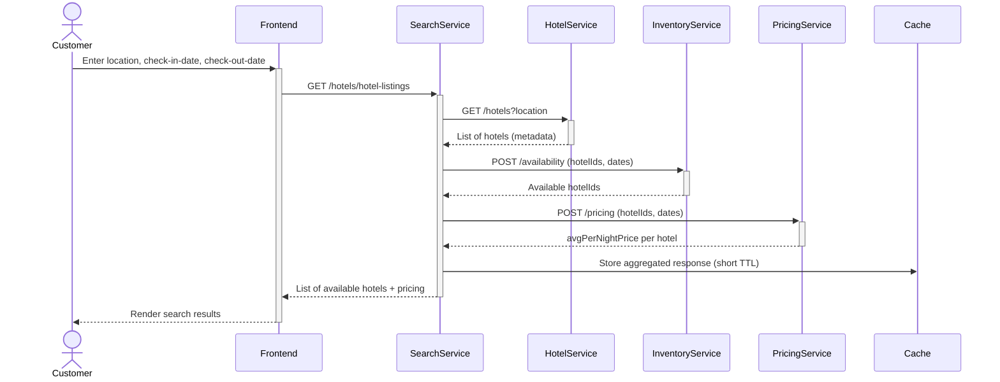
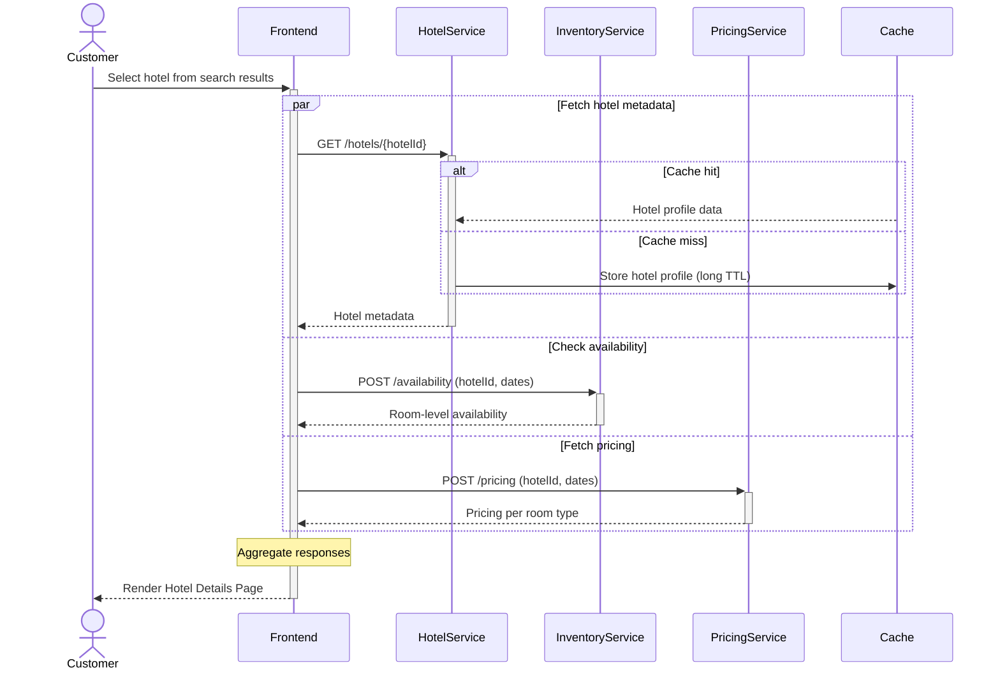
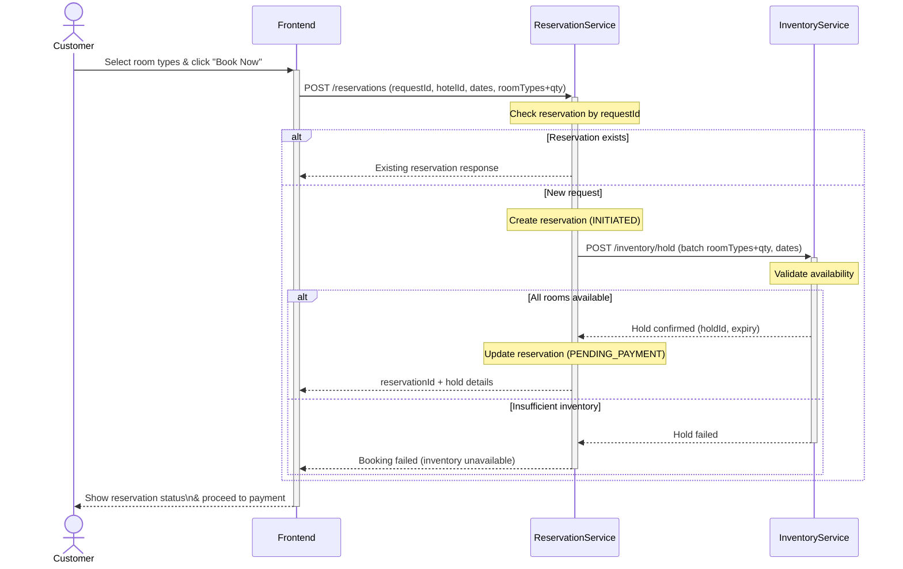
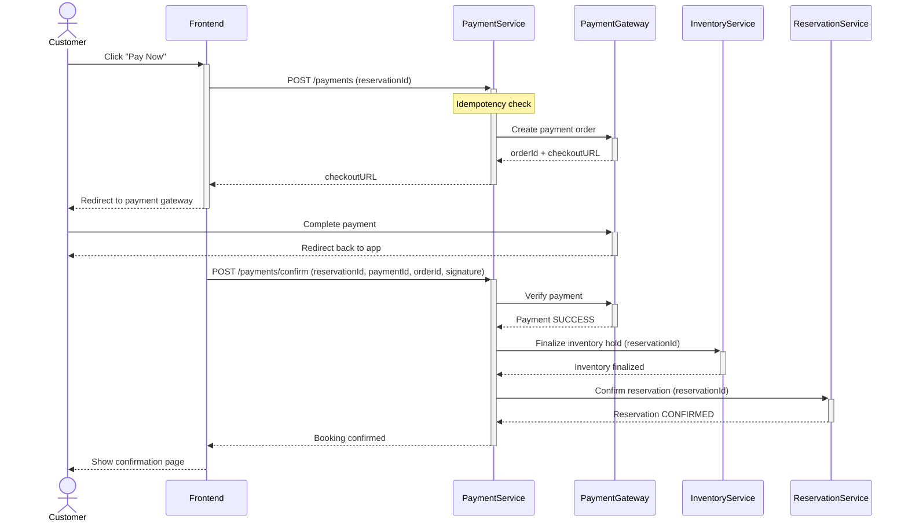

Let’s understand the **step-by-step sequence flow of each of the core use cases** to gain deeper insights into how the system works in practice.


<span style="color:red;">(design choices here are more focused on low level design principles and patterns)</span>

---
### Use Case 1: Search Hotels

A straightforward approach would be to let a single `SearchService` own all data required for hotel search. However, a search query inherently requires combining **two fundamentally different categories of data**. 

- On one side, it relies on relatively static information such as hotel names, locations, images, amenities, policies, and room-type definitions, that changes infrequently and can be aggressively cached. 

- On the other side, it depends on highly dynamic data like room availability and pricing, which can change frequently due to bookings, demand fluctuations, or pricing rules.

Treating both data types uniformly forces the system to optimize for the most volatile data, which increases latency, reduces cache effectiveness, and wastes compute resources. To avoid this, the system can be decomposed into specialized services. 

- A dedicated `HotelService` can manage stable hotel profile content and be optimized for read-heavy access and aggressive caching. 

- An `InventoryService` can handle fast-changing room availability with a focus on freshness and concurrency control, while a `PricingService` can manage dynamic pricing logic and frequent updates.

- The `SearchService` can then act as an **orchestrator**, coordinating calls to these backend services, retrieving static and dynamic data in parallel, and aggregating the results into a unified search response.

The following interactions describe the step-by-step flow between the **user interface** and the **backend components** during this operation:

1. The `Customer` enters the search criteria such as `location`, `checkInDate`,  `checkOutDate` and submits the **Search Hotels** form.

2. The `Frontend` sends a `GET /hotels/hotel-listings` request to the `SearchService`, including all the selected form parameters: `location`, `checkInDate` and `checkOutDate`.

3. The `SearchService` coordinates with downstream services to determine hotel availability and pricing.  

	- **Hotel Lookup**: Sends a GET request to the `HotelService` to fetch all hotels listed for the selected `location`.  

	- **Availability Check**: For the list of hotels returned, it queries the `InventoryService` to identify hotels with at least one available room for the specified `checkInDate` and `checkOutDate`.

	- **Pricing Calculation**: For hotels with availability, it calls the `PricingService` to retrieve the `avgPerNightPrice` for the selected date range.

4. After aggregating hotel metadata, availability, and pricing information, the `SearchService` caches the final response (short TTL) and returns a list of available hotels to the `Frontend`.

5. The `Frontend` renders the response as a grid of `Hotel` cards, displaying key details such as: `hotelName`, `avgPricePerNight`, `availability`, `rating`, etc.

<span style="color:green;font-weight:bold;">Sequence Diagram</span>




This design allows each service to scale independently, minimizes performance interference, and ensures fast search responses without compromising the accuracy required for downstream booking flows.

---
### Use Case 2: View Hotel Details

The **View Hotel Details** use case differs from **Search Hotels** in both **scope and load characteristics**. While hotel search is optimized for high-volume traffic and aggregated results across many hotels, viewing hotel details is a **low-volume, deep read** focused on a single hotel. This interaction typically involves richer data such as detailed descriptions, images, amenities, policies, and room-level information.

Unlike the Search Hotels flow, where the `SearchService` acts as an orchestrator, the **frontend can directly coordinate** with the `HotelService`, `InventoryService`, and `PricingService` to render the hotel details page.

The following interactions describe the step-by-step flow between the **user interface** and the **backend components** during this operation:

1. The `Customer` selects a hotel from the search results on the user interface.

2. The `Frontend` issues **three asynchronous requests** in parallel:

	- Sends a `GET /hotels/{hotelId}` request to the `HotelService` to retrieve static hotel information such as the hotel name, descriptions, amenities, and policies (typically served from cache, with database fallback).

	- Sends a `POST /availability` request to the `InventoryService` to retrieve room-level availability for the selected date range.

	- Sends a `POST /pricing` request to the `PricingService` to calculate and fetch pricing details for each available room type.

3. The `Frontend` aggregates responses from the `HotelService`, `InventoryService`, and `PricingService`, and renders the **Hotel Details Page**, displaying hotel profile information along with available room types and their corresponding prices.

<span style="color:green;font-weight:bold;">Sequence Flow</span>




This approach avoids unnecessary backend orchestration, reduces end-to-end latency, and simplifies the request flow, while still preserving clean service boundaries and strict data ownership.

**When Frontend Aggregation Is a Good Approach (only for reference)**

This pattern is well-suited when the use case has **moderate or low request volume**, such as **View Hotel Details**. Each user action typically results in one page load, not repeated or bursty traffic like search. The frontend making a few additional calls does not create scaling issues.

The frontend aggregation works well when orchestration is limited to:

- Calling services in parallel
- Passing user-selected parameters
- Merging responses for display  
- There is no complex decision-making, workflow state, or transactional logic involved.

Frontend aggregation is appropriate when:

- Data can be slightly inconsistent (eventual consistency is acceptable)
- There is no need for atomic guarantees across services  
    For example, viewing availability and pricing does not require the same guarantees as booking.

---
### Use Case 3: Make Reservations

Using a single `ReservationService` to handle the entire booking lifecycle (inventory locking, payment coordination, reservation confirmation) may appear simpler, but it introduces significant architectural drawbacks. 

The reservation flow involves **multiple domains with very different reliability, latency, and consistency characteristics**, particularly inventory management and payment processing. Coupling these responsibilities into a single service increases complexity, enlarges the failure blast radius, and makes it harder to reason about correctness and recovery.

To address these issues, the reservation workflow can be designed as a **two-part process with split orchestration responsibilities**.

##### Phase 1: Reservation Initiation & Inventory Hold

The `ReservationService` can orchestrate the booking initiation and inventory locking phase. It can coordinate with the `InventoryService` to place a **temporary hold** on the selected inventory, preventing double booking while payment is in progress.

The following interactions describe the step-by-step flow between the **user interface** and the **backend components** during this operation:

1. The `Customer` selects one or more **room types** and clicks **Book Now** on the user interface.

2. The `Frontend` sends a `POST /reservations` request to the `ReservationService`, including `requestId (idempotency key)`, `hotelId`, `checkInDate`, `checkOutDate` and selected room types with quantities  (e.g., `{ roomTypeA: 2, roomTypeB: 1 }`).

3. The `ReservationService` first checks whether a reservation already exists for the given `requestId`:

	- If a matching reservation exists, it returns the existing response.

	- If not, it creates a **new reservation record** in the **INITIATED** state.

4. The `ReservationService` then calls the `InventoryService` with a **single batch request** to place **temporary holds** for all selected room types and quantities for the given date range.

5. The `InventoryService` verifies availability for **each room type and requested quantity**:

	- If sufficient inventory exists for all requested rooms, it places a **temporary inventory hold** and returns a hold confirmation.

	- If any room type cannot be fulfilled, the request fails and no holds are created.

6. On successful hold creation, the `ReservationService` updates the reservation record with  the hold details, expiration timestamp, and transitions it to the **PENDING_PAYMENT** state.

7. Finally, the `ReservationService` returns the `reservationId` along with inventory hold details and the hold expiration timestamp to the frontend, enabling the user to proceed with payment.



##### Phase 2: Payment Processing & Reservation Confirmation

Payment processing depends on **external systems** that are inherently unreliable and slow. Payment gateways may time out, send duplicate callbacks, or complete payments asynchronously. Handling retries, idempotency, webhook verification, and reconciliation are therefore **core responsibilities of the `PaymentService`**, not the `ReservationService`.

By allowing the `PaymentService` to orchestrate this phase, payment-related failures and retries are **isolated from critical reservation state**, preventing gateway instability from corrupting booking data. The `PaymentService` can independently verify the payment with the external gateway, coordinate with the `InventoryService` to finalize the inventory hold, and then invoke the `ReservationService` to **confirm the reservation**. 

This sequencing guarantees that reservations are finalized **only after successful payment**, while keeping payment-specific failure handling fully decoupled from core booking logic.

The following interactions describe the step-by-step flow between the **user interface** and the **backend components** during this operation:

1. The `Customer` clicks **Pay Now** on the user interface after reviewing the reservation details.

2. The `Frontend` sends a `POST /payments` request to the `PaymentService`, including the `reservationId`.

3. The `PaymentService` validates the request, performs an **idempotency check**, creates a **payment order** with the external payment gateway and returns the **checkout URL along with the payment order details** to the `Frontend`.

4. The `Frontend` redirects the `Customer` to the **payment gateway checkout page** to complete the payment.

5. After the payment is completed, the frontend calls `POST /payments/confirm` on the `PaymentService` with the `reservationId` and payment verification details.

6. The `PaymentService` verifies the payment status with the payment gateway. Upon successful payment verification, the `PaymentService` calls the `InventoryService` to **finalize the inventory hold**, converting the temporary hold into a permanent allocation.

7. After inventory finalization succeeds, the `PaymentService` calls the `ReservationService` to **confirm the reservation**, transitioning it from **PENDING_PAYMENT** to **CONFIRMED**.

8. The `PaymentService` records the final payment state and responds to the `Frontend` with a successful booking confirmation.
    
9. The `Frontend` updates the `Customer`, displaying the booking confirmation and completion status.



This split orchestration model improves **fault isolation, scalability, and correctness**, while keeping service responsibilities clean and aligned with their respective domains.

**(only for reference)**

Payment processing, in particular, depends on **external gateways** that are inherently unreliable and slow, and requires idempotency, retries, and asynchronous callbacks. Embedding this logic directly into the `ReservationService` risks destabilizing critical reservation state during gateway failures or timeouts. 

Additionally, inventory operations require **strong consistency and precise concurrency control**, which conflicts with the eventual consistency and retry-oriented nature of payment workflows. Forcing both concerns into one service either overcomplicates the implementation or weakens correctness guarantees.

> **Design Choice: Keep `PricingService` separate from `InventoryService`**
> 
> The `InventoryService` should focus only on availability while the `PricingService` should handle all price-related logic such as base rates, taxes, discounts and dynamic pricing. 
> 
> Separating them ensures clear responsibilities, accurate price re-verification at checkout, and flexibility to support promotions, personalization, and advanced yield models without complicating inventory code.

<span style="color:red">(extra - include this in above explanation)</span>

The booking process is designed as a two-step flow to ensure availability and payment integrity:

1. Book Now (Initiation)
    - When the user clicks Book Now, the system creates a reservation record in PENDING status.
    - A temporary inventory hold is placed to prevent the same room from being booked by another user.
    - The API responds with a reservationId and a payment session/redirect URL, which the client uses to proceed to payment.
    
2. Pay Now (Finalization)
    
    - When the user clicks Pay Now (or when the payment gateway callback occurs), the system verifies that the inventory hold is still valid.
    - It then processes the payment request with the payment provider.
    - If successful, the temporary hold is converted into a confirmed allocation, the reservation status is updated to CONFIRMED, and payment details are persisted.
    - Notifications are triggered (e.g., email/SMS).
    - If payment fails or the hold has expired, the system releases the hold and marks the reservation as FAILED or EXPIRED.

---

<span style="color:purple;font-weight:bold;">Advantages of separating</span> **room_types (hotelDB)** <span style="color:purple;font-weight:bold;">and</span> **room_inventory (inventoryDB)**

1. **Clear service ownership / bounded context**: Each service (HotelService vs InventoryService) owns its data model and lifecycle; teams can work independently.

2. **Independent scaling and resource tuning**: <span style="color:red;font-weight:bold;">Inventory workloads (frequent writes/updates, time-series queries) can be tuned differently (IO, partitioning, retention)</span> from hotel metadata (reads, joins).

3. **Optimized storage & indexing per workload**: <span style="color:red;font-weight:bold;">Inventory can be optimized for date-range queries, partitioned by month, use different indexes or even a time-series DB; room_types stays normalized for catalog queries.</span>

4. **Reduced contention and better performance:** <span style="color:red;font-weight:bold;">High-rate inventory updates won’t lock or bloat hotel metadata tables; write-heavy inventory does not impact reads on hotel data.</span>

5. **Flexible technology choice:** <span style="color:red;font-weight:bold;">Use the best DB per need (Postgres for room_types, a time-series DB or scaled Postgres for inventory) without forcing one model on both.</span>

6. **Security and compliance separation**: Different access control, retention, or audit policies per domain (inventory may have different SLA/retention requirements).

<span style="color:purple;font-weight:bold;">Short trade-offs to be aware of:</span>

1. **No cross-DB foreign keys**: you must use stable identifiers (UUIDs) or denormalize/replicate minimal metadata.

2. **Increased operational complexity:** cross-service calls, sync/consistency, monitoring, and distributed transactions (usually avoided).

3. **Potential eventual consistency**: <span style="color:red;font-weight:bold;">need strategies: synchronous lookups, denormalized copies, or event-driven replication.</span>

---
### Booking Workflow

**Option 1:**

When user clicks `Book Now` button, a request is sent to the inventory service to create a hold with `status = CREATED` and `expiry_date = NULL` for the request and update the inventory for the selected room types (using pessimistic locking). 

- If all inventory updates succeed, update the `status = CONFIRMED` and `expiry_at = DATETIME` attributes of the created hold.

- If anything fails, all updates to the database are reverted, including the created hold.

**Idempotency Check:** In case the user clicks the `Book Now` button multiple times, the hold will ensure that no inventory updates take place if a hold is active.

If the hold has expired when the user clicks the `Pay Now` button, the payment workflow will check the hold expiry and return stating `Inventory hold expired`.

If the hold expired while the payment was in-progress:
- If the payment completes, mark the hold as confirmed.
- If the payment fails, mark the hold as cancelled and revert the inventory updates. 

---
### What happens right after Razorpay says “payment successful”?

From Razorpay / frontend you basically get:

- `razorpay_payment_id`
- `razorpay_order_id`
- `razorpay_signature`
- plus your own context: `reservationId`, `holdId`, `amount`, etc.

Now someone has to:

1. **Verify the payment** (signature, amount, status) with Razorpay.
2. **Persist the payment record** (SUCCESS / FAILED etc.).
3. **Trigger domain changes**:
    
    - finalize reservation;
    - convert / confirm inventory hold;
    - maybe send emails, invoices, loyalty points, etc.

4. Handle **weird cases**:
    
    - payment is captured but reservation confirm fails;
    - duplicate callbacks / retries;
    - refunds / partial captures later.

<span style="color:red;font-weight:bold;">All of these are deeply _payment-centric_ concerns. That’s why the payment service should drive this, not reservation.</span>

---
### Why transactions matter SO much in payment flows

**Prevent** **partial state corruption**

Imagine this horrible scenario without a transaction:

1. You verify Razorpay signature → update Payment status to `SUCCESS_CLIENT_CALLBACK`.
2. **Before** you orchestrate hold/reservation calls…
3. DB update is saved.
4. Then the method throws an exception (network issue, service down, etc.).
5. Payment record is stuck halfway:
    - It says “signature validated”
    - But reservation is not finalized
    - Hold is not consumed
    - Payment is neither `SUCCESS` nor fully `FAILED`

This is a **corrupted state** → impossible to reliably recover from.

`@Transactional` prevents this by:

- NOT committing anything until the whole method returns successfully.

**Important subtle point:** `@Transactional` does **NOT** make downstream REST calls transactional.

Those happen outside DB boundaries. But it **DOES** protect your internal state. This is how sagas are normally written:

- Local DB changes → transactional (atomic)
- External service calls → outside transaction
- If an external call fails → you handle compensation (update DB state to reflect partial failure)

Without `@Transactional`, your saga breaks.

**Example**:

Inside your method you do:

```
payment.setStatus(SUCCESS_CLIENT_CALLBACK);
paymentRepository.save(payment);

inventoryClient.consumeHold(...); // external call
reservationClient.confirmReservation(...); // external call

payment.setStatus(SUCCESS);
paymentRepository.save(payment);
```

With `@Transactional`:

- If anything fails before the method completes → **no change** is saved
- If all steps succeed → both updates are committed together

Without it:

- You could save `SUCCESS_CLIENT_CALLBACK`
- Then hit an exception
- Leaving payment stuck forever in an incomplete state

This is how bookings get into “limbo” and cost people money.

---


