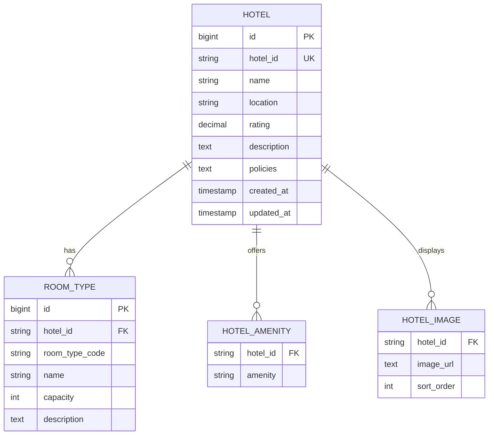
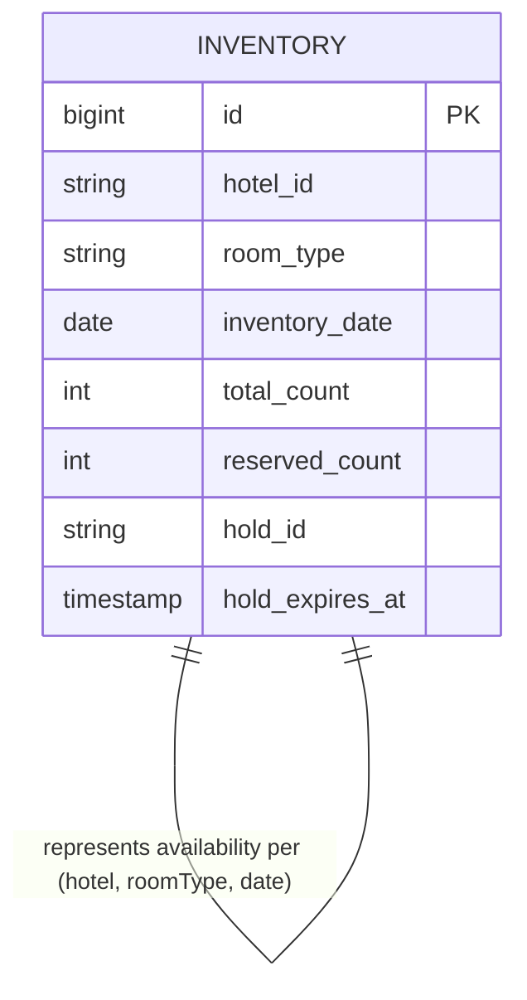
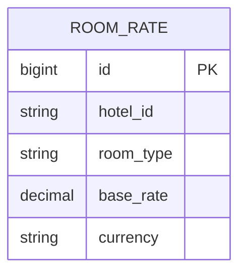
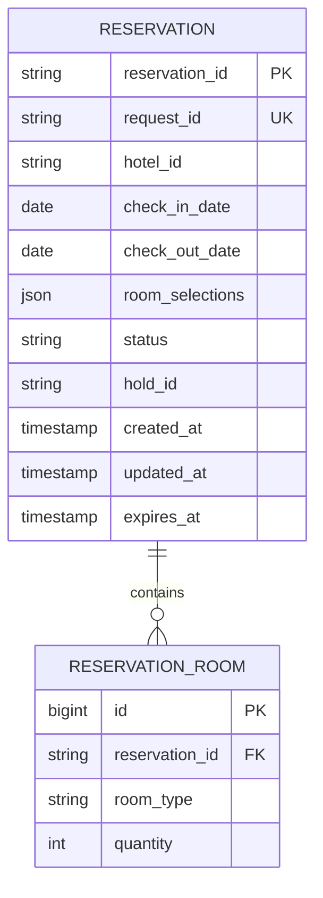
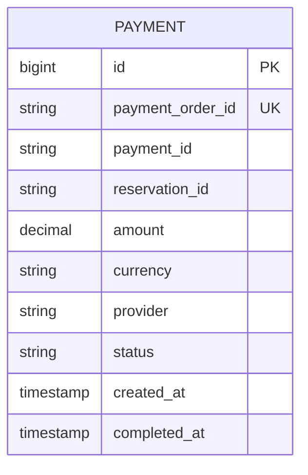

Different parts of the system evolve at very different rates and under different constraints. For example, hotel profile information such as names, amenities, and images changes infrequently and is primarily read-heavy, while inventory and reservation data changes constantly and must be updated with strong consistency under high concurrency. 

By designing schemas around these change characteristics, each service can use storage structures, indexing strategies, and transactional guarantees that best fit its data. This approach naturally leads to different schemas and storage patterns across services, avoids forcing one-size-fits-all models, and prevents slow-moving, read-heavy data from interfering with fast-changing, correctness-critical workflows like booking and payment.


Let’s examine the **data models** for each core service, focusing on the queries they must support, how their data volumes are expected to grow over a 10-year horizon, and the **partitioning, indexing, and storage strategies** required to sustain scalability, reliability, and performance at scale.

---
### Hotel Service

The Hotel Service primarily supports the following query types:

- Fetch a list of hotels by `location` (used by Search Service)
- Fetch a complete hotel profile by `hotelId` (used by Hotel Details page)
- Fetch room-type definitions for a hotel

These queries are primarily **read-heavy** and designed to return results quickly with **low latency**. They do not require strict correctness guarantees because they deal with static or slow-changing data, and updates are **rare and infrequent**, meaning concurrent writes are uncommon. This makes them well suited for caching and read-optimized database access.

#### Schema Design



Since this data changes infrequently and does not participate in transactional booking workflows, its schema is intentionally kept **simple and normalized**, modeling only static metadata.

##### Database Choice

A **relational database** works well for the Hotel Service because the data is clearly structured and naturally fits into tables with relationships.

In addition, schema changes are easy to manage for slow-changing data, and constraints like unique `hotelId` or `(hotelId, roomType)` can be enforced directly at the database level, keeping the data clean and reliable with minimal application logic.

##### Indexing Strategy

The Hotel Service indexing strategy focuses on keeping **read queries fast and predictable**. 

A primary key and unique index on `hotelId` enable quick access to individual hotel profiles, while a composite index on `(hotelId, roomTypeCode)` allows efficient retrieval of room-type definitions for a specific hotel. 

For search queries that filter hotels by location, relying on a full table scan would be inefficient at scale and lead to high I/O and inconsistent latency. Introducing a B-tree index on `locationId` allows the database to locate matching rows directly through index lookups, avoiding full scans and significantly improving performance for low-latency search endpoints.

##### Data Growth (10-Year Horizon)

Hotel metadata grows **slowly and in a highly predictable manner**, driven primarily by the onboarding of new hotels rather than frequent updates to existing records.

```json
- Assumption: Total Hotels over 10-Year span = 1 Million
- Average Hotel Record Size = 1 KB (with indexes)
- Total Storage for Hotels = 1,000,000 × 1 KB = 1 GB
```

Each hotel is associated with a **bounded and fixed** set of room types, amenities, and images. 

There are no unbounded collections or time-series–style inserts in this model. As a result, even over a 10-year horizon and at large scale, the overall data footprint remains modest and easy to manage compared to dynamic datasets such as inventory or reservations.

##### Partitioning Strategy

Partitioning is **not required initially** due to low write volume and predictable growth. If needed at very large scale, partitioning or sharding can be introduced by `location` (regional sharding).

---
### Inventory Service

The Inventory Service must support several correctness-critical query patterns:

- Check availability for a hotel across a **date range**
- Place **temporary holds** on inventory for selected room types and quantities
- Confirm or release previously held inventory
- Batch availability checks across multiple hotels for search

These queries are **write-heavy and highly contended**, with multiple users often trying to update the same inventory records at the same time.

#### Schema Design



The schema is designed to support **strong consistency, fine-grained updates, and high write contention**, while still enabling efficient availability queries for search and booking flows.

#### Database Choice

A **relational database** is well suited for the Inventory Service because it provides strong transactional guarantees and supports row-level locking, which are essential for handling concurrent inventory holds safely. 

Pessimistic locking mechanisms like `SELECT … FOR UPDATE` allow the system to serialize competing booking requests and prevent race conditions that could lead to overbooking. Since inventory correctness is more important than raw throughput, a strongly consistent relational database is a better choice than NoSQL or eventually consistent stores, which could allow conflicting updates and compromise booking accuracy.

#### Indexing Strategy

Search and booking operations routinely filter inventory by `hotelId`, `roomType`, and `date`. Without proper indexing, these queries would degrade into **sequential scans over millions of rows**, especially when validating availability across multiple consecutive dates. This would lead to high I/O, lock contention, and unpredictable latency.

By introducing a composite B-tree index on `(hotelId, roomType, date)`, the database can efficiently locate the exact inventory rows required and perform fast range scans over booking windows, ensuring consistent performance for both search and booking workflows.

An optional index on `holdId` supports quick lookup during **confirm** and **release** operations, which are triggered frequently during payment success, failure, or timeout flows.

##### Data Growth (10-Year Horizon)

As the number of hotels grows, **inventory data expands multiplicatively** across room types and calendar days, making it the fastest-growing dataset in the system.

```json
- Assumptions:
    - Total Hotels = 1,000,000
    - Avg Room Types per Hotel = 3 (Standard, Deluxe, Suite)
    - Days per Year = 365

- Rows per Year
    = 1,000,000 × 3 × 365
    ≈ 1,095,000,000 ≈ 1.1 - 1.2 Billion rows

- Avg Row Size = ~50 bytes

- Total Storage (10-Year Horizon)
    = 10 × 1,200,000,000 × 50 bytes
    ≈ 600,000,000,000 bytes ≈ 0.6 TB

```

Because inventory is modeled at the **(hotel × roomType × date)** level, even modest growth in hotels results in massive data expansion over time. This makes inventory the **largest and most rapidly growing dataset** in the platform.

#### Partitioning Strategy

Partitioning the **Inventory** table by **date on a monthly basis** is a practical and scalable approach, given the data’s time-series nature and rapid growth. By organizing records into monthly partitions (for example, `inventory_2025_01`, `inventory_2025_02`, and so on), the system keeps **active inventory data** for current and upcoming dates compact and efficient to query, while naturally isolating older data.

Most availability checks, inventory holds, and booking updates operate on a **small future window**, typically the next 30–90 days. With monthly partitioning, the database only scans the partitions whose date ranges overlap the query, instead of the entire table. This significantly reduces I/O, lowers lock contention, and improves overall query performance under concurrent load.

From an operational perspective, recent partitions, such as the next **6–8 months**, can be kept on **fast, writable storage** and tuned for low-latency reads and writes, since this is where the majority of search and booking traffic is concentrated. Older partitions, which are rarely accessed for live bookings, can be **archived or moved to cheaper storage**, keeping the primary database lean and performant while still preserving historical data when needed.

---
### Pricing Service

The Pricing Service primarily supports the following queries:

- Fetch base rates for a given `(hotelId, roomType)`
- Fetch **bulk average per-night prices** for multiple hotels (used by Search Service)
- Compute final prices for a hotel, room type, and date range

These queries are **mostly read-heavy and focused on computation**, with very little write activity or contention.

#### Schema Design



The schema is designed to support **fast, read-heavy access** and **deterministic price calculations**, while remaining small, stable, and easy to evolve as pricing rules change.

#### Database Choice

A **relational database** works well for the Pricing Service because the data is structured and easy to model with tables and relationships. While strong consistency is available, it is not heavily stressed since pricing data changes infrequently. 

Schema changes are simple to manage over time, and index-based lookups provide fast and predictable reads. Because writes are rare, the database easily handles the workload without performance issues.

#### Indexing Strategy

A composite index on `(hotelId, roomType)` enables quick base-rate lookups, while optional date-range indexes support efficient rule evaluation. Frequently accessed pricing data can also be cached in memory to further reduce database load.

#### Data Growth (10-Year Horizon)

Pricing data grows **slowly and in a very controlled way**. Each hotel typically has only one base rate per room type, the number of pricing rules is limited, and there are no per-booking or time-series records generated. Because of this, even as the platform scales over many years, the overall size of pricing data remains **small and manageable**, especially when compared to rapidly growing datasets like inventory or reservations.

#### Partitioning Strategy

Partitioning is **not needed at the beginning** because pricing data is small and access patterns are stable. If the system grows significantly in the future, `room_rates` can be sharded by `hotelId`. 

However, most scalability for the Pricing Service comes from **caching and stateless price computation**, rather than complex database partitioning.

---
### Reservation Service

The Reservation Service must support the following queries efficiently:

- Create a reservation using a `requestId` (idempotency key)
- Fetch reservation details by `reservationId`
- Update reservation state (`INITIATED → PENDING_PAYMENT → CONFIRMED`)
- Scan for expired or timed-out reservations
- Retrieve reservations for customer views or support tools

These queries tend to be **write-heavy during booking spikes**, when many users are creating or updating reservations at the same time. After a booking is completed, the access pattern shifts and becomes **read-heavy**, as users and support systems frequently fetch reservation details for viewing, confirmation, or troubleshooting. 

#### Schema Design



The schema is designed to support **safe state transitions, idempotent creation, and strong consistency**, while handling bursty traffic patterns during booking flows.

#### Database Choice

A **relational database** is well suited for the Reservation Service because it provides strong transactional guarantees needed for safe state transitions, enforces uniqueness and correctness through constraints and indexes, and prevents partial updates during failures using ACID transactions. 

Since reservation data is business-critical and must remain consistent and auditable at all times, eventually consistent data stores are avoided to ensure the reservation state is never ambiguous.

#### Indexing Strategy

A unique index on `requestId` ensures idempotent reservation creation, while the primary key on `reservationId` enables fast lookups of individual bookings. An index on `status` supports background jobs such as expiry and cleanup, and optional indexes on `hotelId` and `createdAt` help with reporting and support queries. 

Together, these indexes provide efficient reads while keeping write overhead at a manageable level.

#### Data Growth (10-Year Horizon)

Because reservation records are **transactional**, they are accessed most frequently within the first **12 months** after creation (for cancellations, modifications, customer support queries, chargebacks, and dispute resolution). Beyond this window, access frequency drops sharply, making older records far less relevant for day-to-day operations.

```json
- Assumption: Daily Bookings = 100,000
- Assumption: Retention Window = 1 year (365 days)

- Total Bookings per Year
  = 100,000 × 365
  = 36.5 Million

- Avg Booking Record Size = ~1 KB (including indexes and overhead)

- Total Storage per Year
  = 36,500,000 × 1 KB
  ≈ 36.5 GB

```

Reservation data grows **steadily and predictably** as booking volume increases over time. While it is much larger than static datasets such as hotel metadata or pricing rules, it remains **significantly smaller than inventory data**, which multiplies across dates and room types.

#### Partitioning Strategy

Reservations can be **partitioned by creation time**, typically using **monthly or yearly partitions**, to support long-term scalability as booking volume grows. 

Recent partitions contain **active and frequently accessed reservations**, which keeps day-to-day queries fast and predictable. As reservations age and access frequency drops, older partitions can be **archived or moved to cold storage** without impacting live traffic.

---
### Payment Service

The Payment Service must efficiently support:

- Create a payment record for a reservation
- Lookup payment by `paymentOrderId` (gateway reference)
- Lookup payment by `reservationId`
- Update payment status based on callbacks or confirmations
- Audit and reconciliation queries

These queries are **write-heavy** when payments are created and confirmed, and **read-heavy** later for verification, retries, and customer or support lookups. While these operations are generally **not extremely latency-sensitive**, they are **reliability-critical**, because payment state must always be correct and recoverable, even in the presence of retries, failures, or duplicate callbacks from external payment gateways.

#### Schema Design



The schema models the **full lifecycle of a payment**, from creation to completion or failure. Each payment record represents a single payment intent tied to a reservation.

#### Database Choice

A **relational database** is well suited for the Payment Service because it provides **strong consistency**, supports **unique constraints** to prevent duplicate processing.

Eventual consistency is avoided since payment state must always be **accurate, deterministic, and auditable**.

#### Indexing Strategy

A unique index on `paymentOrderId` ensures idempotency and prevents duplicate processing, while an index on `reservationId` allows quick correlation with booking data across services. 

An index on `status` supports operational tasks such as retries and monitoring, and an optional index on `createdAt` enables reporting and audit queries. 

Together, these indexes provide fast and reliable lookups while keeping write overhead low and manageable.

#### Data Growth (10-Year Horizon)

Payment data grows **steadily over time**, increasing in proportion to the number of bookings. Each reservation typically generates one or more payment records, which must be retained for long periods to meet compliance and auditing requirements. 

While the dataset becomes large over time, it remains **predictable and manageable**, and is much smaller than inventory data, though similar in size to reservation data.

#### Partitioning Strategy

Payment data is **partitioned by creation time** (monthly or yearly) so that recent, active payments stay in fast **hot partitions**, while older records can be archived or moved to cold storage. 

This time-based partitioning makes it easier to manage long-term data retention, keeps day-to-day queries fast, and helps meet auditing and regulatory requirements as the system grows.

---

The **Hotel** entity serves as the master record for each registered hotel, providing static information customers need to discover and evaluate hotels before making a reservation. 

#### <span style="color:green;font-weight:bold;">Schema</span>

| Field       | Approx. Size | Description                                          |
| ----------- | ------------ | ---------------------------------------------------- |
| id          | ~8-16 bytes  | Unique identifier (UUID or numeric ID)               |
| name        | ~50 bytes    | Hotel name (typically under 50 characters)           |
| location_id | ~3 bytes     | Location reference (mapped to city or region)        |
| address     | ~100 bytes   | Full address (typically under 100 characters)        |
| description | ~200 bytes   | Text description of the hotel (up to 200 characters) |
| amenities   | ~500 bytes   | List of amenities, e.g., Wi-Fi, Pool (~10 items)     |
| rating      | ~4 bytes     | Usually 1–5 stars with one decimal place, like 4.3   |
#### <span style="color:green;font-weight:bold;">Partitioning Strategy</span>

Even with `1 Million` hotels over `10-year` horizon, the dataset would only occupy `1 GB`. Because of its modest size and static nature, partitioning is unnecessary.

**room_type:** 
- name field should not be too large. Hence, use `varchar(length)` instead of dynamic `text`.

---
### Room_Type_Inventory

The **Room_Type_Inventory** entity serves as the authoritative source for tracking daily room availability for each room type within a hotel. It ensures accurate availability checks during search and booking operations.

It is utilized to check if a customer can reserve a specific type of room or not.

<span style="color:green;font-weight:bold;">Schema</span>

| Field        | Approx. Size | Description                                 |
| ------------ | ------------ | ------------------------------------------- |
| hotel_id     | ~16 bytes    | Reference to the hotel                      |
| room_type_id | ~16 bytes    | Reference to the room type                  |
| date         | ~8 bytes     | Calendar date (daily granularity)           |
| total_rooms  | ~4 bytes     | Total rooms of this type the hotel operates |
| reserved     | ~4 bytes     | Rooms already reserved for the date         |
| updated_at   | ~8 bytes     | Timestamp of the last inventory update      |

<span style="color:green;font-weight:bold;">Storage Estimation</span>

<span style="color:green;font-weight:bold;">Partitioning Strategy</span>


<span style="color:red;">EXTRA</span>

The `updated_at` timestamp lets the system know when a record was last modified, which helps detect stale data (e.g., if a cache is older than the DB value). 

Additionally, during booking, the system might compare the `updated_at` timestamp to ensure the record hasn’t changed since it was fetched. This supports optimistic locking, preventing double bookings or using outdated prices.

`(hotel_id, room_type_id, date)` is the composite primary key. The rows of the table are pre-populated by querying the inventory data across all future dates within 2 years. <span style="color:red;">(explore this)</span>. <span style="color:green;font-weight:bold;background:beige;">We can have a daily job that pre-populates inventory data when the dates advance further.</span>

**Query 1: Select rows within a date range**

```
SELECT date, total_inventory, total_reserved
FROM room_type_inventory
WHERE room_type_id = ${room_type_id} AND hotel_id = ${hotelId} AND date BETWEEN ${checkInDate} and ${checkOutDate}
```

---
### Room_Type_Rate

The **Room_Type_Rate** entity manages pricing information for each room type on each date. It provides base rates for search results and detailed rate breakdowns for checkout validation.

<span style="color:green;font-weight:bold;">Schema</span>

| Field        | Approx. Size | Description                        |
| ------------ | ------------ | ---------------------------------- |
| hotel_id     | ~16 bytes    | Reference to the hotel             |
| room_type_id | ~16 bytes    | Reference to the room type         |
| date         | ~8 bytes     | Date of the rate                   |
| base_price   | ~8 bytes     | Base room price (numeric)          |
| updated_at   | ~8 bytes     | Timestamp of the last price update |

<span style="color:green;font-weight:bold;">Indexing Strategy</span>

Since price lookups typically happen alongside availability checks, efficient access by (`hotel_id`, `room_type_id`, `date`) is critical. 

A composite B-tree index ensures quick retrieval of rates for search results and booking flows, while also enabling consistency checks during reservation finalization.

```
CREATE INDEX idx_rate_lookup ON room_type_rate(hotel_id, room_type_id, date);
```

<span style="color:green;font-weight:bold;">Storage Estimation</span>

```
- Assumptions: 
	- Total Hotels = 1 Million
	- Avg Room Types per Hotel = 3 (Standard, Deluxe, Suite)
	  
- Rows per year = 1,000,000 x 3 x 365 ~ 1,200,000,000 = 1.2 Billion
- Avg Row Size = 50 bytes
  
- Total Storage for 10-Year Horizon = 10 x 1,200,000,000 x 50 bytes
									= 600,000,000,000 = 0.6 TB
```

<span style="color:green;font-weight:bold;">Partitioning Strategy</span>

Rates are time-series data, so partitioning by date is essential to maintain query performance. Like inventory, recent partitions remain in hot storage, while older rates can be archived or recalculated on demand from pricing rules.

Can shard by `hotelId`.

<span style="color:red;font-weight:bold;">Follow Up</span>

Inventory is the authoritative availability ledger — counts of rooms that can be reserved — while rates are the authoritative pricing ledger — base rates, discounts, and pricing rule snapshots. 

They change at different frequencies, have different transactional requirements (inventory updates must support atomic holds/confirmations; pricing needs versioning and rule evaluation), and are typically owned and evolved by different teams/services. 

Keeping them separate enforces separation of concerns, simplifies correctness for booking flows, and lets you scale and optimize each table independently. 

You can still colocate a price snapshot on the inventory row for fast search results, without making the pricing engine lose its authoritative role.

---
### Reservation

This entity represents the transactional data that links a user to a specific room in a hotel for a defined date range.

```
- reservation_id:
- request_id: 
- User ID: ~16 bytes (UUID or numeric ID)
- Hotel ID: ~16 bytes
- Room ID: ~16 bytes
- Dates: ~32 bytes (check-in and check-out dates)
- Payment status: ~20 bytes (e.g., “Paid”, “Pending”)
- Other Attributes: ~500 bytes (created timestamp, updated timestamp, etc.)
```


<span style="color:red;">Design Choice</span>

A relational database provides ACID (atomicity, consistency, isolation, durability). ACID properties are important for the reservation system. 

ACID properties make the application code a lot simpler and make the whole system easier to reason about.

Needs to store booking details such as hotelid, checkindate, checkoutdate and reservation items such as {roomtypeid, count/quantity, rate}. The pay now page requires this to show all the revelant booking review details on the frontend. 

---

To model the "search hotels" workflow for a hotel reservation system, a suitable ER diagram could include entities such as User, Search, Hotel, Room, Location, and Amenities. The relationships would capture that a User performs a Search, Search returns Hotels (in a Location), Hotels have Rooms and Amenities, and availability is checked.

Here's a summary of the ER diagram:

- User performs Searches
- Each Search can return multiple Hotels (filtered by Location, dates, etc.)
- Hotel has many Rooms
- Hotels and Rooms can have Amenities
- Room has Availability for a date range

---
### Storage Estimation

Designing a scalable system requires a clear understanding of how much data the platform needs to store and manage over time. **Storage estimation** helps us anticipate database size, plan for indexing, implement backup strategies, and decide whether to adopt **sharding or archiving** for future growth. 

Let's estimate the storage requirements for key entities:

---
### Room

If rooms were stored as an **embedded list inside the Hotel entity**, updating a single room (e.g., changing its availability or price) would require **updating the entire hotel record**. This could lead to **write conflicts** and require **locking the whole hotel record**, reducing performance under high load. 

By keeping **Room** as a separate entity, each room can be updated independently, minimising lock contention and improving **scalability**, **performance**, and **concurrency handling**.

```
- Room ID: ~16 bytes (UUID or numeric ID)
- Room Type: ~100 bytes (e.g., "Deluxe", "Standard")  
- Price: ~50 bytes (price value + currency)  
- Availability: ~250 bytes (calendar)  
- Other Attributes: ~500 bytes (bed type, occupancy, amenties, etc.)
```

```
- Assumption: Average Rooms per Hotel = 100
- Average Room Record Size = 1 KB (with indexes & overhead)  
- Total Storage for Rooms = 1,000,000 * 100 * 1 KB = 100 GB
```

---

<span style="color:green;font-weight:bold">Summary</span>

| **Entity**       | **Estimated Size per Record** | **Total Records** | **Total Storage** |
| ---------------- | ----------------------------- | ----------------- | ----------------- |
| **Hotels**       | 5 KB                          | 1,000,000         | 5 GB              |
| **Hotel Images** | 500 KB                        | 10,000,000        | 5 TB              |
| **Rooms**        | 1 KB                          | 100,000,000       | 100 GB            |
| **Users**        | 1 KB                          | 50,000,000        | 50 GB             |
| **Bookings**     | 1 KB                          | 36,500,000        | 36.5 GB           |

---
### EXTRA

<span style="color:purple;font-weight:bold">Users</span>

This entity forms the basis for identity management, personalization, and secure access across the platform.

```
- User ID: ~16 bytes (UUID or numeric ID)
- Name: ~100 bytes (First Name + Last Name)
- Email: ~100 bytes (can be long, e.g., corporate emails)
- Phone Number: ~20 bytes (include country code + separators)
- Hashed Password: ~256 bytes (depending on algorithm)
- Other Attributes: ~500 bytes (profile image URL, addresses, preferences, etc.)
```

```
- (Assumption) Total Registered Users: 50 Million
- Average User Record Size: 1 KB (with indexes & overhead)
- Total Storage = 50,000,000 * 1 KB = 50,000,000 KB = 50 GB
```

---
### Hotel Entity

Indexing on Rating:

```
CREATE INDEX idx_hotel_rating ON hotel(rating);
```

---

You should store holdId in the payments table, and there are some strong reasons for it.

Think of it this way: a payment in your system is not “free-floating” — it is for a specific reservation attempt that is backed by a specific inventory hold. Capturing that relationship explicitly makes a lot of things safer and easier.

Here’s why storing holdId on Payment is useful:

**Strong linkage: “What exactly was this payment for?”**

With payment → holdId:

- You can say: “This payment was made for inventory hold X”, which in turn represents:
    
    - which hotel
    - which room types
    - which dates
    - what quantity
    
- That’s crucial for:
    
    - audits
    - debugging production issues
    - customer support (“which rooms did they actually pay for?”)

If you only kept reservationId, you’d have to chase Reservation → holdId every time, and across services that can get messy.

---
