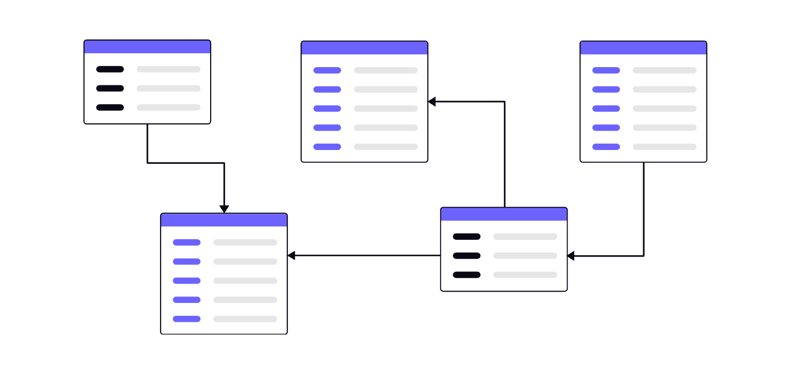
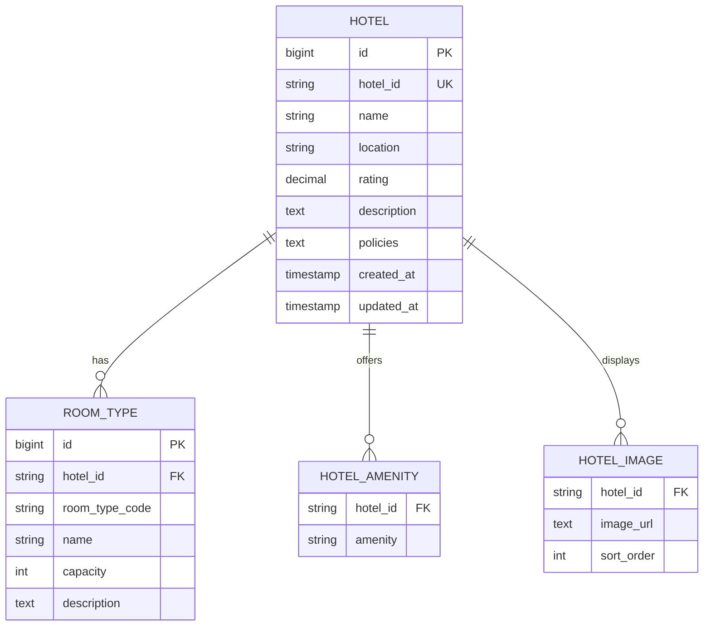

Different parts of the system evolve at very different rates and under different constraints. For example, hotel profile information such as names, amenities, and images changes infrequently and is primarily read-heavy, while inventory and reservation data changes constantly and must be updated with strong consistency under high concurrency. 

By designing schemas around these change characteristics, each service can use storage structures, indexing strategies, and transactional guarantees that best fit its data. This approach naturally leads to different schemas and storage patterns across services, avoids forcing one-size-fits-all models, and prevents slow-moving, read-heavy data from interfering with fast-changing, correctness-critical workflows like booking and payment.



Let’s examine the **data models** for each core service, focusing on the queries they must support, how their data volumes are expected to grow over a 10-year horizon, and the **partitioning, indexing, and storage strategies** required to sustain scalability, reliability, and performance at scale.

---
### Hotel Service

The Hotel Service owns **static hotel metadata** and is designed to support **read-heavy access patterns** with minimal write contention.

#### Schema Design



Since this data changes infrequently and does not participate in transactional booking workflows, its schema is intentionally kept **simple and normalized**, modeling only static metadata.

##### Database Choice

A **relational database** works well for the Hotel Service because the data is clearly structured and naturally fits into tables with relationships.

In addition, schema changes are easy to manage for slow-changing data, and constraints like unique `hotelId` or `(hotelId, roomType)` can be enforced directly at the database level, keeping the data clean and reliable with minimal application logic.

##### Indexing Strategy

Relational databases provide mature indexing and query optimization. A primary key and unique index on `hotelId` allows quick access to individual hotel profiles, while an index on `location` supports efficient hotel searches by city or region. 

A composite index on `(hotelId, roomTypeCode)` enables fast lookups of room-type definitions for a given hotel.

##### Data Growth (10-Year Horizon)

Hotel metadata grows **slowly and predictably** over time, mainly as new hotels are onboarded. 

Each hotel has a limited and fixed set of room types, amenities, and images, and there are no unbounded or time-based data additions. As a result, even at large scale, the overall data size remains manageable.

##### Partitioning Strategy

Partitioning is **not required initially** due to low write volume and predictable growth. If needed at very large scale, partitioning or sharding can be introduced by `location` (regional sharding).

---


Because reads are cache-friendly and highly repeatable, most traffic can be absorbed by caches, further reducing the need for complex partitioning strategies.


The Hotel Service primarily serves **read-heavy queries**, including:

- Fetch hotels by `location`
- Fetch a hotel profile by `hotelId`

Writes are rare and typically administrative (hotel onboarding or profile updates).

The **Hotel** entity serves as the master record for each registered hotel, providing static information customers need to discover and evaluate hotels before making a reservation. 

#### <span style="color:green;font-weight:bold;">Schema</span>

| Field       | Approx. Size | Description                                          |
| ----------- | ------------ | ---------------------------------------------------- |
| id          | ~8-16 bytes  | Unique identifier (UUID or numeric ID)               |
| name        | ~50 bytes    | Hotel name (typically under 50 characters)           |
| location_id | ~3 bytes     | Location reference (mapped to city or region)        |
| address     | ~100 bytes   | Full address (typically under 100 characters)        |
| description | ~200 bytes   | Text description of the hotel (up to 200 characters) |
| amenities   | ~500 bytes   | List of amenities, e.g., Wi-Fi, Pool (~10 items)     |
| rating      | ~4 bytes     | Usually 1–5 stars with one decimal place, like 4.3   |

#### <span style="color:green;font-weight:bold;">Indexing Strategy</span>

Since every hotel search begins with a destination, queries such as `SELECT * FROM hotel WHERE location_id = ?` would typically trigger a sequential scan of the entire hotel table, forcing the database to check every row. At scale, this leads to unnecessary I/O, unpredictable spikes, and slow responses during peak load. 

Because search endpoints demand low and consistent latency, a B-tree index on `location_id` can be introduced to allow the database to directly locate the relevant rows through index lookups, eliminating the need for full table scans and drastically improving query performance.

```
CREATE INDEX idx_hotel_location ON hotel(location_id);
```

#### <span style="color:green;font-weight:bold;">Storage Estimation</span>

```
- Assumption: Total Hotels = 1 Million
- Average Hotel Record Size = 1 KB (with indexes)
- Total Storage for Hotels = 1,000,000 × 1 KB = 1 GB
```

#### <span style="color:green;font-weight:bold;">Partitioning Strategy</span>

Even with `1 Million` hotels over `10-year` horizon, the dataset would only occupy `1 GB`. Because of its modest size and static nature, partitioning is unnecessary.

**room_type:** 
- name field should not be too large. Hence, use `varchar(length)` instead of dynamic `text`.

---
### Room_Type_Inventory

The **Room_Type_Inventory** entity serves as the authoritative source for tracking daily room availability for each room type within a hotel. It ensures accurate availability checks during search and booking operations.

It is utilized to check if a customer can reserve a specific type of room or not.

<span style="color:green;font-weight:bold;">Schema</span>

| Field        | Approx. Size | Description                                 |
| ------------ | ------------ | ------------------------------------------- |
| hotel_id     | ~16 bytes    | Reference to the hotel                      |
| room_type_id | ~16 bytes    | Reference to the room type                  |
| date         | ~8 bytes     | Calendar date (daily granularity)           |
| total_rooms  | ~4 bytes     | Total rooms of this type the hotel operates |
| reserved     | ~4 bytes     | Rooms already reserved for the date         |
| updated_at   | ~8 bytes     | Timestamp of the last inventory update      |

<span style="color:green;font-weight:bold;">Indexing Strategy</span>

Search and booking flows frequently require filtering inventory by `hotel_id`, `room_type_id`, and `date`. Without indexes, these queries would degrade into sequential scans across millions of rows, especially when checking multi-day availability. 

By creating a composite B-tree index on (`hotel_id`, `room_type_id`, `date`), the database can efficiently locate availability records and ensure fast range scans for booking windows.

```
CREATE INDEX idx_inventory_lookup ON room_type_inventory(hotel_id, room_type_id, date);
```

<span style="color:green;font-weight:bold;">Storage Estimation</span>

```
- Assumptions: 
	- Total Hotels = 1 Million
	- Avg Room Types per Hotel = 3 (Standard, Deluxe, Suite)
	  
- Rows per year = 1,000,000 x 3 x 365 ~ 1,200,000,000 = 1.2 Billion
- Avg Row Size = 50 bytes
  
- Total Storage for 10-Year Horizon = 10 x 1,200,000,000 x 50 bytes
									= 600,000,000,000 = 0.6 TB
```

<span style="color:green;font-weight:bold;">Partitioning Strategy</span>

Can shard by `hotelId`.

Most queries touch a small date range (e.g., next 30–90 days). If the dataset is partitioned by month, system will only scan the partitions whose date ranges overlap the query, dramatically reducing I/O.

 Keep recent partitions (the next 6–8 months) on fast writable storage (hot storage) and tune those partitions for low-latency reads/writes. This is where most searches and bookings will hit. 
 
 Older partitions outside the hot window are rarely accessed for live bookings and can be archived off the primary DB to cheaper storage.

<span style="color:red;">EXTRA</span>

The `updated_at` timestamp lets the system know when a record was last modified, which helps detect stale data (e.g., if a cache is older than the DB value). 

Additionally, during booking, the system might compare the `updated_at` timestamp to ensure the record hasn’t changed since it was fetched. This supports optimistic locking, preventing double bookings or using outdated prices.

`(hotel_id, room_type_id, date)` is the composite primary key. The rows of the table are pre-populated by querying the inventory data across all future dates within 2 years. <span style="color:red;">(explore this)</span>. <span style="color:green;font-weight:bold;background:beige;">We can have a daily job that pre-populates inventory data when the dates advance further.</span>

**Query 1: Select rows within a date range**

```
SELECT date, total_inventory, total_reserved
FROM room_type_inventory
WHERE room_type_id = ${room_type_id} AND hotel_id = ${hotelId} AND date BETWEEN ${checkInDate} and ${checkOutDate}
```

---
### Room_Type_Rate

The **Room_Type_Rate** entity manages pricing information for each room type on each date. It provides base rates for search results and detailed rate breakdowns for checkout validation.

<span style="color:green;font-weight:bold;">Schema</span>

| Field        | Approx. Size | Description                        |
| ------------ | ------------ | ---------------------------------- |
| hotel_id     | ~16 bytes    | Reference to the hotel             |
| room_type_id | ~16 bytes    | Reference to the room type         |
| date         | ~8 bytes     | Date of the rate                   |
| base_price   | ~8 bytes     | Base room price (numeric)          |
| updated_at   | ~8 bytes     | Timestamp of the last price update |

<span style="color:green;font-weight:bold;">Indexing Strategy</span>

Since price lookups typically happen alongside availability checks, efficient access by (`hotel_id`, `room_type_id`, `date`) is critical. 

A composite B-tree index ensures quick retrieval of rates for search results and booking flows, while also enabling consistency checks during reservation finalization.

```
CREATE INDEX idx_rate_lookup ON room_type_rate(hotel_id, room_type_id, date);
```

<span style="color:green;font-weight:bold;">Storage Estimation</span>

```
- Assumptions: 
	- Total Hotels = 1 Million
	- Avg Room Types per Hotel = 3 (Standard, Deluxe, Suite)
	  
- Rows per year = 1,000,000 x 3 x 365 ~ 1,200,000,000 = 1.2 Billion
- Avg Row Size = 50 bytes
  
- Total Storage for 10-Year Horizon = 10 x 1,200,000,000 x 50 bytes
									= 600,000,000,000 = 0.6 TB
```

<span style="color:green;font-weight:bold;">Partitioning Strategy</span>

Rates are time-series data, so partitioning by date is essential to maintain query performance. Like inventory, recent partitions remain in hot storage, while older rates can be archived or recalculated on demand from pricing rules.

Can shard by `hotelId`.

<span style="color:red;font-weight:bold;">Follow Up</span>

Inventory is the authoritative availability ledger — counts of rooms that can be reserved — while rates are the authoritative pricing ledger — base rates, discounts, and pricing rule snapshots. 

They change at different frequencies, have different transactional requirements (inventory updates must support atomic holds/confirmations; pricing needs versioning and rule evaluation), and are typically owned and evolved by different teams/services. 

Keeping them separate enforces separation of concerns, simplifies correctness for booking flows, and lets you scale and optimize each table independently. 

You can still colocate a price snapshot on the inventory row for fast search results, without making the pricing engine lose its authoritative role.

---
### Reservation

This entity represents the transactional data that links a user to a specific room in a hotel for a defined date range.

```
- reservation_id:
- request_id: 
- User ID: ~16 bytes (UUID or numeric ID)
- Hotel ID: ~16 bytes
- Room ID: ~16 bytes
- Dates: ~32 bytes (check-in and check-out dates)
- Payment status: ~20 bytes (e.g., “Paid”, “Pending”)
- Other Attributes: ~500 bytes (created timestamp, updated timestamp, etc.)
```

Since booking records are transactional in nature, they are most frequently queried within the first **12 months** (for cancellations, modifications, customer support, disputes, etc.). After this retention window, the likelihood of accessing historical bookings drops significantly.

```
- Assumption: Daily Bookings = 100,000 (from load estimation)
- Assumption: Booking Retention = 1 year (365 days)
- Total Bookings per Year = 100,000 * 365 = 36.5 Million
- Booking Record Size = 1 KB (with indexes & overhead)
- Total Storage for Bookings = 36,500,000 * 1 KB = 36.5 GB
```

> **NOTE:** To optimize performance and reduce storage costs, move older bookings from the **OLTP (Online Transaction Processing) database** to an **OLAP (Online Analytical Processing) database**.

<span style="color:red;">Design Choice</span>

A relational database provides ACID (atomicity, consistency, isolation, durability). ACID properties are important for the reservation system. 

ACID properties make the application code a lot simpler and make the whole system easier to reason about.

Needs to store booking details such as hotelid, checkindate, checkoutdate and reservation items such as {roomtypeid, count/quantity, rate}. The pay now page requires this to show all the revelant booking review details on the frontend. 

---

To model the "search hotels" workflow for a hotel reservation system, a suitable ER diagram could include entities such as User, Search, Hotel, Room, Location, and Amenities. The relationships would capture that a User performs a Search, Search returns Hotels (in a Location), Hotels have Rooms and Amenities, and availability is checked.

Here's a summary of the ER diagram:

- User performs Searches
- Each Search can return multiple Hotels (filtered by Location, dates, etc.)
- Hotel has many Rooms
- Hotels and Rooms can have Amenities
- Room has Availability for a date range

---
### Storage Estimation

Designing a scalable system requires a clear understanding of how much data the platform needs to store and manage over time. **Storage estimation** helps us anticipate database size, plan for indexing, implement backup strategies, and decide whether to adopt **sharding or archiving** for future growth. 

Let's estimate the storage requirements for key entities:

---
### Room

If rooms were stored as an **embedded list inside the Hotel entity**, updating a single room (e.g., changing its availability or price) would require **updating the entire hotel record**. This could lead to **write conflicts** and require **locking the whole hotel record**, reducing performance under high load. 

By keeping **Room** as a separate entity, each room can be updated independently, minimising lock contention and improving **scalability**, **performance**, and **concurrency handling**.

```
- Room ID: ~16 bytes (UUID or numeric ID)
- Room Type: ~100 bytes (e.g., "Deluxe", "Standard")  
- Price: ~50 bytes (price value + currency)  
- Availability: ~250 bytes (calendar)  
- Other Attributes: ~500 bytes (bed type, occupancy, amenties, etc.)
```

```
- Assumption: Average Rooms per Hotel = 100
- Average Room Record Size = 1 KB (with indexes & overhead)  
- Total Storage for Rooms = 1,000,000 * 100 * 1 KB = 100 GB
```

---

<span style="color:green;font-weight:bold">Summary</span>

| **Entity**       | **Estimated Size per Record** | **Total Records** | **Total Storage** |
| ---------------- | ----------------------------- | ----------------- | ----------------- |
| **Hotels**       | 5 KB                          | 1,000,000         | 5 GB              |
| **Hotel Images** | 500 KB                        | 10,000,000        | 5 TB              |
| **Rooms**        | 1 KB                          | 100,000,000       | 100 GB            |
| **Users**        | 1 KB                          | 50,000,000        | 50 GB             |
| **Bookings**     | 1 KB                          | 36,500,000        | 36.5 GB           |

---
### EXTRA

<span style="color:purple;font-weight:bold">Users</span>

This entity forms the basis for identity management, personalization, and secure access across the platform.

```
- User ID: ~16 bytes (UUID or numeric ID)
- Name: ~100 bytes (First Name + Last Name)
- Email: ~100 bytes (can be long, e.g., corporate emails)
- Phone Number: ~20 bytes (include country code + separators)
- Hashed Password: ~256 bytes (depending on algorithm)
- Other Attributes: ~500 bytes (profile image URL, addresses, preferences, etc.)
```

```
- (Assumption) Total Registered Users: 50 Million
- Average User Record Size: 1 KB (with indexes & overhead)
- Total Storage = 50,000,000 * 1 KB = 50,000,000 KB = 50 GB
```

---
### Hotel Entity

Indexing on Rating:

```
CREATE INDEX idx_hotel_rating ON hotel(rating);
```

---

You should store holdId in the payments table, and there are some strong reasons for it.

Think of it this way: a payment in your system is not “free-floating” — it is for a specific reservation attempt that is backed by a specific inventory hold. Capturing that relationship explicitly makes a lot of things safer and easier.

Here’s why storing holdId on Payment is useful:

**Strong linkage: “What exactly was this payment for?”**

With payment → holdId:

- You can say: “This payment was made for inventory hold X”, which in turn represents:
    
    - which hotel
    - which room types
    - which dates
    - what quantity
    
- That’s crucial for:
    
    - audits
    - debugging production issues
    - customer support (“which rooms did they actually pay for?”)

If you only kept reservationId, you’d have to chase Reservation → holdId every time, and across services that can get messy.

---
