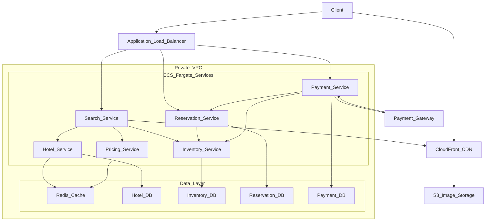
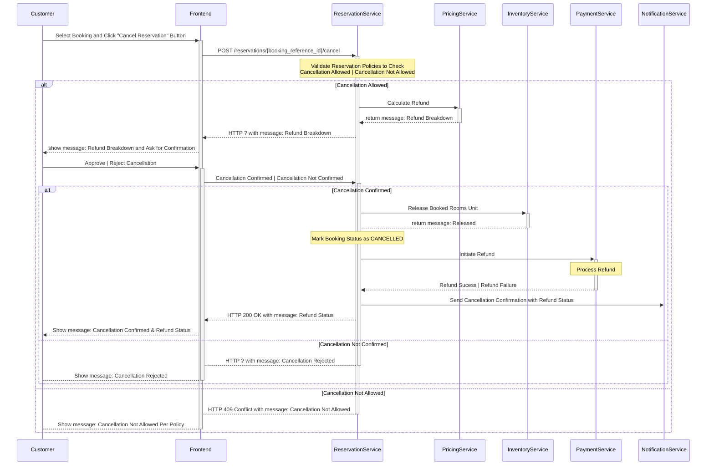

Let’s do a **service-by-service discussion of the final architecture**, grounded in AWS infrastructure and aligned with the workload, scaling, and correctness requirements identified earlier.

---
### Search Service

Handles the highest traffic volume and sits at the front of the system. It is a read-optimized aggregator that coordinates with Hotel, Inventory, and Pricing services. 

```json
- Assumptions: 
	- One ECS task can safely handle 80 - 100 RPS (aggregation + cache lookups)
  
- Peak Search Load ≈ 1,250 RPS   
- Target utilization ≈ 70 - 75% for headroom

- Required instances at peak
	≈ 1,250 RPS / 90 RPS per instance
	≈ 14 instances
```

With aggressive caching and image delivery offloaded to **CloudFront**, the service is primarily compute-bound. To handle a peak load of ~1250 RPS, the system typically requires **12 - 15 ECS instances**, spread across AZs for fault tolerance.

---
### Hotel Service

The **Hotel Service peak load is primarily driven by the Search Hotels use case**, not by individual hotel detail views. During a search, the Search Service needs to fetch **hotel metadata for many hotels in a single request**, which creates a fan-out effect toward the Hotel Service.

```json
- Assumptions: 
	- Avg hotels returned per search (location-based) = 20
	- Hotel metadata fetched in batches (not one call per hotel)
	- Assumption: Batch size per Hotel Service call = 10 hotels
	- Safe capacity per instance ≈ 150 - 200 RPS
  
- Peak Search RPS = 1,250
  
- Hotel Service calls per search
	= 20 / 10
	= 2 calls
	
- Hotel Service Peak RPS
	= Search Peak RPS × Calls per search
	= 1,250 × 2
	= 2,500 RPS

- Required instances
	= 2,500 RPS / 175 RPS per instance
	≈ 14 instances
```

With a high cache hit rate via **ElastiCache**, the Hotel Service can handle traffic efficiently with **12 - 15 ECS instances**, backed by an RDS database with read replicas.

---
### Inventory Service

In the **Search Hotels** flow, the Search Service must determine **which hotels have availability** for a given date range. Since **availability is dynamic and correctness-critical**, this data cannot be embedded or denormalized into the Search or Hotel services. As a result, the Search Service must call the **Inventory Service**, creating fan-out.

However, unlike Hotel metadata, **Inventory fan-out must be tightly controlled**, because Inventory is write-heavy, highly contended, and database-bound.

```json
- Assumptions:
	- Inventory calls per search = 1 (batched)
	- Safe instance capacity ≈ 150 - 200 RPS
	  

- Inventory Peak RPS (search-driven)
	= Search Peak RPS × Inventory calls per search
	= 1,250 × 1
	= 1,250 RPS
	
- Required instances
	= 1,250 RPS / 175 RPS per instance
	≈ 7 - 8 instances
```

Scaling is conservative and driven by database throughput rather than RPS. Typically, **7 - 8 ECS instances** are sufficient, with careful tuning of connection pools and locking behavior.

---
### Pricing Service

A stateless, compute-focused service that calculates prices on demand. Because pricing logic is isolated in the `PricingService`, the `SearchService` must call it during search, which introduces fan-out.

However, the **pricing fan-out is much easier to control** than the inventory fan-out because pricing data is **read-heavy, stateless, and cacheable**.

```json
- Assumptions:
	- Avg hotels per search result = 20
	- Pricing calls per search = 1 (bulk)
	- Safe instance capacity ≈ 300–400 RPS

- Peak Search RPS = 1,250
  
- Pricing Peak RPS (search-driven)
	= Search Peak RPS × Pricing calls per search
	= 1,250 × 1
	= 1,250 RPS

Required instances
	= 1,250 RPS / 350 RPS per instance
	≈ 4 instances
```

For the target load, **3 - 4 ECS instances** are usually enough to handle both search-time bulk pricing and booking-time validation.

---
### Reservation Service

Owns the booking lifecycle and reservation state machine. Traffic is low but correctness-critical and transactional. 

```json
- Assumptions:
	- Safe instance capacity ≈ 10–15 RPS
	  
- Peak Reservation RPS = 5
  
Required instances
	= 5 RPS / 12 RPS per instance
	≈ 1 instance
```

The service is database-bound rather than network-bound, and typically requires **2 - 3 ECS instances** for redundancy and steady performance.

---
### Payment Service

Integrates with external payment gateways and handles retries, callbacks, and asynchronous confirmations. Traffic volume is low, but reliability is paramount. 

```json
Assumptions:
	- Payment success rate ≈ 95%
	- Safe instance capacity ≈ 10–15 RPS
	  
- Reservation RPS ≈ 5
- Pay Now RPS = 5 × 0.95 ≈ 5 RPS

- Required instances
	= 6 RPS / 12 RPS per instance
	≈ 1 instance
```

A small fleet of **2 - 3 ECS instances** is sufficient, with scaling driven by failure handling rather than throughput.

---
### Final Architecture



---

We need a **VPC (Virtual Private Cloud)** for the backend because when we deploy applications or services in the cloud, we want the **same level of control, security, and isolation** as if we were running them in our own on-premises data center.

> **NOTE:** Without a VPC, your resources would share a flat network with others in the cloud (not safe).

Private subnet - Amazon RDS will exist here. AWS need us to define 2 private subnets to host database across 2 different AZs.

Public subnet - EC2 instances for backend services will exist here. Needs Internet Gateway so that the outside world can reach this public subnet.

We need 3 route tables:
1. Main Route Table:
2. Public Route Table:
3. Private Route Table:

API Gateway - Allows us to enforce HTTPs for the backend services

modify the inbound rules of RDS to that it can see inputs from the EC2 instances.

modify the outbound rules of EC2 instances such that they can send requests to the RDS instances.

**Prefer fewer RDS _clusters/instances_ (shared infra) for cost & manageability**, but **give critical services dedicated clusters** (reservation, payment) for isolation, performance and compliance reasons.


---

Implemented using ES as primary search backend; DB fallback if ES is unavailable.

It is sufficient to store this table in a transactional database <span style="color:red;font-weight:bold;">-- ??? why not in no-sql database considering this will not be part of any transaction flow.</span>

<span style="color:red;font-weight:bold;">Future Scope (Hotel Entity)</span>

For search, push hotel data into Elasticsearch. replicate or index Hotel entity into Elasticsearch for efficient search, and maintain periodic backups or snapshots in object storage for recovery and auditing.

Images should go in object storage. 

```
Assuming each hotel has 10 images and each image is ~500 KB, the total storage required for storing all images would be: 1,000,000 × 10 × 500 KB = 5,000,000,000 KB = 5 TB.
```

<span style="color:red;font-weight:bold;">Future Scope (Inventory Entity)</span>

For **extremely high throughput, combine partitioning with horizontal sharding** (e.g., shard by `hotel_id` ranges or by region) so partitions are distributed across nodes.

---

Designing a scalable architecture begins with understanding the scale of the problem. **Back-of-the-envelope estimations** help us approximate critical metrics like **traffic load**, **storage requirements**, and **bandwidth usage**, which in turn influence key architectural decisions such as the number of **application servers**, **database sharding strategies**, **caching mechanisms**, and overall **network design**.

By doing these quick calculations early, we avoid over-engineering and ensure the system can gracefully handle both current and future demand. Let’s perform these estimations for our **Hotel Reservation System**.


You have:

- hotel-service
- repository-service
- reservation-service
- search-service
- payment-service
- pricing-service

And each has **its own DB locally**.

**On AWS Free Tier, you CANNOT create 6 RDS instances for free.** You can only run **one** free instance.

---
### Option A: Use ONE RDS instance with multiple schemas (best for free tier). 


Create **one PostgreSQL RDS** and create schemas like:

```
hotel_service
repository_service
reservation_service
search_service
payment_service

```

Each service gets isolation at the schema level.

**Pros**

- Free tier compatible
- Easy to manage
- Still gives logical separation

**Cons**

- Not strict microservice isolation (in production you'd separate)

---
### **Option B — Use ONE RDS instance but multiple databases**

PostgreSQL allows multiple DBs under one instance:

```
hotel_db
repository_db
reservation_db
search_db
payment_db
```

**Pros**

- Better isolation than schemas
- Still fits free tier

**Cons**

- Still one instance → performance tied together

---

If your DB services primarily _compose_ many small pieces of data into a single response for multiple client types → **GraphQL is a very strong fit**.

---

- In hotel systems, it’s often used to quickly find candidate hotels for a query like “hotels in Goa with pool and breakfast”.
    
- Instead of scanning the whole Hotel DB, you index hotel metadata (name, location, amenities, rating, etc.) in ES and query it very fast.
    
- ES usually gives you the top N candidates (say 200 hotel_ids) that you then pass to Inventory and Pricing.
    
- This way, you don’t overload Inventory with all hotels in the destination.

In Search Hotel flow, Inventory + Pricing call can run in parallel (with async futures / reactive programming) to reduce overall latency.

---

As **Search** and **Reservation** Service are public-facing APIs, they should be designed using **RESTful principles**. 


---

1. **User Management**: Allow users to register, log in, and manage their personal profiles and preferences.

2. **Hotel Search**: Enable users to search for hotels based on preferences such as location, travel dates, number of guests, and filters like price or amenities.

3. **Hotel Details Display**: Present hotel information including descriptions, photos, amenities, room types, occupancy limits, policies, and real-time pricing.

4. **Booking Management**: Support the complete booking flow, including reservations, confirmations, modifications, and cancellations.

5. **Payment Processing**: Provide secure payment handling with multiple methods, such as credit/debit cards, UPI, wallets, and net banking.

6. **Notifications**: Send booking confirmations, reminders, and updates through email, SMS, and push notifications.

7. **Inventory Management**: Enable hotels or administrators to manage room inventory, rates, and availability effectively.

---

- **Hotel Inventory Service**
    
    - Purpose: Check which hotels and rooms are available for the selected location and dates.
        
    - Why? Availability changes frequently, so this service maintains real-time room inventory to prevent overbooking.
        
- **Pricing Service**
    
    - Purpose: Get **real-time pricing** for each room type (considering demand, season, discounts).
        
    - Why? Prices fluctuate dynamically, so a dedicated service ensures accurate cost display during search.
        
- **Hotel Details Service**
    
    - Purpose: Provide metadata like **hotel description, amenities, photos, policies, and ratings**.
        
    - Why? This is static or semi-static information that enhances the user experience during hotel selection.

---

Caching is layered to attack the biggest byte and query hotspots first. At the application tier we cache the first pages of popular searches and hotel details in Redis with short TTLs (minutes) and versioned keys so writes can invalidate only affected entries. 

Availability is cached aggressively with very short TTLs (seconds) and write-through invalidation on successful bookings; even modest hit rates here shave milliseconds off end-to-end latency and protect the primary store. On the client and edge we leverage HTTP caching semantics—immutable, fingerprinted JS/CSS and pre-generated thumbnails—so repeat visits incur minimal transfer.

---

need to keep inventory service and hotel service in sync. 

---
### Use Case 4: Cancel a Reservation

Enable customers to cancel an existing reservation in accordance with policy, update inventory, and (if eligible) process a refund.

The following interactions describe the step-by-step flow between the **user interface** and the **backend components** during this operation:

1. The `Customer` selects an existing booking and clicks the “Cancel Reservation” button on the user interface. 

2. The `Frontend` sends a `POST /reservations/{booking_reference_id}/cancel` request to the `ReservationService`, along with the customer’s details.

3. The `ReservationService` first validates whether cancellation is allowed under the reservation’s terms, such as free cancellation deadlines, penalties, or non-refundable conditions.

	- If cancellation is eligible but charges apply, the `ReservationService` invokes the `PricingService` to calculate the applicable refund and prompts the `Customer` to confirm the cancellation.

	- If the policy does not allow cancellation, `ReservationService` immediately returns an error stating that cancellation is not possible.

4. Once the `Customer` confirms, the `ReservationService` releases the booked room units back into availability by communicating with the `InventoryService` and updates the booking status to `CANCELLED`.

5. In parallel, the `ReservationService` initiates the refund process by sending a request to the `PaymentService`, which in turn interacts with the `Payment Gateway` (such as a `Bank`, `CardProcessor`, or `UPIProvider`) to transfer the refund to the `Customer`. 

	- If the refund succeeds, the system continues normally.

	- If the refund fails, the booking remains cancelled, but the refund is flagged as pending and retried asynchronously.

6. After updating the booking and processing the refund, the `ReservationService` triggers the `NotificationService` to send a cancellation confirmation to the `Customer` through email, SMS, or push notification. 

7. Finally, the `Frontend` displays a confirmation message to the `Customer`, summarizing the cancellation details and refund status. This ensures the customer has a clear, transparent view of their cancellation outcome.

<span style="color:green;font-weight:bold;">Sequence Diagram</span>



---

