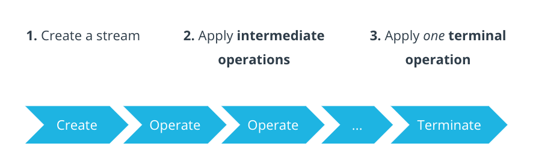

The **Stream API** allows you to **process collections** (like `List`, `Set`) in a **declarative, functional-style** manner.  

> **NOTE:** Instead of writing loops manually, you can describe **what you want to do**, not **how**.

---
### Stream Processing Pipeline

A stream pipeline consists of **creating a stream**, **calling intermediate operations** on the stream, and then **terminating the stream** using a terminal operation.



---
### Intermediate operations

Intermediate operations are the building blocks of a stream pipeline. <span style="color:green;font-weight:bold;background:beige;">They process the stream and return a new stream as the output. This allows you to chain multiple operations together</span>, creating a sequence of transformations on the data.

**Common Intermediate Operations**

| Method              | Description                           |
| ------------------- | ------------------------------------- |
| `filter(Predicate)` | Keeps elements that match a condition |
| `map(Function)`     | Transforms each element               |
| `sorted()`          | Sorts elements                        |
| `limit(n)`          | Takes only first `n` elements         |
| `distinct()`        | Removes duplicates                    |

---
### Terminal Operations

Terminal operations are the final step in the pipeline. They consume the entire stream produced by the chain of intermediate operations. 

Unlike intermediate operations, <span style="color:green;font-weight:bold;background:beige;">terminal operations typically return a non-Stream result (like a count, a collection, or even nothing void) and close the stream. This means you cannot perform further operations on the stream after a terminal operation is called</span>.

**Common Terminal Operations**

| Method                     | Description                                  |
| -------------------------- | -------------------------------------------- |
| `collect()`                | Collects results into a list, set, map, etc. |
| `forEach()`                | Loops over each element (like a for-loop)    |
| `count()`                  | Returns number of elements                   |
| `anyMatch()`, `allMatch()` | Returns boolean based on condition           |

---
### Key Characteristics

- Streams are **single-use**. Once you do an operation on a `Stream`, you cannot do any more operations on that same stream. <span style="color:green;font-weight:bold;background:beige;">This means intermediate operations always return a brand new</span> `Stream`<span style="color:green;font-weight:bold;background:beige;">, never the original</span>.

- Streams are **lazily evaluated**. No computation happens until the very end, when the terminal operation is called.

---
### Difference between Collections and Streams

A **collection** is an in-memory data structure, which holds all the values that the data structure currently has. Every element in the collection has to be computed before it can be added to the collection.

In contrast, a stream is a conceptually fixed data structure in which elements are computed on demand. In reality, streams **don't store the data themselves** but rather act as a processing abstraction on top of existing data sources like collections (e.g., `List`, `Set`), arrays, or even I/O channels.

> **NOTE:** Collections are about data and streams are about computations.

---

<span style="color:red;font-weight:bold;">Q. What will be the output of the following code snippet?</span>

```
import java.util.*;

public class Example {
    public static void main(String[] args) {
        List<String> words = List.of("apple", "banana", "pear", "watermelon");

        String longest = words.stream()
            .max(Comparator.comparingInt(String::length))
            .orElse(null);

        System.out.println(longest);
    }
}

```

<span style="color:green;font-weight:bold;">Explanation</span>

 1. `words.stream()` converts the list `words` into a `Stream<String>`. 
 2. `Comparator.comparingInt(String::length)` creates a comparator that compares strings based on their length.
 3. `max(Comparator.comparingInt(String::length))`
 4. 

**Find the Longest Word**

<span style="color:green;font-weight:bold;">Output</span>

```
watermelon
```

---

Q. **Join Strings with Comma Separator**

```
import java.util.*;
import java.util.stream.Collectors;

public class JoinWords {
    public static void main(String[] args) {
        List<String> fruits = List.of("apple", "banana", "pear");

        String result = fruits.stream()
            .collect(Collectors.joining(", "));

        System.out.println(result); // Output: apple, banana, pear
    }
}

```

---

Q. **Sum of Squares of Odd Numbers**

```
import java.util.*;

public class SumOfSquares {
    public static void main(String[] args) {
        List<Integer> nums = List.of(1, 2, 3, 4, 5);

        int sum = nums.stream()
            .filter(n -> n % 2 != 0)
            .mapToInt(n -> n * n)
            .sum();

        System.out.println(sum); // Output: 35
    }
}

```

---

Q. **Flatten List of Lists and Remove Duplicates**

```
import java.util.*;
import java.util.stream.Collectors;

public class FlattenUnique {
    public static void main(String[] args) {
        List<List<Integer>> nested = List.of(List.of(1, 2), List.of(2, 3), List.of(4));
        List<Integer> flat = nested.stream()
            .flatMap(List::stream)
            .distinct()
            .collect(Collectors.toList());

        System.out.println(flat); // Output: [1, 2, 3, 4]
    }
}
```

---

Q. **Find the Second Highest Number**

```
import java.util.*;
import java.util.stream.Collectors;

public class SecondHighest {
    public static void main(String[] args) {
        List<Integer> nums = List.of(5, 2, 8, 3, 9);

        Integer second = nums.stream()
            .distinct()
            .sorted(Comparator.reverseOrder())
            .skip(1)
            .findFirst()
            .orElse(null);

        System.out.println(second); // Output: 8
    }
}
```

---
### Parallel Processing

Streams can leverage multi-core architectures without you having to write a single line of multithread code.

Just replace `stream()` with `parallelStream()` and the Streams API will internally decompose your query to leverage the multiple cores on your computer.

---
### EXTRA


  - `sorted(Comparator<T> comparator)`: Sorts the elements using a comparator.

  - `collect(Collector<T, A, R> collector)`: **Aggregates the elements into a collection**, such as a `List`, `Set`, or `Map`.
  - `reduce(BinaryOperator<T> accumulator)`: **Combines the elements** into a single value using an associative accumulation function.
  - `forEach(Consumer<T> action)`: **Performs an action for each element**.
  - `toArray()`: Converts the stream into an array.
  - `findFirst()`: Returns the first element of the stream, if present.
  - `count()`: Returns the number of elements in the stream.
  - `anyMatch(Predicate<T> predicate)`: Returns true if any elements match the predicate.
  - `allMatch(Predicate<T> predicate)`: Returns true if all elements match the predicate.
  - `noneMatch(Predicate<T> predicate)`: Returns true if no elements match the predicate.


---

How would you use `Stream.filter()` with a lambda to remove null or empty strings?

```
list.stream()
    .filter(s -> s != null && !s.isEmpty())
    .collect(Collectors.toList());
```

---


