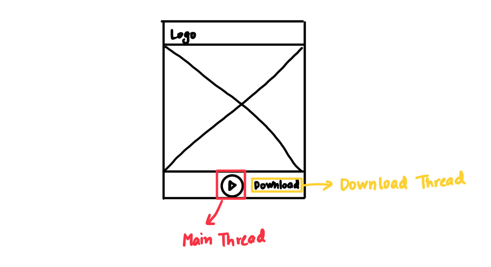

**Multithreading** is a programming concept where a **single process (application)** can run **multiple tasks (threads)** at the same time.

Real-life example:

> Imagine you're using a **music player app**. While the **music is playing (one thread)**, you might also be **downloading a new song (another thread)**, and **updating the UI to show lyrics or animations (another thread)**. These operations happen in parallel without blocking each other — that’s multithreading.

(create something similar to highlight multithreading working visually)

---

Q. What is the difference between multiple processes and multiple threads?

The essential difference is that while each process has a complete set of its own variables, threads share the same data.

---
### EXTRA

In a web browser:
- One thread handles UI updates
- Another thread downloads a file
- A third plays a video  

All happening at the same time — without freezing.

---
