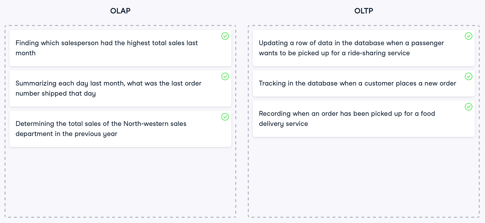

OLTP stands for online transaction processing. These systems are optimised for processing a large volume of simple database transactions and queries as quickly as possible. Typical uses of OLTP systems include cash terminals and reservation bookings.

Queries for OLTP systems tend to affect only a few rows of data within the database. OLTP systems are often critical for the business and not used for analysis. Organisations often use them in transactional databases or the source systems that feed into the data warehouse.

---

Example: Credit Card Company

Meet Eli, a **data engineer** at a credit card company. He is responsible for maintaining the **OLTP system** that **tracks each customer's purchase** and **updates their current balance**. This system was designed to track thousands of purchases and their updates every second. 

However, this system was not designed to analyse **customer purchasing patterns**. Instead, Eli's team uses a data warehouse and an **OLAP system** that **tracks purchases by year, customer age, location, and time of day**. Analysts within the company use this data to make business decisions.

---

Q. Differentiate between OLAP and OLTP systems.

OLAP systems are designed to support data analysis. They execute complex queries of multiple rows or transactions faster than a traditional relational database. The core of the OLAP system is the data cube which represents the data in multi-dimensions allowing for data slicing. 

Comparatively, OLTP systems are designed to be very fast at performing simple database queries that focus on one or only a few rows of data. The core of these systems is the database table which stores the data in rows and columns.

---
