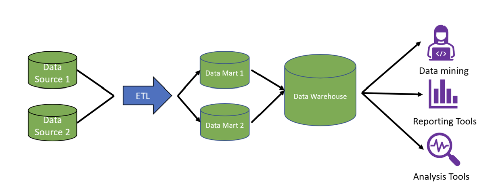

**Inmon Top-down Architecture:** 

The first architecture we will discuss was popularised by Bill Inmon.

Views the data warehouse as a tool to contain all of the organisation's data. Essential to this architecture is that the organisation must decide on the naming, the definition, which data is valid if there are conflicts, and all other data cleaning operations on all of the data before it enters the warehouse.

This architecture stores data in the warehouse in a normalised form. The data then moves to a department-focused data marts where end users and applications can query it. This approach has some advantages. 

First, **conforming the input sources into a single definition that the organisation agrees upon makes the data warehouse an effective source of truth.**

Furthermore, since the data is normalised within the warehouse, less storage is needed, and creating new data marts for reporting or analysis is relatively straightforward. However, because the data is normalised, it requires more joins for reporting leading to slower response times, which is one of the disadvantages of the top-down approach. 

Additionally, as you might imagine, gaining alignment by the organisation on the data definitions can take a lot of upfront work resulting in a higher startup cost for warehouse projects.

The top-down approach requires the organisation to create the data definitions first, allowing them to connect the data with different parts of the organisation and avoid duplicate data.

---

**Kimball Bottom-Up Architecture:**

Ralph Kimball popularised the next popular data warehouse architecture, also known as the bottom-up approach. In this approach, once the data has been brought in, it is denormalised into a star schema. 

A star schema is a way of storing data that makes query writing fast and straightforward. '

In the Kimball approach, the focus is on getting from data to reporting as fast as possible. This is done by first organising and defining the data definitions of one department of the organisation, placing that data into a data mart, and making it available for reporting. After completing one department, a new department is chosen, and the cycle repeats.

Various data attributes, such as name and location, connect the data marts. The data marts are then integrated into a data warehouse. It contrasts the top-down approach because the data moves to the data marts first and then to the warehouse.

As the organisation adds new departments or processes, more development will need to be done. The bottom-up approach has a lower upfront cost but requires more upkeep than the top-down approach.

---

