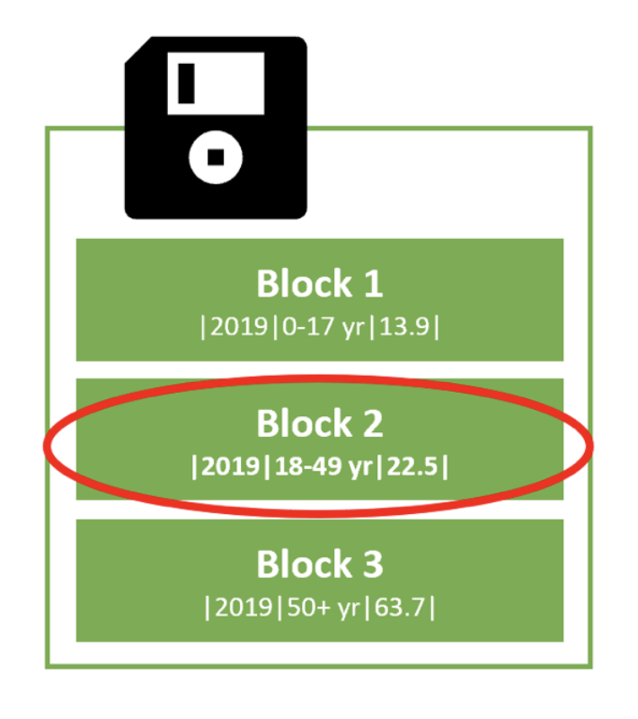
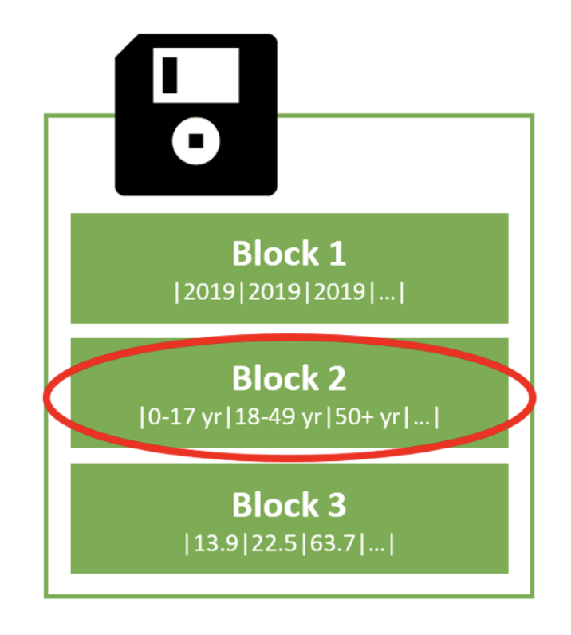

### Column vs row data storing

This subtle difference in how data is stored allows for the tuning of databases for transactional or analytical workloads.

**Basics of computer storage**

In an oversimplification of the process, we can say that computers typically store data in blocks on their hard drive for long-term storage. 

This data can be stored over multiple blocks. When that data is needed later, the hard drive looks up which block holds the required data and reads those blocks. 

Data stored over many blocks will take longer to retrieve than the same data stored over only a few blocks. For analytical workloads, we can take advantage of this by storing likely needed data over a few blocks, increasing query speeds.

### Row-Based Data Store

The row format is excellent for transactional workloads because the computer system can add new data to the table by writing it in a new block.

However, if we were interested in the question `For the 2019 season, what is the average hospitalization percentage across all age groups?` the system would need to read each block containing data for `2019`. In our simplified example, three blocks of data need to be read.

This storage method can be relatively slow for analytical workload, where we often want summaries of many rows of data.

---
### Column-Based Data Store

The column store format stores the data for a column together. For instance, the data for the age group column is now shown in block 2 of the diagram. 

Answering the question `For the 2019 season, what is the average hospitalization percentage across all age groups?` the computer system only needs to read the blocks with the season and percentage data, therefore using one less block of data to answer the same question.

Although the tradeoff is it takes relatively longer to add new rows because the blocks for each column need to be read and edited. 

Finally, a column store has the added benefit of better data compression because all of the data in a block is the same type. Therefore, we can store the same data with less space.

---
