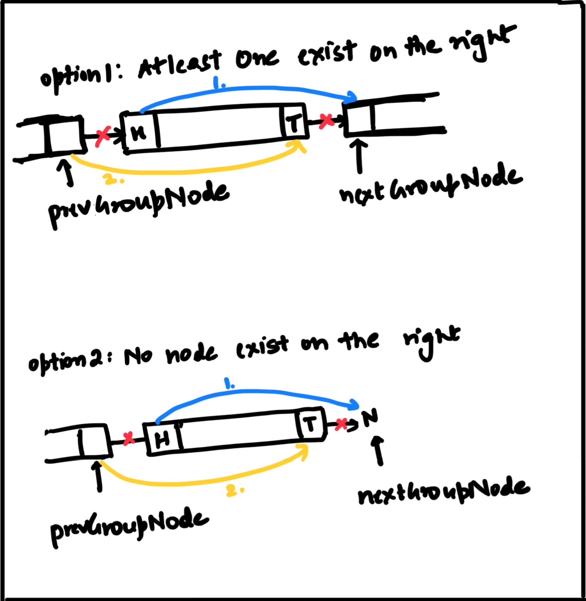

Link: [Leetcode 92](https://leetcode.com/problems/reverse-linked-list-ii/)

---
### Problem Statement

Given the `head` of a singly linked list and two integers `left`and `right` where `left <= right`, reverse the nodes of the list from position `left` to position `right`, and return the reversed list.

**Example**

**Input:** `head = [1,2,3,4,5], left = 2, right = 4`

**Output:** `[1,4,3,2,5]`


---
### Metadata

**Difficulty:** #Medium 

**Recently Asked in Companies:**

- **0 - 3 months**: #Amazon `3`, #Google `2`, #Meta `2`

- **0 - 6 months**: #Bloomberg `3`

- **6 months ago**: #Microsoft `17`, #Adobe `10`, #Apple `9`, #Nvidia `4`, #Uber `2`, #Walmart `2`

---
### General Observations

- <span style="color:red;font-weight:bold;">Is it guaranteed that</span> `1 ≤ left ≤ right ≤ n, where n = length of the linked list`<span style="color:red;font-weight:bold;">?</span>
- **Yes**, if `left == right`, no reversal is required.

---
### Iterative Link Reversal - Brute Force

To reverse a portion of the list between positions `left` and `right`:

1. **Traverse** the list to find the nodes <span style="color:red;font-weight:bold">before the head</span> and <span style="color:red;font-weight:bold">after the tail</span> of the sublist to be reversed. 
2. **Reverse the links** between `left` and `right`.
3. **Reconnect** the reversed sublist with the nodes <span style="color:red;font-weight:bold">before</span> and <span style="color:red;font-weight:bold">after</span> it.

> **NOTE:** <span style="color:green;">Add a dummy node before the head of the list. This ensures that <strong>every node</strong>, even the head, has a <strong>preceding node</strong>, which makes reconnection logic clean and consistent.</span>



**Algorithm**

```
```

**Time Complexity**

**Space Complexity**

**Java Implementation**

```
```

---
### Iterative Link Reversal - In One Pass

Instead of identifying the sublist head and tail, cutting the list and reversing separately, we can reverse the sublist **in-place** using a loop.

**Algorithm**

```
Step 1: Traverse the list until the left position

- dummy = ListNode(-1);
- dummy.next = head;

- prevNode = dummy;
- run loop for (left-1) times and do: prev = prev.next;
```

```
Step 2: Reverse the links between left and right using a loop

- prev = null;
- curr (sublist head) = prevNode.next;

- run loop for (right-left+1) times and do: curr = curr.next;
	- next = curr.next;
	- curr.next = prev;
	- prev = curr;
```

```
Step 3: Reconnect the reversed sublist with the nodes before and after it.

- prevNode.next.next = curr;
- prev.next = prev;
```

```
Step 4: Return the head of the modified list

- return dummy.next;
```

**Time Complexity**

We are iterating over the linked list once. Considering the list contains `n` elements, overall time complexity = `O(n)`.

**Space Complexity**

We are not using any extra space. Hence, overall space complexity = `O(1)`.

**Java Implementation**

```
public ListNode reverseBetween(ListNode head, int left, int right) {

	if(head == null || head.next == null || left == right) return head;

	ListNode dummy = new ListNode(-1);
	dummy.next = head;

	// Step 1: Traverse the list until the left position.
	ListNode prevNode = dummy;
	for(int i=0; i<(left-1); i++) prevNode = prevNode.next;

	// Step 2: Reverse the links between left and right using a loop.
	ListNode prev = null;
	ListNode curr = prevNode.next;
	for(int i=0; i<(right-left+1); i++) {
		ListNode next = curr.next;
		curr.next = prev;
		prev = curr;
		curr = next;
	}

	// Step 3: Reconnect the reversed sublist with the nodes before and after it.
	prevNode.next.next = curr;
	prevNode.next = prev;

	return dummy.next;

}
```

---
### Iterative Front Insertion - Extra

Instead of reversing pointers **in place**, you **extract each node from the sublist and insert it at the front of the reversed section**.

**Algorithm**

```
Step 1: Traverse the list until the left position

- dummy = ListNode(-1);
- dummy.next = head;

- prevNode = dummy;
- run loop for (left-1) times and do: prev = prev.next to get to the node where    the head of the reversed sublist would be attached;
```

```
Step 2: Pick each element positioned in the range [left,right] and insert it to          the front, making it the head of the reversed sublist 

- curr (sublist head) = prevNode.next;

- run loop for (right-left) times and do: curr = curr.next to iterate over         each element of the sublist to be reversed;
	- temp = curr.next;
	- curr.next = temp.next;
	- temp.next = prevNode.next;
	- prevNode.next = temp;
```

```
Step 3: Return the head of the modified list

- return dummy.next;
```

**Time Complexity**

In the worst-case scenario, i.e., when `left = 1 & right = n`, we will iterate over the entire linked list. Hence, overall time complexity = `O(n)`.

**Space Complexity**

No extra space is used. Hence, overall space complexity = `O(1)`.

**Java Implementation**

```
public ListNode reverseBetween(ListNode head, int left, int right) {

	if(head == null || head.next == null || left == right) return head;

	ListNode dummy = new ListNode(-1);
	dummy.next = head;
	ListNode prevNode = dummy;

	// Step 1: Move `prevNode` to the node before left.
	for(int i=0; i<(left-1); i++) prevNode = prevNode.next;

	// Step 2: Reverse sublist using front insertion method
	ListNode curr = prevNode.next;
	for(int i=0; i<(right-left); i++) {
		ListNode temp = curr.next;
		curr.next = temp.next;
		temp.next = prevNode.next;
		prevNode.next = temp;
	}

	// Step 3: Return the head of the modified list
	return dummy.next;

}
```

---