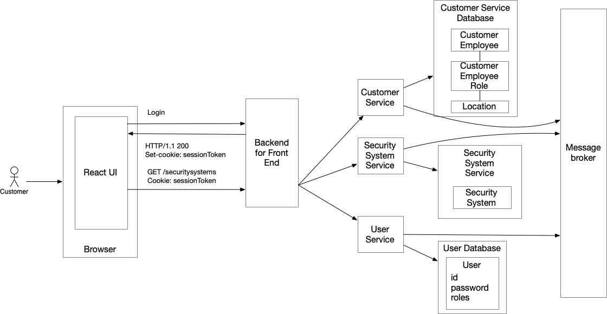

The architecture consists of the following elements:

1. Backend for front-end (BFF): A dedicated **API Gateway** for the UI that handles login and forwards requests from the UI to the services.

2. `Customer Service`: Manages customers, employees, employees’s roles and the customer’s locations.

3. `Customer Service Database`: Stores customer information and is private to the `Customer Service`.

4. `Security System Service`: Manages security systems.

5. `Security System Database`: Stores security system information and is private to the `Security Service`.

6. Message broker: Used for inter-service communication including the service collaboration patterns that rely on asynchronous messaging.

7. `User Service`: Manages users, credentials and their roles.

8. `User Service Database`: Stores user information and is private to the `User Service`

---
### Authentication in a microservice architecture

Just like in the monolithic application, a user logs in with a username and password. However, in a microservice architecture, the Backend for Frontend (BFF) - rather than the services - participates in the login process. 

The BFF maintains the user session, which includes the user’s identity, and issues a session token to the UI.

Another important difference from the monolith is that the business logic that needs the user’s identity cannot simply access the user session via an in-memory mechanism, such as a `ThreadLocal` variable. In a microservice architecture, that business logic is implemented in services that run as separate processes. Consequently, the BFF, which knows the user’s identity (and perhaps their roles), must pass that information to these services.

---
### Disadvantages

But there’s one characteristic of the microservice architecture that can make it challenging for a service to implement authorization: the necessary data might be scattered across multiple services and accessible only via their APIs.

---
### EXTRA

Users sit in a single logical cluster with read replicas because read pressure is modest.