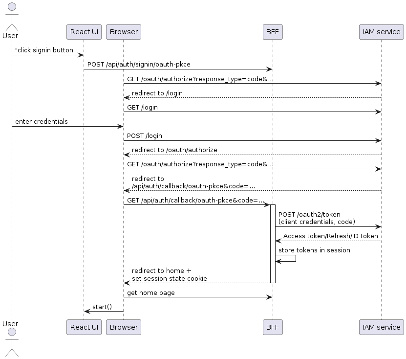
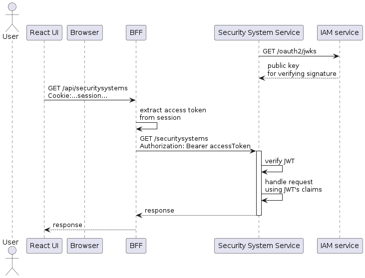

The flow begins with authentication, which establishes the user’s identity. The outcome of the [authentication process described in part 2](https://microservices.io/post/architecture/2025/05/28/microservices-authn-authz-part-2-authentication.html) is a session cookie in the user’s browser that contains a JWT-based access token issued by the `IAM Service`.

The access token contains information about the user including their identity and roles, and plays a central role in the authorization process. When the logged-in user performs actions in the UI, the browser-based UI makes HTTP requests to the BFF (Backend for Frontend) that include the session cookie. The BFF extracts the access token from the session cookie and includes it in the HTTP requests that it makes to backend services.

---
### The Login Flow

The flow is initiated when the user clicks the login button. The login button invokes the `signIn()`function, which is implemented by NextAuth client library. The following diagram shows the resulting interactions:

The sequence of events is as follows:

1. React UI fetches the URL to start an authentication code flow request from the BFF and tells the browser to go to that URL
    
2. Browser opens the IAM service’s authorization endpoint
    
3. IAM service redirects the browser to the login page
    
4. User enters their credentials
    
5. Browser POSTs the user’s credentials to the IAM service
    
6. IAM service verifies the user’s credentials and redirects the browser to revisit the authorization endpoint
    
7. IAM service redirects the browser to the URL specified by the `redirect_uri` supplied in step 1 with additional query parameters - most notably an authorization `code`, which is a one-time use credential for getting tokens
    
8. BFF makes a request to IAM service’s token endpoint, supplying various parameters including the client credentials and the authorization `code`
    
9. IAM service validates the client credentials and the code and returns ID token, access token and refresh token
    
10. BFF stores the tokens in the session and redirects the browser to home page, setting the session cookie
    
11. Browser opens the application’s page, which loads the React-based UI

---
### The request flow: from UI to backend services

Let’s now look at what happens when the browser makes a request, such as `GET /api/securitysystems`, via the BFF to a backend service.

The sequence of events is as follows:

1. On startup, the `Security System Service` fetches the public key for JWT signature verification from the IAM service
    
2. Later, the React UI makes an HTTP `GET /securitysystems` request to the BFF, which includes the session cookie
    
3. BFF extracts the access token from the session and includes it in the request to the `Security System Service`
    
4. `Security System Service` validates the request’s JWT using the public key obtained from the IAM service’s JWKS endpoint.
    
5. The `Security Service` reads the JWT’s identity and authorization claims and uses them for permission checks.
    
6. `Security Service` returns a response to the BFF
    
7. BFF returns the response to the React UI

