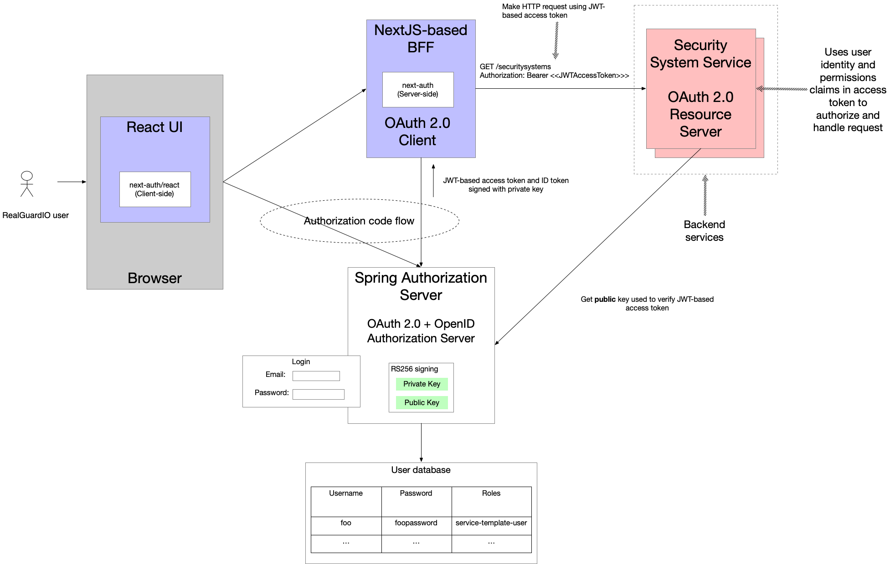
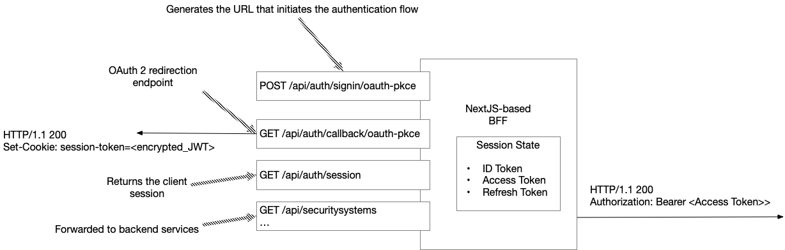
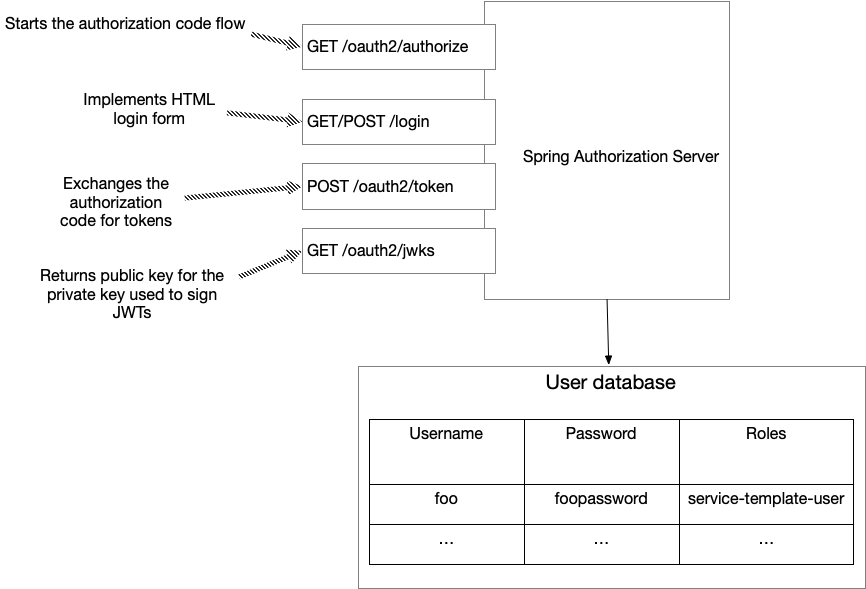
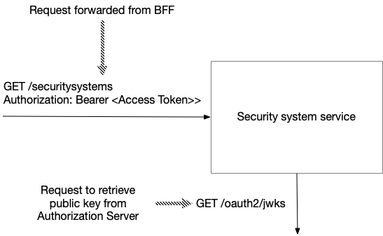

---
### Implementing authentication using OAuth 2.0 and OIDC

Together, OAuth 2.0 and OpenID connect provide an authentication and authorization mechanism that works well in a microservice architecture. The BFF plays the role of the OAuth 2.0 client, and the backend services are resource servers.

> **NOTE:** One notable difference from the traditional OAuth 2.0 scenario is that the client, resource server, and authorization server are all (effectively) part of the same application.

The key elements of the RealGuardIO architecture are as follows:

- React-based UI - runs in the browser and implements the RealGuardIO UI.
    
- BFF - the NextJS/Typescript-based Backend for front-end, which plays the role of an OAuth 2.0 client. It manages the user’s session, forwards requests from the React UI to the backend services and implements security using the `next-auth` library.
    
- Spring Authorization Server-based IAM service - handles authentication including the login page and issues access tokens and ID tokens to BFF.
    
- Backend services - implement the application’s business logic and play the role of resource servers. They use the access token’s user identity information and permissions to authorize and handle the requests.

When a user logs in successfully, the IAM service issues an access token and ID token to BFF, which stores them in the user’s session. When the React UI makes an HTTP request to BFF, such as `GET /api/securitysystems`, the request includes the session cookie. The BFF’s handler for the endpoint extracts the access token from the session and includes it in the request sent to the backend service.

Let’s look at each of the architectural elements in more detail.

#### React-based UI

The RealGuardIO React-based UI runs in the browser. Its home page queries the session, which it retrieves from the BFF, to determine whether the user is logged in. If the user is not logged in, the home displays a `login` button, which uses the `next-auth/react` library to initiate the login flow. Once the user is logged in, the home page displays the alarm systems that are accessible to the user. The home page invokes the BFF’s REST API endpoint to retrieve those security systems.
#### BFF

The BFF, which plays the role of the OAuth 2.0 client, is written in Typescript and uses NextJS, which is both a NodeJS-based server-side framework and a React-based client-side framework. It implements the OAuth 2.0 client and session management functionality using the NextAuth authentication library. This library exposes various endpoints as shown in the following diagram:

This library implements a [REST API](https://next-auth.js.org/getting-started/rest-api), which is used by the NextAuth.js client. It defines a `POST /api/auth/signin/:provide` endpoint, which the NextAuth.js client invokes when the login button is clicked. This endpoint returns the URL for making a request to the Authorization Server’s authorization endpoint, which initiates the authorization flow.

It also implements the [OAuth 2.0 redirection endpoint](https://datatracker.ietf.org/doc/html/rfc6749#section-3.1.2), which is the URI to which the authorization server redirects the user’s browser after authentication is complete. This endpoint’s handler obtains the ID token, access token and refresh token from the authorization server’s endpoint and then redirects the browser to the React UI’s home page.

NextAuth also maintains the session state that contains the ID token, access token and refresh tokens along with the application data. The session is an encrypted JWT stored in a cookie. The client can obtain the session state from the `GET /api/auth/session` endpoint. For security reasons, this endpoint typically returns a subset of session state, e.g., sensitive data such as the refresh token is private to the BFF.

In addition to implementing endpoints for authorization and session management, the BFF also routes API requests from the React UI to the backend services. For each inbound request, it gets the access token from the session and includes it in the outbound request.

#### Spring Authorization Server-based IAM service

The Spring Authorization Server-based IAM service plays the role of the OAuth 2.0/OpenID Connect Authorization server. The following diagram shows the key endpoints that implement authentication:

The IAM service implements the login page. It also issues access, ID, and refresh tokens to BFF.
#### Backend services

Each service, such as the `Security System Service`, plays the role of an OAuth 2.0 Resource Server. When a service receives a request from the BFF, it first validates the token. It verifies that the JWT has not yet expired and that its `iss` claim matches the base URL of the IAM service. It also verifies the JWT’s signature using the public key obtained (and cached) from the IAM service’s `JWKS` endpoint.

Once a service has verified the JWT, it uses the JWT’s claims to identify and authorize the user.

---
