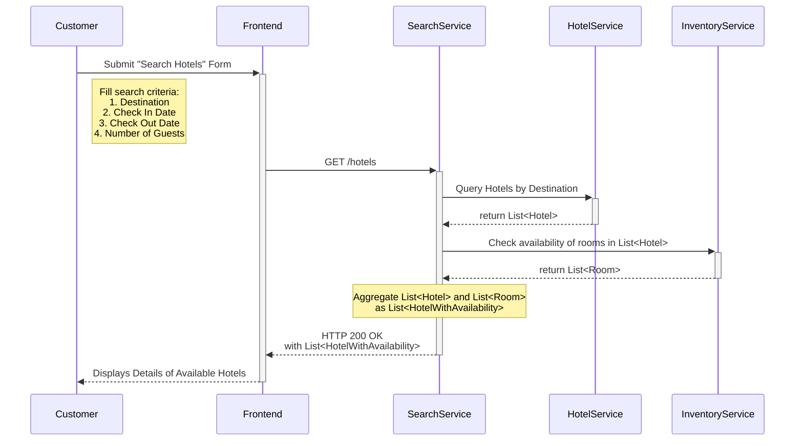

The **Hotel Reservation System** connects **customers** with **hotels**, handling every stage of the reservation process, including **searching, choosing a hotel, booking rooms, processing payments, and delivering notifications**.

Let’s understand the **step-by-step sequence flow of the core use cases** to gain deeper insights into how the system works in practice.

---
### Use Case 1: Search Hotels

Enable customers to search hotels by **location**, **dates**, and **number of guests**, with **filters (e.g., price, amenities, rating)** and **sorting options (e.g., price low-to-high, best rated)**. 

The following interactions describe the step-by-step flow between the **user interface** and the **backend components** during this operation:

1. The `Customer` enters the search criteria such as `destination`, `check_in_date`,  `check_out_date`, and the `number_of_guests` and submits the "Search Hotels" form.

2. The `Frontend` sends a `GET \hotels` request to the `SearchService`, including the search parameters: `destination`, `check_in_date`, `check_out_date`, `number_of_guests`.

3. The `SearchService` first queries the `HotelService` to identify hotels that meet the basic criteria such as `destination`. This step quickly narrows down the list of potential options based on relatively static information that does not change often.

4. Once a list of candidate hotels is identified, the`SearchService` calls the `InventoryService` to verify whether those hotels actually have rooms available for the specified dates and fetch the most up-to-date pricing. Since room inventory and prices fluctuate frequently, this step ensures accuracy and prevents displaying stale or incorrect information. 

5. Finally, the `SearchService` aggregates the static hotel details with the dynamic availability data and returns a refined list of bookable hotels to the `Customer`.

Sequence Diagram

> **NOTE:** As a **future scope**, introducing a dedicated **PricingService** could help us dynamically adjust prices based on factors such as demand, time of day, or occupancy levels, while also supporting personalized pricing models like special offers for returning customers, corporate clients, or location-based users.

---
### Use Case 2: Display Hotel & Room Information

Display detailed hotel descriptions, photos, amenities, room types, occupancy, policies, and real-time pricing.

---
### Use Case 3: Handle Booking

---
### Use Case 4: Payment Processing

---
### Use Case 5: Sending Notifications

---
