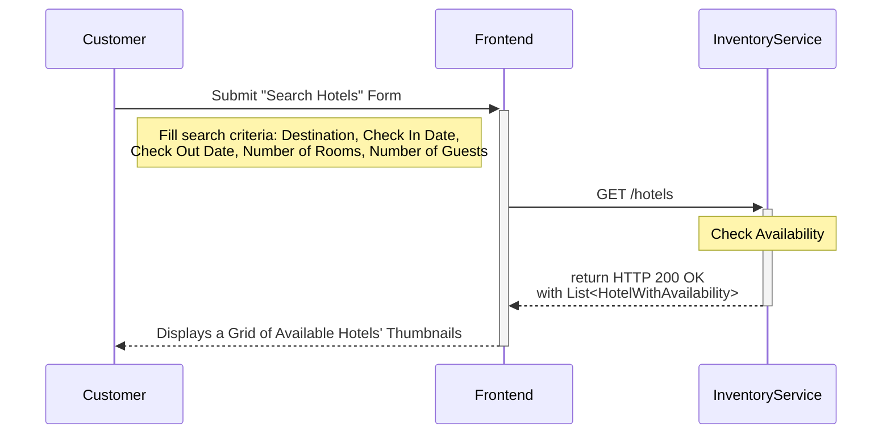
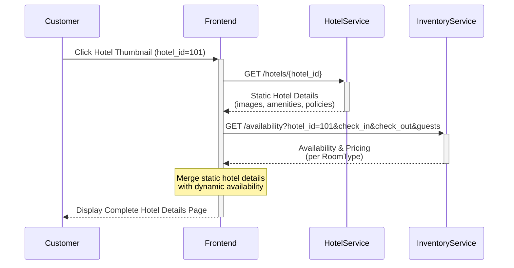
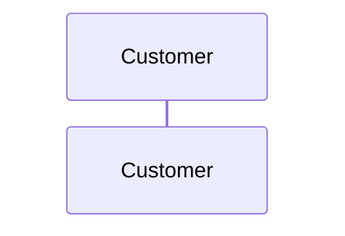

The **Hotel Reservation System** connects **customers** with **hotels**, handling every stage of the reservation process, including **search hotels, view hotel details, make a reservation or cancel an existing reservation.

Let’s understand the **step-by-step sequence flow of the core use cases** to gain deeper insights into how the system works in practice.

---
### Use Case 1: Search Hotels

Enable customers to search hotels by **location**, **dates**, and **number of guests**, with **filters (e.g., price, amenities, rating)** and **sorting options (e.g., price low-to-high, best rated)**. 

The following interactions describe the step-by-step flow between the **user interface** and the **backend components** during this operation:

Interaction 1: Submit "Search Hotels" Form

1. The `Customer` enters the search criteria such as `destination`, `check_in_date`,  `check_out_date`, `number_of_rooms` and the `number_of_guests`, and submits the "Search Hotels" form.

2. The `Frontend` sends a `GET /hotels` request to the `InventoryService`, including the all the search parameters.

3. The `InventoryService` looks up which `Hotels` have available `Rooms` for the given input and retrieves minimal information such as `hotel_Id`, `name`, `location`, `thumbnail_image`, `rating`, and the `lowest_available_price`.

4. Finally, the `InventoryService` returns a list of available `Hotels`, which the `Frontend` uses to display a grid of `Hotel` thumbnails.

Sequence Diagram

---
### Use Case 2: View Hotel Details

Enable customers to view complete information about a selected hotel, including its amenities, images, policies, and the detailed availability of room types for the specified dates.

The following interactions describe the step-by-step flow between the **user interface** and the **backend components** during this operation:

1. The `Customer` clicks on a `Hotel` thumbnail (e.g., `hotel_id = 101`).

2. The `Frontend` sends a `GET /hotels/{hotel_id}` request to the `HotelService` to fetch complete static information about that specific hotel. This includes high-resolution `images`, `amenities`, `descriptions`, `policies` etc. 

3. In parallel, the `InventoryService` is queried to fetch up-to-date availability and pricing for each `RoomType`.

4. Finally, the `Frontend` merges the static hotel details from the `HotelService` with the dynamic room availability from the `InventoryService`, forming a complete hotel detail view. 

Sequence Flow

---
### Use Case 3: Make a Reservation

Enable customers to select a hotel and room type, provide guest details, make payment, and confirm a booking.

The following interactions describe the step-by-step flow between the **user interface** and the **backend components** during this operation:

1. The `Customer` selects one or more desired `RoomTypes` and specifies the `quantity` for each, along with the intended `check_in_date` and `check_out_date`. Once the selection is complete, the `Customer` clicks the “Book Now” button to proceed with the booking.

2. The `Frontend` sends a `POST \bookings` request to the `ReservationService`, including all reservation parameters and the `pricing_snapshot` to verify price consistency at checkout.

3. The `ReservationService` calls the `InventoryService` to place a temporary lock on the requested rooms. This prevents other customers from booking the same rooms while the current booking is in progress. 

	- If the lock is successful, the `ReservationService` calls the `PricingService` to validate the final booking price. This ensures that the customer is charged the most up-to-date amount and avoids discrepancies with the earlier displayed pricing.

	- If the rooms are not available, the `ReservationService` immediately returns an error to the `Frontend`, prompting the `Customer` to revise their selection.

4. Once the pricing is confirmed, the `ReservationService` initiates the payment process by sending a request to the `PaymentService`, which in turn communicates with an external `Payment Gateway` such as a `Bank`, `CardProcessor`, or `UPIService`.

	- If the payment succeeds, the `ReservationService` finalizes the booking by persisting the `Reservation`, updating the `InventoryService` to permanently reduce room availability and triggering the `NotificationService` to send a booking confirmation to the customer via email, SMS, or push notification.

	- If the payment fails, the `ReservationService` releases the locked rooms in `InventoryService` and notifies the `Frontend` so the `Customer` can attempt payment again or choose another method.

5. Finally, the `Frontend` displays a "Booking Confirmation" page to the `Customer` containing the reservation details such as `hotel_name`, selected `room_types`, `stay_dates`, `pricing_breakdown`, and a unique `booking_reference_number`, completing the transaction successfully.

Sequence Diagram

---

    
- The **ReservationService** then initiates payment by calling the **PaymentService**, which integrates with an external **Payment Gateway** (card, UPI, wallet, net banking).
    
    - If **payment fails**, the ReservationService releases the room lock and notifies the customer of the failure.
        
    - If **payment succeeds**, the booking continues.
        
- On successful payment, the **ReservationService**:
    
    - Confirms the booking and updates the **InventoryService** to permanently decrement the available room count.
        
    - Stores booking details in the **Reservation Database** for future reference and reporting.
        
- The **ReservationService** triggers the **NotificationService** to send a booking confirmation to the customer via email, SMS, or push notification, including a unique booking reference ID.
    
- Finally, the **Frontend** displays a **Booking Confirmation Page** to the **Customer**, showing reservation details such as hotel name, room type, stay dates, pricing breakdown, and booking reference number.

---

the flow continues with locking the room in InventoryService, verifying pricing, processing payment, and confirming the reservation.

    
8. **Frontend → BookingService**: `POST /bookings` with booking request (hotel_id, room_type, dates, guest details, price snapshot).
    
9. **BookingService → InventoryService**: Place **temporary lock** on room(s).
    
10. **BookingService → PricingService**: Re-verify price (ensures no mismatch).
    
11. **BookingService → PaymentService → Payment Gateway**: Process payment.
    
12. On success:
    

- Confirm booking → decrement inventory.
    
- Save reservation in DB.
    
- Trigger **NotificationService** for confirmation email/SMS.
    

13. **BookingService → Frontend**: Return confirmation response.
    
14. **Frontend** displays **Booking Confirmation Page** with reference number.

---

When the **customer clicks on a hotel thumbnail** in the search results (for example, ), the system needs to fetch a more detailed view of that particular hotel, including its room options and pricing for the selected dates.

The **frontend then sends a request** to the `SearchService`, such as `GET /hotels/{hotel_id}?check_in=2025-09-10&check_out=2025-09-12&guests=2`. This request contains the customer’s selected hotel along with the search context (dates and number of guests) so the backend can provide relevant availability information.

The **SearchService first queries the HotelService** to retrieve full static details about the hotel. This includes high-resolution images, amenities, descriptions, and policies such as check-in and check-out times or cancellation rules. Since this data changes infrequently, it is sourced from the HotelService or its database.

Next, the **SearchService calls the InventoryService** to fetch real-time room availability for the chosen hotel. The InventoryService provides dynamic details such as the room types (e.g., Deluxe, Suite, Standard), the number of rooms available for the given dates, the complete price breakdown (base price, taxes, and total), and any restrictions like minimum stay requirements or whether the booking is refundable. This ensures the customer only sees rooms that are truly bookable.

The **SearchService then aggregates** the static hotel details with the dynamic availability information and returns a structured response object, commonly called `HotelWithAvailabilityDetails`.

Finally, the **frontend displays a detailed hotel page** to the customer. This page showcases large images, detailed descriptions, amenities, and most importantly, the list of available room types with their prices and booking options. From here, the customer can review the details and proceed to book a specific room.

---
### Use Case 3: Cancel an Existing Reservation

---
### Key Design Choices

keep separate services for hotel, inventory and pricing 