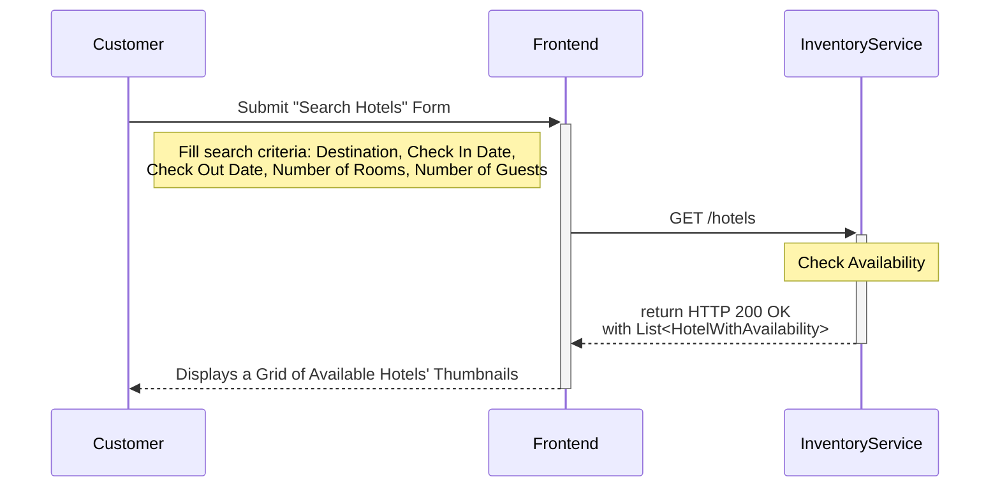
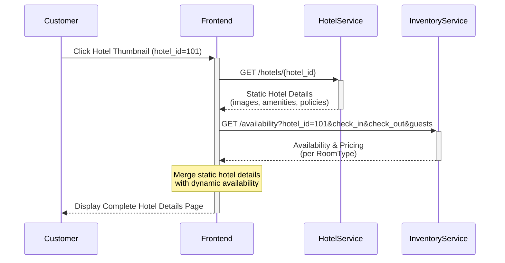
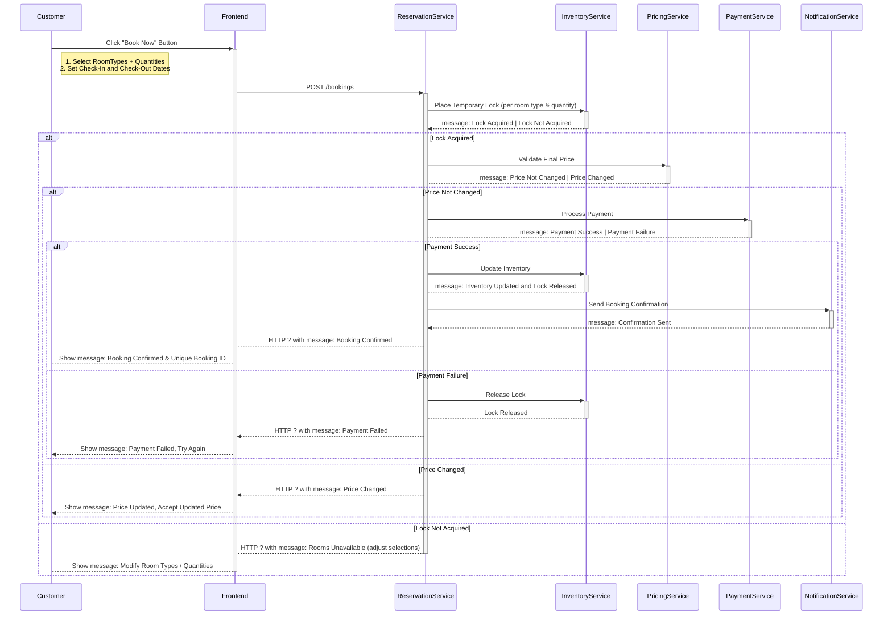
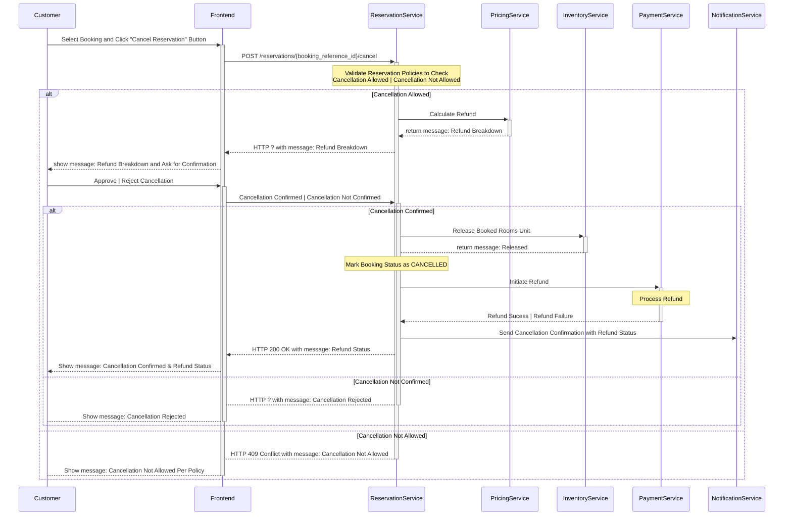

The **Hotel Reservation System** connects **customers** with **hotels**, handling every stage of the reservation process, including **search hotels, view hotel details, make a reservation or cancel an existing reservation.

Let’s understand the **step-by-step sequence flow of the core use cases** to gain deeper insights into how the system works in practice.

---
### Use Case 1: Search Hotels

Enable customers to search hotels by **location**, **dates**, and **number of guests**, with **filters (e.g., price, amenities, rating)** and **sorting options (e.g., price low-to-high, best rated)**. 

The following interactions describe the step-by-step flow between the **user interface** and the **backend components** during this operation:

1. The `Customer` enters the search criteria such as `destination`, `check_in_date`,  `check_out_date`, `number_of_rooms` and the `number_of_guests`, and submits the "Search Hotels" form.

2. The `Frontend` sends a `GET /hotels` request to the `InventoryService`, including the all the search parameters.

3. The `InventoryService` looks up which `Hotels` have available `Rooms` for the given input and retrieves minimal information such as `hotel_Id`, `name`, `location`, `thumbnail_image`, `rating`, and the `lowest_available_price`.

4. Finally, the `InventoryService` returns a list of available `Hotels`, which the `Frontend` uses to display a grid of `Hotel` thumbnails.

Sequence Diagram

> **Design Choice: Keep `InventoryService` separate from `HotelService`**
> 
> The `HotelService` manages slow-changing information like hotel `names`, `locations`, `images`, `amenities`, `policies`, and `room type` definitions, which rarely change and can be stored in databases or cached for long periods. 
> 
> The `InventoryService` handles fast-changing data such as room availability, booking locks, and restrictions, which update constantly. 
> 
> Keeping them separate ensures `HotelService` is optimized for stable content while `InventoryService` is optimized for dynamic state.

---
### Use Case 2: View Hotel Details

Enable customers to view complete information about a selected hotel, including its **amenities**, **images**, **policies**, and the **availability of room types for the specified dates**.

The following interactions describe the step-by-step flow between the **user interface** and the **backend components** during this operation:

1. The `Customer` clicks on a `Hotel` thumbnail (e.g., `hotel_id = 101`).

2. The `Frontend` sends a `GET /hotels/{hotel_id}` request to the `HotelService` to fetch complete static information about that specific hotel. This includes high-resolution `images`, `amenities`, `descriptions`, `policies` etc. 

3. In parallel, a `GET /availability?hotel_id=101&check_in&check_out&guests` request is sent to the `InventoryService` to fetch up-to-date availability and pricing for each `RoomType`.

4. Finally, the `Frontend` merges the static hotel details from the `HotelService` with the dynamic room availability from the `InventoryService`, forming a complete hotel detail view. 

Sequence Flow

---
### Use Case 3: Make a Reservation

Enable customers to select a hotel and room type, provide guest details, make payment, and confirm a booking.

The following interactions describe the step-by-step flow between the **user interface** and the **backend components** during this operation:

1. The `Customer` selects one or more desired `RoomTypes` and specifies the `quantity` for each, along with the intended `check_in_date` and `check_out_date`. Once the selection is complete, the `Customer` clicks the “Book Now” button to proceed with the booking.

2. The `Frontend` sends a `POST \bookings` request to the `ReservationService`, including all reservation parameters and the `pricing_snapshot` to verify price consistency at checkout.

3. The `ReservationService` calls the `InventoryService` to place a temporary lock on the requested rooms. This prevents other customers from booking the same rooms while the current booking is in progress. 

	- If the lock is successful, the `ReservationService` calls the `PricingService` to validate the final booking price. This ensures that the customer is charged the most up-to-date amount and avoids discrepancies with the earlier displayed pricing.

	- If the rooms are not available, the `ReservationService` returns an error to the `Frontend`, prompting the `Customer` to revise their selection.

4. Once the pricing is confirmed, the `ReservationService` initiates the payment process by sending a request to the `PaymentService`, which in turn communicates with an external `Payment Gateway` such as a `Bank`, `CardProcessor`, or `UPIService`.

	- If the payment succeeds, the `ReservationService` finalizes the booking by persisting the `Reservation`, updating the `InventoryService` to permanently reduce room availability and triggering the `NotificationService` to send a booking confirmation to the customer via email, SMS, or push notification.

	- If the payment fails, the `ReservationService` releases the locked rooms in `InventoryService` and notifies the `Frontend` so the `Customer` can attempt payment again or choose another method.

5. Finally, the `Frontend` displays a "Booking Confirmation" page to the `Customer` containing the reservation details along with a unique `booking_reference_id`.

Sequence Diagram

> **Design Choice: Keep `PricingService` separate from `InventoryService`**
> 
> The `InventoryService` should focus only on availability while the `PricingService` should handle all price-related logic such as base rates, taxes, discounts and dynamic pricing. 
> 
> Separating them ensures clear responsibilities, accurate price re-verification at checkout, and flexibility to support promotions, personalization, and advanced yield models without complicating inventory code.

---
### Use Case 4: Cancel a Reservation

Enable customers to cancel an existing reservation in accordance with policy, update inventory, and (if eligible) process a refund.

The following interactions describe the step-by-step flow between the **user interface** and the **backend components** during this operation:

1. The `Customer` selects an existing booking and clicks the “Cancel Reservation” button on the user interface. 

2. The `Frontend` sends a `POST /reservations/{booking_reference_id}/cancel` request to the `ReservationService`, along with the customer’s details.

3. The `ReservationService` first validates whether cancellation is allowed under the reservation’s terms, such as free cancellation deadlines, penalties, or non-refundable conditions.

	- If cancellation is eligible but charges apply, the `ReservationService` invokes the `PricingService` to calculate the applicable refund and prompts the `Customer` to confirm the cancellation.

	- If the policy does not allow cancellation, `ReservationService` immediately returns an error stating that cancellation is not possible.

4. Once the `Customer` confirms, the `ReservationService` releases the booked room units back into availability by communicating with the `InventoryService` and updates the booking status to `CANCELLED`.

5. In parallel, the `ReservationService` initiates the refund process by sending a request to the `PaymentService`, which in turn interacts with the `Payment Gateway` (such as a `Bank`, `CardProcessor`, or `UPIProvider`) to transfer the refund to the `Customer`. 

	- If the refund succeeds, the system continues normally.

	- If the refund fails, the booking remains cancelled, but the refund is flagged as pending and retried asynchronously.

6. After updating the booking and processing the refund, the `ReservationService` triggers the `NotificationService` to send a cancellation confirmation to the `Customer` through email, SMS, or push notification. 

7. Finally, the `Frontend` displays a confirmation message to the `Customer`, summarizing the cancellation details and refund status. This ensures the customer has a clear, transparent view of their cancellation outcome.

Sequence Diagram

---

