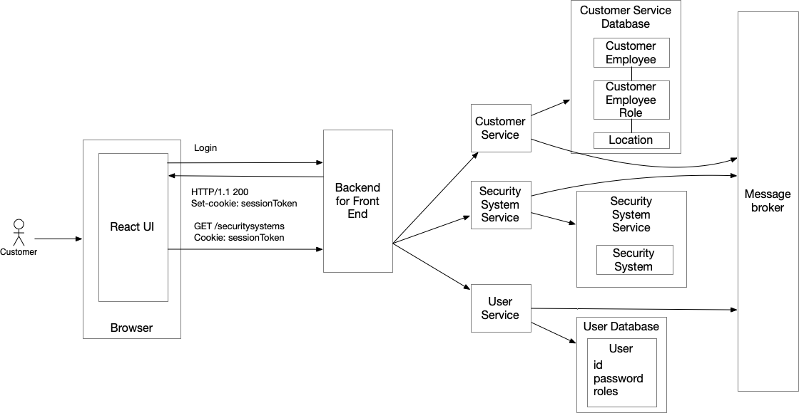

The architecture consists of the following elements:

1. Backend for front-end (BFF): A dedicated **API Gateway** for the UI that handles login and forwards requests from the UI to the services.

2. `Customer Service`: Manages customers, employees, employees’s roles and the customer’s locations.

3. `Customer Service Database`: Stores customer information and is private to the `Customer Service`.

4. `Security System Service`: Manages security systems.

5. `Security System Database`: Stores security system information and is private to the `Security Service`.

6. Message broker: Used for inter-service communication including the service collaboration patterns that rely on asynchronous messaging.

7. `User Service`: Manages users, credentials and their roles.

8. `User Service Database`: Stores user information and is private to the `User Service`

---
### Authentication in a microservice architecture

Just like in the monolithic application, a user logs in with a username and password. However, in a microservice architecture, the Backend for Frontend (BFF) - rather than the services - participates in the login process. 

The BFF maintains the user session, which includes the user’s identity, and issues a session token to the UI.

Another important difference from the monolith is that the business logic that needs the user’s identity cannot simply access the user session via an in-memory mechanism, such as a `ThreadLocal` variable. In a microservice architecture, that business logic is implemented in services that run as separate processes. Consequently, the BFF, which knows the user’s identity (and perhaps their roles), must pass that information to these services.

---
### Disadvantages

But there’s one characteristic of the microservice architecture that can make it challenging for a service to implement authorization: the necessary data might be scattered across multiple services and accessible only via their APIs.

Implementing authentication in a microservice architecture presents two challenges. The first challenge is the decentralized nature of the application. It consists of multiple services, each exposing its own set of REST endpoints. This raises the question: does each service need to implement authentication independently?

> **NOTE:** Each service has an architecture that is similar to that of the monolithic application.

The second challenge is that authentication is inherently complex and error-prone. It requires secure password storage, protection against common attacks such as CSRF, and ongoing compliance with evolving security best practices.

What’s more, applications must sometimes support multiple login mechanisms, including social login providers, which adds further complexity to the authentication logic.

---
### The API Gateway: a central location in a decentralized architecture

In a monolithic architecture, communication between a client, such as a React UI, and the application is relatively straightforward. A client makes requests to one of the monolith’s REST endpoints, such as `GET /securitysystems`, which query and update business entities. 

But in a microservice architecture client-application communication is less straightforward because there isn’t a single set of endpoints. In theory, a client could directly call each service, but a better solution is to implement the **API Gateway pattern**.

**An API Gateway is a service that acts as a single entry point into the application for all client requests.** 

> **NOTE:** **A variation of the API Gateway pattern is the Backend for Frontend (BFF) pattern**. A BFF is an API Gateway that supports a single frontend (a.k.a. client), such as a React-based UI. Among other things, it provides an API that’s tailored to the needs of the client.

---
### Authenticating an API Client

Let’s imagine the client is an application that makes requests to the API Gateway. In order to access a secured endpoint such as `GET /securitysystems`, **the application can require the client to provide credentials**. The credentials, which identify a client, typically consist of an API Key and possibly a secret, that are passed in the request’s `Authorization` header.

The API Gateway could simply forward the `GET /securitysystems` request to the `Security System Service`, which then authenticates the credentials against a database. The problem with this approach is that every service would need to implement authentication. There’s also the issue of how each service knows the user’s credentials, since services don’t share databases.

A better option is to make the API Gateway responsible for authenticating each request before forwarding it to the appropriate service. This frees the individual services from needing to handle authentication themselves.

---
### Propagating user identity to the services - Authorization

Centralizing authentication in the API gateway simplifies the services. This, however, creates a new problem: if they no longer authenticate the credentials, how do they know the identity of the user? 

For example, the `Security System Service` may need to know which user made the request in order to enforce permissions or record audit information.

The solution is for the API Gateway to propagate the user identity to the `Security System Service` by including it in a request’s header. The `Security System Service` can then use the user identity to, for example, retrieve the user’s security systems from the database or record who changed the state of a security system.

A common way to convey user identity is by passing a JSON Web Token (JWT). A JWT is a signed JSON document containing claims about the user, including their identity and permissions.

The API gateway can pass the JWT in a request header (usually the `Authorization` header), allowing backend services to securely identify the user and enforce authorization - without performing authentication themselves.

---
### Login-based authentication requires session state

The API Gateway authenticates every request from an API Client. If, however, the client is a UI, authentication only happens once - when the user logs into the application. The application typically displays a login page; the user enters their credentials, which are then authenticated by the application. After that, subsequent requests from the UI to the API Gateway must somehow be associated with the client.

The solution is for the login mechanism to create a session that is associated with the user’s identity. The API Gateway returns a session token - typically as a cookie - to the UI. The UI includes this session token in every subsequent request. The API Gateway then maps the session token to the user’s information, which is then propagated to the backend services as before.

> **NOTE:** There are two common ways to implement sessions. The first option is for the session token to act as a session identifier, which the API Gateway uses to retrieve the session state from a database. The second option is for the session token to contain the session state itself. It could, for example, be an encrypted JWT. Each approach has trade-offs in terms of performance, scalability, and revocation capabilities.

---
### Delegating authentication to an identity and access management service

The API Gateway/BFF could implement authentication itself. For an API client, it could authenticate the client’s credentials by verifying that they match what’s stored in a user database and then generating a JWT. Similarly, for a UI, the API Gateway/BFF would display the login page and then authenticate the submitted credentials. 

On the surface, this seems quite straightforward. However, implementing authentication securely is complex and error-prone. It requires secure password storage, protection against common attacks, such as CSRF, and compliance with evolving security best practices. Moreover, applications often need to support multiple login mechanisms, including social logins.

For these reasons, many teams choose to delegate authentication to an identity and access management (IAM) service, which may either run on your infrastructure or be offered as a SaaS solution. **These products typically implement login using a combination of two standards: OAuth 2.0, which is an authorization protocol, and OpenID Connect (OIDC), which is an authentication protocol built on OAuth 2.0.**

Once a user has been authenticated, an OAuth 2/OIDC-based IAM service issues a JWT-based access token that contains the user’s identity and permissions. The `API Gateway/BFF` stores the access token in the session and includes it in requests forwarded to the backend services.

---
### Deploying an IAM service

There are two options for deploying an IAM service. 

1. One option is to host your own IAM service. There are various open-source services to choose from, including Spring Authorization Server and Keycloak. 
2. The other option is to use a cloud-based SaaS solution, such as Okta, AWS Cognito, or Google Identity Platform.

---
## Implementing authentication using OAuth 2.0 and OIDC

Together, OAuth 2.0 and OpenID connect provide an authentication and authorization mechanism that works well in a microservice architecture. The BFF plays the role of the OAuth 2.0 client, and the backend services are resource servers.

---
### EXTRA

Users sit in a single logical cluster with read replicas because read pressure is modest.

**How to implement authorization in a microservice architecture when the necessary data is scattered across multiple services?**

The application has multiple clients. There are human users who use browser-based UI and mobile applications. There are also 3rd party applications that use the application’s REST API.

The **Authentication Service** acts as the **source of truth for identity** and exposes a set of **stable, well-defined auth / identity APIs** to the rest of the platform. These APIs cover **login** (verifying credentials and issuing tokens), **signup** (creating user accounts and storing credentials securely), **token refresh** (rotating refresh tokens and re-issuing JWTs), and **profile CRUD** (managing user attributes such as name, email, phone, preferences, and roles).

When a user logs in, the **User Service** issues two tokens:

1. **Access Token (JWT)** → short-lived (e.g., 5–15 minutes). Used in API requests.
2. **Refresh Token** → long-lived (e.g., days/weeks). Used only to get a new access token.

Because access tokens expire quickly (for security), the client must **“refresh”** them by calling the User Service with its refresh token. The service verifies the refresh token, issues a **new JWT**, and (optionally) rotates the refresh token.

--- 
### References

1. https://microservices.io/post/architecture/2025/05/28/microservices-authn-authz-part-2-authentication.html
