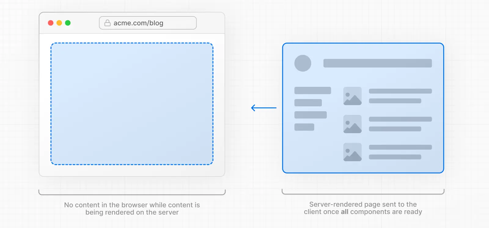

In Next.js, [Layouts and Pages](https://nextjs.org/docs/app/getting-started/layouts-and-pages) are [React Server Components](https://react.dev/reference/rsc/server-components) by default. On initial and subsequent navigations, the [Server Component Payload](https://nextjs.org/docs/app/getting-started/server-and-client-components#how-do-server-and-client-components-work-in-nextjs) is generated on the server before being sent to the client.

There are two types of server rendering, based on _when_ it happens:

- **Static Rendering (or Prerendering)** happens at build time or during [revalidation](https://nextjs.org/docs/app/getting-started/caching-and-revalidating)and the result is cached.
- **Dynamic Rendering** happens at request time in response to a client request.

The trade-off of server rendering is that the client must wait for the server to respond before the new route can be shown. 

