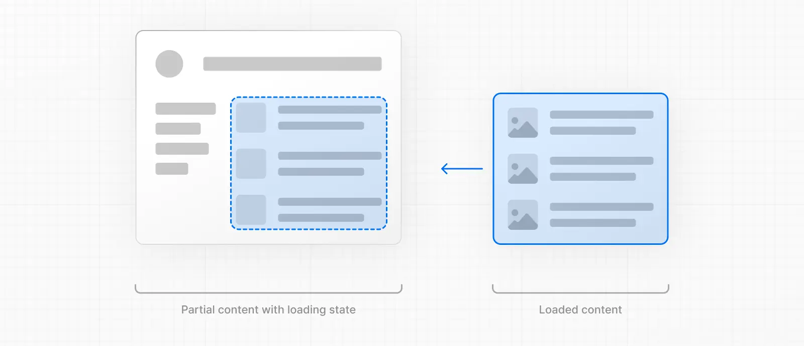
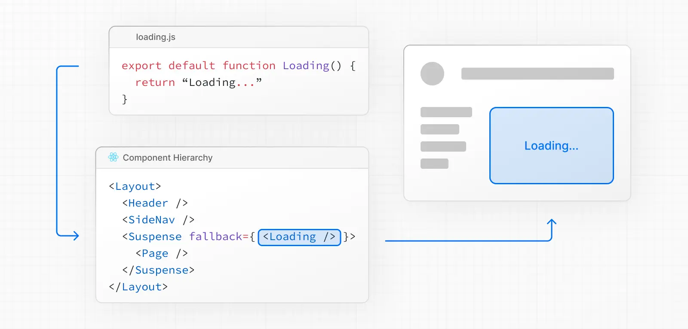
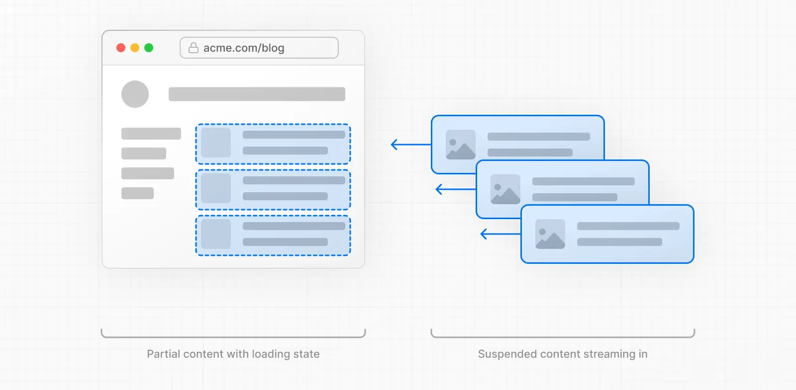

There are two ways you can implement streaming in your application:

1. Wrapping a page with a `loading.js` file.
2. Wrapping a component with `<Suspense>`.


---
### With `loading.js`

You can create a `loading.js` file in the same folder as your page to stream the **entire page**while the data is being fetched. For example, to stream `app/blog/page.js`, add the file inside the `app/blog` folder.


```
export default function Loading() {
  // Define the Loading UI here
  return <div>Loading...</div>
}
```

On navigation, the user will immediately see the layout and a loading state while the page is being rendered. The new content will then be automatically swapped in once rendering is complete.



Behind-the-scenes, `loading.js` will be nested inside `layout.js`, and will automatically wrap the `page.js` file and any children below in a `<Suspense>` boundary.



This approach works well for route segments (layouts and pages), but for more granular streaming, you can use `<Suspense>`.

---
### With `<Suspense>`

`<Suspense>` allows you to be more granular about what parts of the page to stream. For example, you can immediately show any page content that falls outside of the `<Suspense>` boundary, and stream in the list of blog posts inside the boundary.

```
import { Suspense } from 'react'
import BlogList from '@/components/BlogList'
import BlogListSkeleton from '@/components/BlogListSkeleton'
 
export default function BlogPage() {
  return (
    <div>
      {/* This content will be sent to the client immediately */}
      <header>
        <h1>Welcome to the Blog</h1>
        <p>Read the latest posts below.</p>
      </header>
      <main>
        {/* Any content wrapped in a <Suspense> boundary will be streamed */}
        <Suspense fallback={<BlogListSkeleton />}>
          <BlogList />
        </Suspense>
      </main>
    </div>
  )
}
```


---

To improve the navigation experience to dynamic routes, you can use [streaming](https://nextjs.org/docs/app/getting-started/linking-and-navigating#streaming).

Streaming allows the server to send parts of a dynamic route to the client as soon as they're ready, rather than waiting for the entire route to be rendered. This means users see something sooner, even if parts of the page are still loading.

For dynamic routes, it means they can be **partially prefetched**. That is, shared layouts and loading skeletons can be requested ahead of time.



To use streaming, create a `loading.tsx` in your route folder:


 ```
 export default function Loading() {
  // Add fallback UI that will be shown while the route is loading.
  return <LoadingSkeleton />
}
 ```

Behind the scenes, Next.js will automatically wrap the `page.tsx` contents in a `<Suspense>` boundary. The prefetched fallback UI will be shown while the route is loading, and swapped for the actual content once ready.

Benefits of `loading.tsx`:

- Immediate navigation and visual feedback for the user.
- Shared layouts remain interactive and navigation is interruptible.
- Improved Core Web Vitals: [TTFB](https://web.dev/articles/ttfb), [FCP](https://web.dev/articles/fcp), and [TTI](https://web.dev/articles/tti).
---
