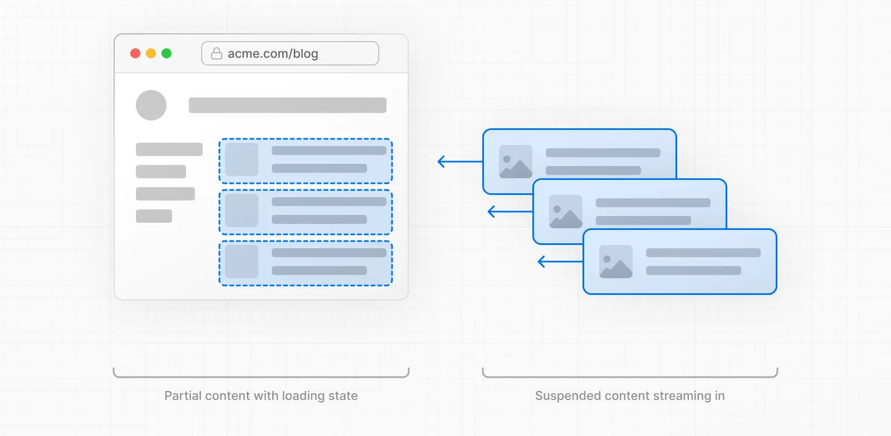
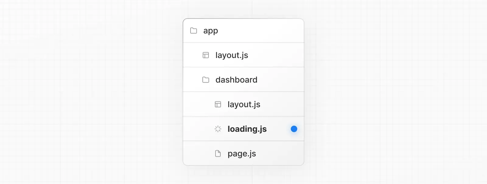

To improve the navigation experience to dynamic routes, you can use [streaming](https://nextjs.org/docs/app/getting-started/linking-and-navigating#streaming).

Streaming allows the server to send parts of a dynamic route to the client as soon as they're ready, rather than waiting for the entire route to be rendered. This means users see something sooner, even if parts of the page are still loading.

For dynamic routes, it means they can be **partially prefetched**. That is, shared layouts and loading skeletons can be requested ahead of time.



To use streaming, create a `loading.tsx` in your route folder:



 ```
 export default function Loading() {
  // Add fallback UI that will be shown while the route is loading.
  return <LoadingSkeleton />
}
 ```

Behind the scenes, Next.js will automatically wrap the `page.tsx` contents in a `<Suspense>` boundary. The prefetched fallback UI will be shown while the route is loading, and swapped for the actual content once ready.

Benefits of `loading.tsx`:

- Immediate navigation and visual feedback for the user.
- Shared layouts remain interactive and navigation is interruptible.
- Improved Core Web Vitals: [TTFB](https://web.dev/articles/ttfb), [FCP](https://web.dev/articles/fcp), and [TTI](https://web.dev/articles/tti).
---
