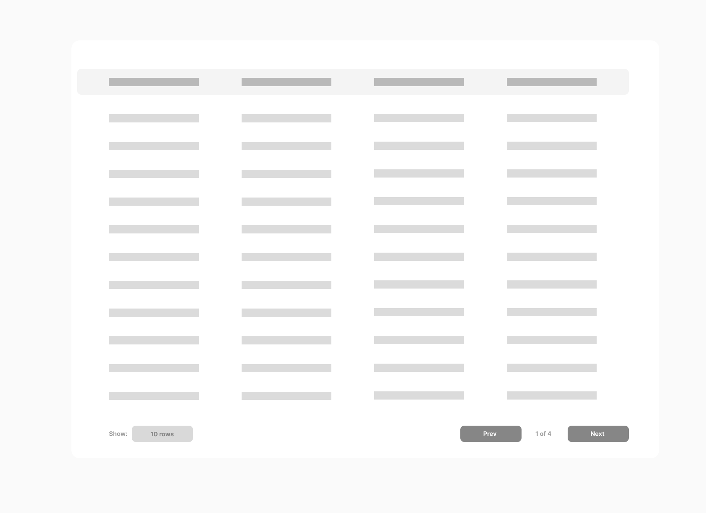

Given a list of users, build a users data table that displays users in a paginated format.

---
### Functional Requirement

1. The users data table should display the following columns: `Id`, `Name`, `Age`, `Occupation` where each row represents a single user.
2. The pagination controls should allow the user to navigate to previous and next pages.
3. The pagination controls should display the current page number and the total number of pages.
4. Provide an option to select the number of users displayed per page (e.g., 5, 10, 20).

---

