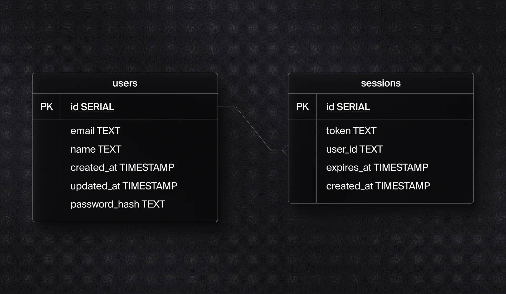
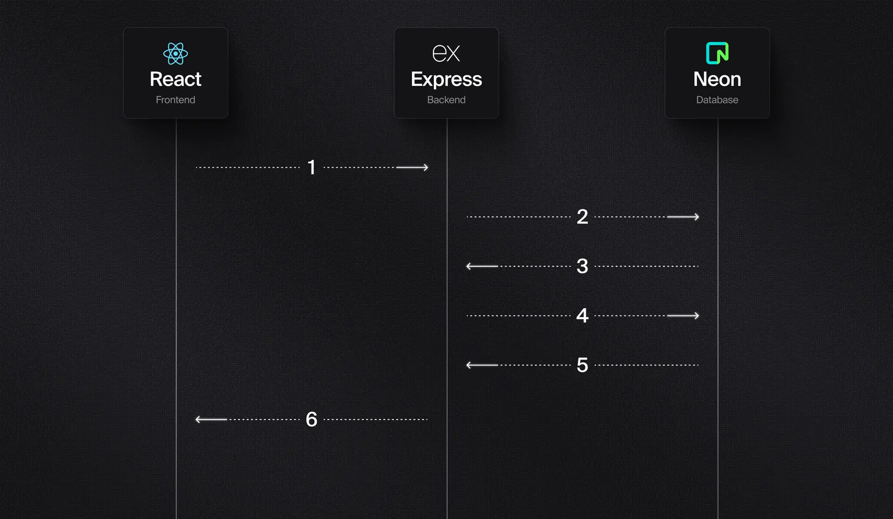

Implementing session-based authentication includes several key requirements.

---
### Storage

A storage mechanism is required to hold information about the **users** and the **sessions**. Using a database would require two tables, one for each entity. 

The following table diagram outlines the minimum requirements to implement session-based authentication.

The `users` table will store general information about the user such as their name, email address, and a hashed version of the password. The `sessions` table will store details about each session.

---
### Handling Sign Up

Signing up the user will require a form to be created on the front end that is accessible if the user is not already authenticated. This typically includes, at minimum, inputs for username and password.

The server needs a route handler that can accept the user’s credentials when they click “Sign up”. The simplest implementation of this will create a user record and store the username and a hashed version of the password.

> **Warning:** **NEVER** store the user credentials in plain text. If anyone obtains unauthorized access to your database, all of your users’ credentials will be exposed.

> **Information:** It’s a best practice to implement validation on both the form the user interacts with and the route handler on the server. This ensures that any requirements for the inputs (ex: password complexity) are met before any records are created.

Sequence Flow

1. Using the login page in React, the user submits their username and password to the server.
2. The server creates a user record in the database.
3. The database returns the ID of the new record.
4. The server creates a session with the user ID.
5. The database returns the ID of the new record.
6. The server sets the cookie and responds back to the front end.

---
### Handling Sign In

A login form is also required to allow the user to sign in. Again, the simplest implementation is at least a username and password.

As with handling sign-up, a route handler also needs to be created on the server to handle the credentials when they are submitted. Instead of creating a new user record, the credentials are verified with the existing user record.

If the React login page contains the proper credentials and they match when checked with the database, a session is created in the database. The token is added to a cookie that is sent back to the client.

Sequence Flow

1. Using the login page in React, the user submits their credentials to the server.
2. The server queries the user record to check the credentials.
3. The database returns the user record if found.
4. The server compares the hashed passwords. If successful, create a new session in the database.
5. The database responds with the ID of the session.
6. The server sets the session ID in the cookie and sends it back to the client.

> **Design Choice: Cookies are used for several reasons:**
> 
> 1. They are automatically sent with each request to the server.
> 2. Cookies can be configured to prevent client-side scripts from accessing them, making them more secure than local storage.
> 3. An expiration can be set directly on the cookie, preventing the browser from trying to access a protected route when the session is expired.

---
