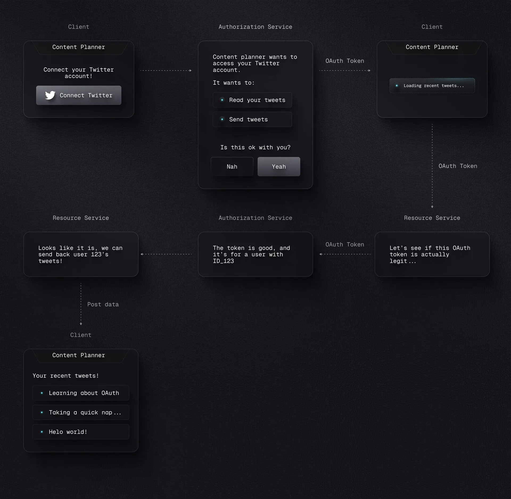
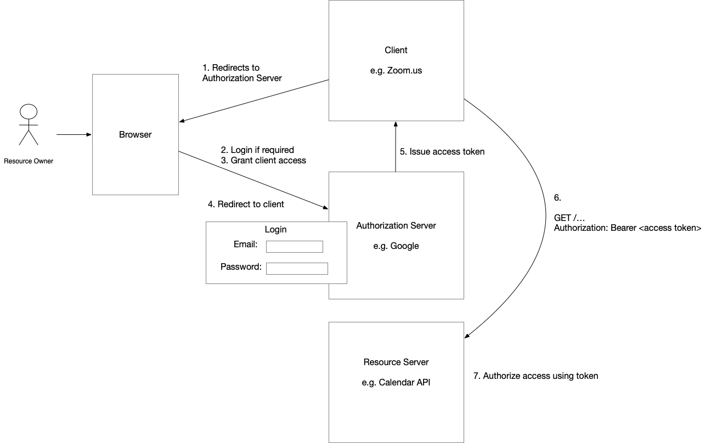

[OAuth](https://oauth.net/2/) stands for "Open Authorization", and it is a set of standard specifications designed by the [IETF](https://www.ietf.org/) that address how a user can grant a third party application access to some of their data/resources, without providing their login directly.

Many apps and authentication providers will automatically detect and block any sort of scripted login attempts as a bot, to prevent fraud and bot attacks.

---
### Common OAuth Terminology

Let's start with some common terminology. This will help to communicate concepts clearly through the rest of the piece.

- **Client**: This is a very generic term that is common in software discussions. When discussing OAuth, however, it has a very specific meaning that is important to really internalize: _A Client is an entity that wants to get something from another entity_. Referencing our above example, Content Planner is the Client, since it wants to get permission to make posts from Twitter, Facebook, LinkedIn, etc.

- **Authorization Service**: This refers to the service that is responsible for signing the user in and out and delegating access to the user's account to third parties. For example, users signing into Content Planner with their Twitter account would use Twitter's authorization service. This may or may not be a _server_, though you will often see it referenced as a "authorization server", including in OAuth specs, but we're going to call it a service in this piece, because it's more accurate, and less confusing. This is sometimes also referred to as an "Identity Provider" or "IdP".

- **Resource Service**: This refers to the service that has the resources the client wants access to. Referencing our above example again for Twitter, this would be the Twitter app itself, which is what has the ability to post things. As mentioned above, this may or may not run on a separate server from the authorization service, and you will likely see it referred to as a "resource server" in other writing about OAuth, but we're sticking with "service" in this piece for accuracy. This is sometimes also referred to as an "Service Provider" or "SP".

- **OAuth Access Token**: A string of random characters (which is generally what a "token" is in the realm of web development) or [JWT](https://datatracker.ietf.org/doc/html/rfc7519) that is given to the _Client_ by the _Authorization Service_ if the OAuth process is completed successfully. The Client can then send this Token to the _Resource Service_ as a form of proof that it should be allowed to access what it's trying to access.

---

1. **OAuth Scoped Access** - scoped 3rd party data access via OAuth (the one we described above)
2. **OAuth SSO** - sign on to an app through a third-party app, using OAuth (like Sign in with Google, etc)
3. **OAuth User Management** - OAuth as a user registration and sign in/out mechanism (a full authorization service built with OAuth)

---

OAuth was originally developed to enable a user of a service to allow a 3rd party service to access their data without disclosing their password. For example, OAuth 2.0 enables a Gmail user to securely grant Zoom access to their calendar. The outcome of the authorization process, which is officially known as a flow, is an access token being issued to the 3rd party application. The 3rd party application - e.g., Zoom - includes that token in the request to the service’s API - e.g., Gmail - which uses the token to authorize the request. Let’s look at how tokens are issued.

An authorization flow involves the following four parties:

- Resource Owner - user that wants to grant the Client access to their data
- Client - 3rd party application, such as Zoom
- Resource server - the API that the user wants the Client to access, such as the Google calendar API
- Authorization Server - authenticates users and issues access tokens, which the client presents to the resource server

The following diagram shows at a high level how these four parties collaborate to grant access:

Without getting into the details, the flow for issuing an access token for a browser-based UI works something like this:

1. To obtain access to the resource server, the client redirects the user’s browser to the Authorization Server’s authorization endpoint.
2. If the user is not already logged into the Authorization Server, the user enters their credentials, and the Authorization Server validates them.
3. The user confirms that the Authorization Server should grant the Client access.
4. The authorization server redirects the browser to the client’s redirection endpoint.
5. The client’s redirection endpoint’s handler invokes the authorization server’s token endpoint to obtain an access token, which grants access to the resource server

---
### Access Tokens

There are two types of access tokens: opaque and transparent. An opaque token is a random sequence of characters. In order to authorize a request containing an opaque token, the resource server must invoke the authorization server to decode the token. A transparent token contains information in a format that the resource server can decode. It eliminates the overhead of a roundtrip to the authorization server.

Modern OAuth 2.0 authorization servers typically issue transparent access tokens in the form of JSON web tokens (JWTs). A JWT is a signed JSON document containing a set of claims - key-value pairs containing information about the user and the token itself. A client’s permissions are represented as claims within the JWT. JWTs are typically signed using an asymmetric algorithm, which uses a private key only known to the authorization server. To validate a JWT, a resource server can - on startup - retrieve the corresponding public key from the authorization server using its JWKS endpoint.

One drawback of JWT-based access tokens is that anyone who possesses one can access the resource server. Unlike with opaque tokens, the resource server does not contact the authorization server to validate a JWT; it verifies the token locally.

**Authorization servers typically issue JWT access tokens with a short expiration time to limit the impact of token theft. To avoid forcing the resource owner to repeatedly authenticate, the authorization server also issues a long-lived refresh token, which the client can use to obtain new access tokens as needed.** 

The client should store the refresh token securely, as it grants ongoing access. A client can revoke a refresh token by making a request to the authorization server’s token revocation endpoint.

--- 
### References

1. https://clerk.com/blog/how-oauth-works

---
