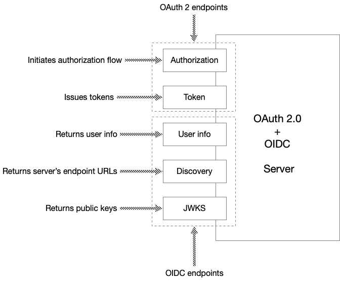

OpenID Connect (OIDC) is an authorization layer on top of OAuth 2.0. It introduces the concept of an ID token, which the authorization server issues along with an access token. An ID token is a JWT that has claims conveying identity information about the authenticated user. To confuse matters, however, modern authorization servers often include a user’s identity information in the access token as well.

In addition to defining an ID token, OIDC defines three endpoints:

- `user info` endpoint - returns information about a user
- `discovery` endpoint - returns a JSON document detailing the server’s endpoints
- `JWKS` endpoints - returns the public key user to validate JWT signatures

Let’s look at each OIDC endpoint in turn.

#### `User info` endpoint

A client invokes the `user info` endpoint to obtain information about a user. On the surface, this might seem redundant since the client is given an ID token. However, depending on the implementation, the ID token might only contain a subset of the user’s information - perhaps due to size limits. Furthermore, the ID token (and the access token) contains a static snapshot of the user information. In contrast, the `user info` endpoint returns the complete, and up-to-date information about the user.

#### `Discovery` endpoint

OpenID Connect also defines a discovery endpoint, which returns a JSON document containing metadata about the server. Most notably, it contains the URLs of the server’s endpoints that are used in the authentication flow.

#### `JWKS` endpoint

Another other endpoint defined by OIDC is the JWKS (JSON Web Key Set) endpoint. It returns a JSON document containing the public keys needed to verify the digital signatures of access token and ID token JWTs. For example, on startup, a resource server will retrieve the public keys from the JWKS endpoint so that it can authorize client requests.