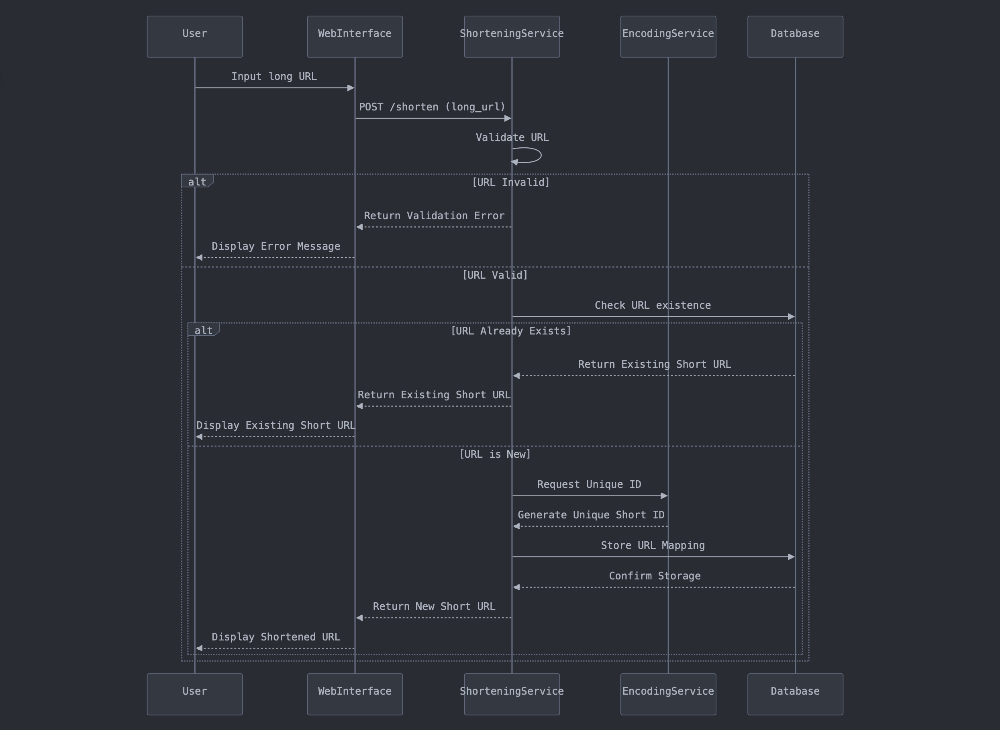

# TinyURL System Design

Design a **URL shortening service** that converts a long URL into a shorter, more manageable link. 

---
## Functional Requirements

1. **URL Shortening:** Take a long URL and create an alias with shorter length.

2. **URL Redirecting:** Redirect a short URL to the corresponding long URL.

> **NOTE:** A URL shortening service can also **handle custom alias creation** or **provide insights on link clicks, location, and user engagement.**

---
## Non-Functional Requirements

1. **Availability:** The system should ensure that users can always access the shortened URLs.

2. **Low latency:** The system should fetch the long URL and redirect users instantly.

3. **Scalability:** A read heavy system capable of handling a traffic volume of 10 Million URL generation requests and 1 Billion redirection requests per day (assuming read / write ratio is 100:1).

4. **Security and Abuse Prevention:** Shortened URLs shouldn't be guessable / predictable.

---
## Workflow for Shortening a Long URL

1. The user inputs a URL on the web interface. A **POST request** (e.g., `POST https://api.tinyurl.com/v1/shorten`), containing the input URL (e.g., `long_url: https://www.example.com/some/very/long/url`), is sent to the **shortening service**.

2. The **shortening service** validates the provided URL to ensure it follows a valid structure, is safe to use and is not already present in the database.

3. If the URL passes all checks, the **shortening service** calls the **encoding service** to encode the long URL into a unique ID (e.g., `abc123`) which can can be used to generate a unique short URL (e.g., `https://tinyURL/abc123`).

4. Once the short URL is generated, the **shortening service** stores the `short_URL → long_URL` mapping in the database and returns the shortened URL to the user.



---
## Load Estimation for Shortening Service

For designing a **scalable** and **highly available** system, analysing **key load parameters** such as the **Requests Per Second (RPS)** and **throughput capacity** is crucial.

**Requests Per Second (RPS):**
- Daily Average URL Generation Requests = 10 Million
- Requests Per Second = 10 Million / (24 hours × 3600 seconds ) ~ **100 RPS**

**Throughput Capacity:**
- Average Processing Time = 10 milliseconds / request
- Throughput Capacity = 1 / 0.01 = **100 RPS**

A single application server can handle the daily average request load of **100 RPS**. However, assuming peak traffic is **5 times the average**, the system must be designed to handle **500 RPS** during peak hours.

To manage this load efficiently, we can deploy **5 application servers** behind a **load balancer** to distribute requests evenly.

> NOTE: Since, every URL shortening request involves generating a unique short ID, the **encoding service** would handle the same load as the **shortening service**.

---
## Storage Capacity Estimation for Shortening Service

The system requires a **data model** to store the **user details** and the **shortened URL (`short_URL → long_URL`) mappings**.

Since the **shortened URL (`short_URL → long_URL`) mappings** will grow at a much **faster rate** than the **user details**, analysing their **storage requirements** is crucial for designing an efficient data model and choosing the right database.

**Storage Requirements Breakdown:**
- Daily Average URL Generation Requests = 10 Million
- URLs Generated in 10 Years = 10 Million × 365 days × 10 years = 36.5 × 10<sup>9</sup> ≈ 40 Billion URLs
- Total Storage per Mapping = 100 bytes (long URL) + 20 bytes (short ID) + 30 bytes (metadata) = 150 bytes
- Required Storage in 10 years = 40 Billion URLs × 150 bytes = 6 × 10<sup>12</sup> = **6 TB**

Since **high read-write throughput** is critical, we can use **Cassandra** to ensure **low-latency queries (sub-10ms latency)**.

---
## Schema Design

**`users` Table:**

| **Field Name**   | **Data Type**  | **Description**                    |
| ---------------- | -------------- | ---------------------------------- |
| `id`             | `Integer`      | Unique User ID                     |
| `email`          | `String`       | Unique email for the user          |
| `password`       | `String`       | Securely hashed password           |
| `created_at`     | `Timestamp`    | Timestamp when the user registered |
| `shortened_urls` | `List<String>` | List of short IDs created by user  |

**`urls` Table:**

| Field Name     | Data Type   | Description                      |
| -------------- | ----------- | -------------------------------- |
| `short_id`     | `String`    | Unique short code                |
| `long_url`     | `String`    | Original long URL                |
| `created_at`   | `Timestamp` | Timestamp of when it was created |
| `expiry_date`  | `Timestamp` | Expiry date                      |
| `access_count` | `Integer`   | Number of times accessed         |

---
## API Design

We will design the APIs using microservices architecture.

#### Shortening Service

```
@postMapping("/shorten")
public String shortenUrl(@Param String longUrl, Integer expiryDays) {
	String shortId = encodingService.generateShortId(longURL);
	ShortUrl shortUrl = new ShortUrl(shortId, longUrl); 
	urlRepository.save(shortUrl);
	return shortURL.toString(); 
}
```

#### Encoding Service

```
```

#### Redirection Service

```
```

---
## Workflow for Redirecting a URL

- The user enters a short URL in the browser. A **GET request** is sent to the **redirection service**.

- The redirection service extracts the **short URL ID** (e.g., `abc123`) and use it to query the database to retrieve the corresponding long URL.

- Once retrieved, the redirection service sends an **HTTP 301 (Permanent) or 302 (Temporary) redirect** response to the browser.

- The browser automatically redirects the user to the **original long URL**.

---
## Load Estimation and API Design

 A URL shortener primarily needs 2 APIs:

Use **Base62 encoding** (0-9, a-z, A-Z) or **hash the URL (SHA-256, MD5)** and take the first **6-8 characters**.

e.g., )

> **NOTE:** 

---
