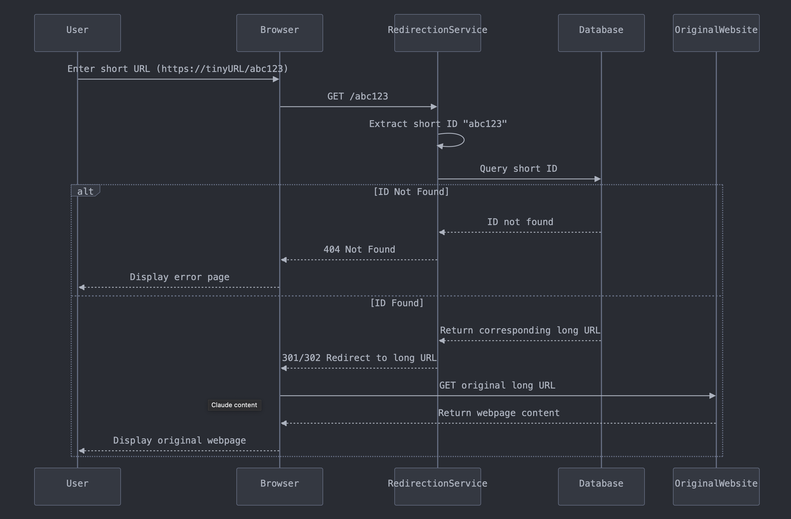

# TinyURL System Design

Design a **URL shortening service** that converts a long URL into a shorter, more manageable link. 

---
## Functional Requirements

1. **URL Shortening:** Take a long URL and create an alias with shorter length.

2. **URL Redirecting:** Redirect a short URL to the corresponding long URL.

> **NOTE:** A URL shortening service can also **handle custom alias creation** or **provide insights on link clicks, location, and user engagement.**

---
## Non-Functional Requirements

1. **Availability:** The system should ensure that users can always access the shortened URLs.

2. **Low latency:** The system should fetch the long URL and redirect users instantly.

3. **Scalability:** The system should be capable of handling a traffic volume of **10 Million URL generation requests** and **1 Billion redirection requests per day** (assuming **read / write ratio** is **100:1**).

---
## Workflow for Shortening a Long URL

1. The `user` inputs a URL on the web interface. A **POST request** (e.g., `POST https://api.tinyurl.com/v1/shorten`), containing the input URL (e.g., `long_url: https://www.example.com/some/very/long/url`), is sent to the **`shortening service`**.

2. The **`shortening service`** validates the provided URL to ensure it follows a valid structure, is safe to use and is not already present in the database.

3. If the URL passes all checks, the `shortening service` calls the **`encoding service`** to encode the long URL into a unique ID (e.g., `abc123`) which can can be used to generate a unique short URL (e.g., `https://tinyURL/abc123`).

4. Once the short URL is generated, the **`shortening service`** stores the `short_url → long_url` mapping in the `database` and returns the shortened URL to the `user`.


---
## Load Estimation for Shortening Service

Considering the **shortening service** is a **write-heavy service**, its load estimation must involve analysing the following **key load parameters**:

**1. Requests Per Second (RPS):**
- <span style="color : red"><strong>Assumption:</strong> Daily Average URL Generation Requests = 10 Million</span>
- Requests Per Second = 10 Million / (24 hours × 3600 seconds ) ~ **100 RPS**

**2. Write Throughput Capacity:**
- <span style="color : red"><strong>Assumption:</strong> Average Processing Time = 10 milliseconds / request</span>
- Throughput Capacity = 1 / 0.01 = **100 RPS**

<span style="color : red"><strong>Assumption:</strong> The peak traffic can be <strong>5 times the average</strong>. Hence, the system must be designed to handle <strong>500 RPS</strong> during peak hours.</span>

<span style="color : green">Considering a single application server can handle <strong>100 RPS</strong>, we can deploy <strong>5 application servers</strong> behind a <strong>load balancer</strong> to efficiently handle all incoming URL shortening requests.</span>

> NOTE: Since every URL shortening request involves generating a unique short ID, the **encoding service** must be handle the same load as the **shortening service**.

---
## Workflow for Redirecting a URL

1. The **`user`** enters a short URL (e.g., `https://tinyURL/abc123`) in the browser. A **GET request** (e.g., `GET /abc123`) is sent to the **`redirection service`**.

2. The **`redirection service`** extracts the **short URL ID** (e.g., `abc123`) and use it to query the `database` to retrieve the corresponding long URL.

3. Once retrieved, the **`redirection service`** sends an **HTTP 301 (Permanent) or 302 (Temporary) redirect** response to the browser.

4. The browser automatically redirects the user to the **original long URL**.



---
## Load Estimation for Redirection Service

Considering the **redirection service** is a **read-heavy service**, its load estimation must involve analysing the following **key load parameters**:

**1. Requests Per Second (RPS):**
- <span style="color : red"><strong>Assumption:</strong> Daily Average Redirection Requests = 10 Million x 100 = 1 Billion</span>
- Requests Per Second = 1 Billion / (24 hours × 3600 seconds ) ~ **10,000 RPS**

**2. Read Throughput Capacity:**
- <span style="color : red"><strong>Assumption:</strong> Average Processing Time = 10 milliseconds / request</span>
- Throughput Capacity = 1 / 0.01 = **100 RPS**

<span style="color : red"><strong>Assumption:</strong> The peak traffic can be <strong>5 times the average</strong>. Hence, the system must be designed to handle <strong>50,000 RPS</strong> during peak hours.</span>

<span style="color : green">Considering a single application server can handle <strong>100 RPS</strong>, we can deploy <strong>500 application servers</strong> behind a <strong>load balancer</strong> to efficiently handle all URL redirection requests.</span>

> NOTE: Since the system is a read-heavy system, i.e., there will be more reads than writes, we can store the (`short_url → long_url`) mapping in a **cache** (e.g., `Redis`) to improve performance.

---
## API Design

The system consists of three primary services:

- **Shortening Service**: Handles user requests to create short URLs.
- **Encoding Service**: Generates unique IDs for given long URLs.
- **Redirection Service**: Resolves short URLs to their original long URLs.

#### Shortening Service API

```
public String shortenUrl(String longUrl) {

	// Check if URL already exists in DB
	UrlMapping existing = urlRepository.findByLongUrl(longUrl); 
	if (existing != null) return existing.getShortUrl(); 
	
	// Call Encoding Service to generate uniqueID 
	String shortId =encodingService.generateShortId(); 
	
	// Create Short URL 
	String shortUrl = "https://tinyurl.com/" + shortId; 
	
	// Save mapping 
	urlRepository.save(new UrlMapping(shortId, longUrl)); 
	
	return shortUrl;
	
}
```

#### Encoding Service API (Internal)

The service must implement a functionality that could encode every incoming long URL to a **unique short URL**.

Using a **hash function (e.g., SHA-256) to encode long URLs** can lead to **collisions** if multiple people try to encode the same long URL. To avoid such collisions, we can use a **unique ID generator** to assign a unique numeric ID to each incoming long URL.

<span style="color : red"><strong>Assumption:</strong> Considering that the system processes an average of <strong>10 million URL generation requests per day</strong> and is expected to operate for <strong>10 years</strong>, the total number of URLs generated over its lifetime would be: <strong>10 million × 365 days × 10 years = 36.5 billion ≈ 40 billion URLs</strong>.</span>

The service must be capable of generating **40 billion unique short IDs** without collisions.

<span style="color : red"><strong>Assumption:</strong> Each short ID consists of characters from <strong>[0-9, a-z, A-Z]</strong>, containing 10 + 26 + 26 = 62 possible characters. Considering 62<sup>6</sup> = 56 Billion, a <strong>6-character long Base-62 ID</strong> must be enough to accommodate all URL shortening requests over the system's lifetime.</span>

<span style="color : LightSkyBlue">Q. How to generate 6 character long unique Base-62 IDs in a distributed system?</span>

<span style="color : green">The service can act as a <strong>centralised authority</strong> responsible for generating <strong>unique, sequentially increasing IDs</strong> and then converting those numeric IDs into a <strong>Base-62 encoded string</strong>.</span>

```
public String generateShortId() {
    long id = counter.getAndIncrement(); // Get the next sequential ID
    return toBase62(id);
}
```

<span style="color : LightSkyBlue">Using a single <strong>centralised ID generator</strong> can become a bottleneck under high traffic.</span>

<span style="color : LightSkyBlue">We can use <strong>multiple ID generators</strong> with unique ID prefixes (e.g., timestamp + machine ID + counter) to allow horizontal scaling. However, adding extra components (like machine ID and timestamp) increases the <strong>length of the short ID</strong>, which may reduce the compactness of the shortened URLs.</span>

<span style="color : green">To eliminate this, we can use a coordination service (e.g., ZooKeeper) to pre-allocate <strong>ID ranges</strong> to each machine (e.g., Machine 1 → 1 to 1M, Machine 2 → 1M+1 to 2M, etc.). This ensures each machine generates IDs from its assigned range <strong>without conflicts</strong>.</span>

#### Redirection Service API

```
```

---
## Storage Capacity Estimation

The system requires a **data model** to efficiently store the **user details** and their **shortened URL (`short_URL → long_URL`) mappings**.

Since the **shortened URL (`short_URL → long_URL`) mappings** will grow at a much **faster rate** than the **user details**, analysing their **storage requirements** is crucial for designing an efficient data model and choosing the right database.

**Storage Requirements Breakdown:**
- Daily Average URL Generation Requests = 10 Million
- URLs Generated in 10 Years = 10 Million × 365 days × 10 years = 36.5 × 10<sup>9</sup> ≈ 40 Billion URLs
- Total Storage per Mapping = 100 bytes (long URL) + 20 bytes (short ID) + 30 bytes (metadata) = 150 bytes
- Required Storage in 10 years = 40 Billion URLs × 150 bytes = 6 × 10<sup>12</sup> = **6 TB**

Since **high read-write throughput** is critical, we can use **Cassandra** to ensure **low-latency queries (sub-10ms latency)**.

---
## Schema Design - Chebotko Diagram

**`users` Table:**

| **Field Name**   | **Data Type**  | **Description**                    |
| ---------------- | -------------- | ---------------------------------- |
| `id`             | `Integer`      | Unique User ID                     |
| `email`          | `String`       | Unique email for the user          |
| `password`       | `String`       | Securely hashed password           |
| `created_at`     | `Timestamp`    | Timestamp when the user registered |
| `shortened_urls` | `List<String>` | List of short IDs created by user  |

**`urls` Table:**

| Field Name     | Data Type   | Description                      |
| -------------- | ----------- | -------------------------------- |
| `short_id`     | `String`    | Unique short code                |
| `long_url`     | `String`    | Original long URL                |
| `created_at`   | `Timestamp` | Timestamp of when it was created |
| `expiry_date`  | `Timestamp` | Expiry date                      |
| `access_count` | `Integer`   | Number of times accessed         |

---
## Architectural Diagram

We will design the APIs using microservices architecture.


---
## EXTRA


