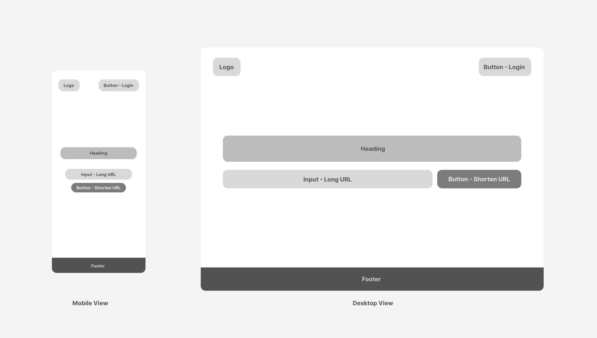

---

---

We need to design a **minimal**, **responsive**, and **user-friendly** frontend interface that allows users to quickly shorten URLs, view their shortened links, and manage them if signed in.

---
### Functional Requirement

The UI would primarily consist of the following screens:

<strong>Landing Page:</strong> Centered interface where users can input a long URL and click a `Shorten URL` button to generate a short link. Once the URL is shortened, it is immediately displayed with a `Copy` button for easy sharing. The page should include a simple header with branding and optional `Sign In` / `Sign Up` links, along with a minimal footer containing legal information.

<strong>User Dashboard (for logged-in users):</strong> Presents a list view of all URLs the user has shortened. Each item shows the original URL, the corresponding short URL, and the number of times it has been accessed. Users can easily copy or delete any link from this dashboard. The dashboard header should include the logo on the left and a user avatar (profile dropdown) on the right, providing access to user options and logout.

---
### Non-Functional Requirement

(Needs Work)

1. Use server-side rendering (SSR) for public pages like the landing page to ensure they are discoverable via search engines (better SEO). The landing page and shortened URL preview components must be **server-side rendered (SSR)** to ensure proper indexing by search engines.

2. Use client-Side Rendering (CSR) for authenticated pages like the user dashboard. It's faster after initial load but not ideal for SEO.

3. Leverage a **Content Delivery Network (CDN)** to serve static assets like CSS, JS, and images, minimising latency across global users. Static assets must remain accessible even during backend outages via cached CDN delivery.

4. All data exchanged between the client and server must be transmitted over **HTTPS**.

---
### Data Model for Landing Page

(Needs Work)

The **data model** primarily includes the following UI state variables:

- `longUrl`: stores the user-entered long URL.
- `shortUrl`: holds the generated short URL returned by the backend.
- `isLoading`: a boolean flag indicating if the shortening request is in progress.
- `error`: captures any validation or server-side errors.
- `copied`: tracks whether the short URL has been copied to the clipboard.

> **NOTE:** This state is typically managed using React's `useState` and updated in response to user actions like input, form submission, and copy-to-clipboard interaction. For a small component like the landing page, **React's built-in `useState`** hook is sufficient. If user preferences or login state were involved, **`useContext`** or a global store like **Redux**, or **Recoil** could be considered.

---
### Data Flow for Landing Page

(Needs Work)

Here’s how the data flows through the system and is managed:

1. **Initial State Load:** When the landing page is first loaded, the initial state consists of the basic UI elements, including the input fields (for entering the long URL) and a button to generate the short URL. This initial state is set by default values or by fetching necessary data from any server-side configuration if required (e.g., branding elements, default instructions, etc.).

2. **User Input Handling (Long URL):** The user enters a long URL into the input field. As soon as the user types, this triggers an event to update the state. Using **state hooks** in React (or the state management solution in use), this update is handled by setting the input value in the component’s state, like `longUrl`.

3. **URL Validation:** When the user submits the long URL, the app checks if it is a valid URL format. If it’s not valid, a validation error message is displayed, updating the UI state with an error message. This also updates the component state (e.g., `errorMessage`), which triggers a re-render to display the error.

4. **Submit URL Request (Generate Short URL):** Upon successful validation, the user clicks the "Generate Short URL" button. A request is made to the backend via an API call, where the long URL is sent for shortening. The UI shows a loading state (such as a spinner or a "Processing..." message) while waiting for the response.

5. **Copy to Clipboard:** When the user clicks the "Copy" button to copy the generated short URL, the application updates the state to reflect that the URL has been copied (e.g., `isCopied` state set to `true`), providing feedback to the user.

6. **URL History (Optional for Later Sessions):** If the application supports saving the history of generated short URLs for logged-in users, it stores this history in the backend. The frontend state (`shortUrlHistory`) would be updated after each successful shortening request. This history could be displayed to the user, allowing them to quickly re-use previous URLs.

---
### Data Model for User Dashboard

---
### Data Flow for User Dashboard

---
